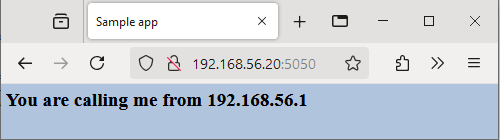

# Lab 1: Continuous Integration/Delivery with Jenkins

In this lab assignment, you will learn the basics on how to set up a build pipeline with Jenkins. In this lab assignment, we will leverage Docker as a platform to easily install and run a Jenkins server. Remark that in a real-world setting, you would probably have a dedicated build server.

## Learning Goals

- Installing and running Jenkins in a Docker container
- Creating simple jobs and build pipelines
- Running the pipeline to build and test an application, and to deploy changes in the application

## Acceptance criteria

- Show that you created a GitHub repository for the sample application
- Show that the application is running by opening it in a web browser
- Show the overview of jobs in the Jenkins dashboard
- Make a change to the sample application, commit and push
- Launch the build pipeline and show the change to the application in the browser
- Show your lab report and cheat sheet! It should contain screenshots of consecutive steps and console output of commands you used.

## 1.1 Set up the lab environment

For this lab assignment, we'll be using the `dockerlab` environment. Start the `dockerlab` VM and log in with `vagrant ssh`. This VM is an Ubuntu 20.04 system with Docker installed. A container will already be running (check this!) with Portainer, a webinterface to manage containers. It can be accessed on <http://192.168.56.20:9000/>. You will be asked to create a password for the admin user. Portainer is not part of this assignment, but you can use it to inspect the running containers.

```bash
Benny@FLAB2021 MINGW64 /c/DATA/GIT/IA/infra-labs-24-25-BennyClemmens/dockerlab (main)
$ vagrant status
==> vagrant: A new version of Vagrant is available: 2.4.1 (installed version: 2.3.7)!
==> vagrant: To upgrade visit: https://www.vagrantup.com/downloads.html

Current machine states:

dockerlab                 not created (virtualbox)

The environment has not yet been created. Run `vagrant up` to
create the environment. If a machine is not created, only the
default provider will be shown. So if a provider is not listed,
then the machine is not created for that environment.

Benny@FLAB2021 MINGW64 /c/DATA/GIT/IA/infra-labs-24-25-BennyClemmens/dockerlab (main)
$ vagrant up
Bringing machine 'dockerlab' up with 'virtualbox' provider...
==> dockerlab: Box 'bento/ubuntu-24.04' could not be found. Attempting to find and install...
    dockerlab: Box Provider: virtualbox
    dockerlab: Box Version: >= 0
==> dockerlab: Loading metadata for box 'bento/ubuntu-24.04'
    dockerlab: URL: https://vagrantcloud.com/bento/ubuntu-24.04
==> dockerlab: Adding box 'bento/ubuntu-24.04' (v202404.26.0) for provider: virtualbox
    dockerlab: Downloading: https://vagrantcloud.com/bento/boxes/ubuntu-24.04/versions/202404.26.0/providers/virtualbox/amd64/vagrant.box
    dockerlab:
==> dockerlab: Successfully added box 'bento/ubuntu-24.04' (v202404.26.0) for 'virtualbox'!
==> dockerlab: Importing base box 'bento/ubuntu-24.04'...
==> dockerlab: Matching MAC address for NAT networking...
==> dockerlab: Checking if box 'bento/ubuntu-24.04' version '202404.26.0' is up to date...
==> dockerlab: Setting the name of the VM: dockerlab_dockerlab_1728631102070_51583
==> dockerlab: Clearing any previously set network interfaces...
==> dockerlab: Preparing network interfaces based on configuration...
    dockerlab: Adapter 1: nat
    dockerlab: Adapter 2: hostonly
==> dockerlab: Forwarding ports...
    dockerlab: 22 (guest) => 2222 (host) (adapter 1)
==> dockerlab: Running 'pre-boot' VM customizations...
==> dockerlab: Booting VM...
==> dockerlab: Waiting for machine to boot. This may take a few minutes...
    dockerlab: SSH address: 127.0.0.1:2222
    dockerlab: SSH username: vagrant
    dockerlab: SSH auth method: private key
    dockerlab:
    dockerlab: Vagrant insecure key detected. Vagrant will automatically replace
    dockerlab: this with a newly generated keypair for better security.
    dockerlab:
    dockerlab: Inserting generated public key within guest...
    dockerlab: Removing insecure key from the guest if it's present...
    dockerlab: Key inserted! Disconnecting and reconnecting using new SSH key...
==> dockerlab: Machine booted and ready!
==> dockerlab: Checking for guest additions in VM...
==> dockerlab: Setting hostname...
==> dockerlab: Configuring and enabling network interfaces...
==> dockerlab: Mounting shared folders...
    dockerlab: /vagrant => C:/DATA/GIT/IA/infra-labs-24-25-BennyClemmens/dockerlab
==> dockerlab: Running provisioner: ansible_local...
    dockerlab: Installing Ansible...
The requested Ansible compatibility mode (2.0) is in conflict with
the Ansible installation on your Vagrant guest system (currently: 10.5.0).
See https://docs.vagrantup.com/v2/provisioning/ansible_common.html#compatibility_mode
for more information.
```

`some vagrant/ansible problem that needs to be resolved first ...`

- VagrantFile
  - `ansible.compatibility_mode = '2.0'` => `ansible.compatibility_mode = 'auto'`

```bash
Benny@FLAB2021 MINGW64 /c/DATA/GIT/IA/infra-labs-24-25-BennyClemmens/dockerlab (main)
$ vagrant destroy -f
==> dockerlab: Forcing shutdown of VM...
==> dockerlab: Destroying VM and associated drives...

Benny@FLAB2021 MINGW64 /c/DATA/GIT/IA/infra-labs-24-25-BennyClemmens/dockerlab (main)
$ vagrant up
Bringing machine 'dockerlab' up with 'virtualbox' provider...
==> dockerlab: Importing base box 'bento/ubuntu-24.04'...
==> dockerlab: Matching MAC address for NAT networking...
==> dockerlab: Checking if box 'bento/ubuntu-24.04' version '202404.26.0' is up to date...
==> dockerlab: Setting the name of the VM: dockerlab_dockerlab_1728641516159_26255
==> dockerlab: Clearing any previously set network interfaces...
==> dockerlab: Preparing network interfaces based on configuration...
    dockerlab: Adapter 1: nat
    dockerlab: Adapter 2: hostonly
==> dockerlab: Forwarding ports...
    dockerlab: 22 (guest) => 2222 (host) (adapter 1)
==> dockerlab: Running 'pre-boot' VM customizations...
==> dockerlab: Booting VM...
==> dockerlab: Waiting for machine to boot. This may take a few minutes...
    dockerlab: SSH address: 127.0.0.1:2222
    dockerlab: SSH username: vagrant
    dockerlab: SSH auth method: private key
    dockerlab:
    dockerlab: Vagrant insecure key detected. Vagrant will automatically replace
    dockerlab: this with a newly generated keypair for better security.
    dockerlab:
    dockerlab: Inserting generated public key within guest...
    dockerlab: Removing insecure key from the guest if it's present...
    dockerlab: Key inserted! Disconnecting and reconnecting using new SSH key...
==> dockerlab: Machine booted and ready!
==> dockerlab: Checking for guest additions in VM...
==> dockerlab: Setting hostname...
==> dockerlab: Configuring and enabling network interfaces...
==> dockerlab: Mounting shared folders...
    dockerlab: /vagrant => C:/DATA/GIT/IA/infra-labs-24-25-BennyClemmens/dockerlab
==> dockerlab: Running provisioner: ansible_local...
    dockerlab: Installing Ansible...
    dockerlab: Running ansible-playbook...
usage: ansible-playbook [-h] [--version] [-v] [--private-key PRIVATE_KEY_FILE]
                        [-u REMOTE_USER] [-c CONNECTION] [-T TIMEOUT]
                        [--ssh-common-args SSH_COMMON_ARGS]
                        [--sftp-extra-args SFTP_EXTRA_ARGS]
                        [--scp-extra-args SCP_EXTRA_ARGS]
                        [--ssh-extra-args SSH_EXTRA_ARGS]
                        [-k | --connection-password-file CONNECTION_PASSWORD_FILE]
                        [--force-handlers] [--flush-cache] [-b]
                        [--become-method BECOME_METHOD]
                        [--become-user BECOME_USER]
                        [-K | --become-password-file BECOME_PASSWORD_FILE]
                        [-t TAGS] [--skip-tags SKIP_TAGS] [-C] [-D]
                        [-i INVENTORY] [--list-hosts] [-l SUBSET]
                        [-e EXTRA_VARS] [--vault-id VAULT_IDS]
                        [-J | --vault-password-file VAULT_PASSWORD_FILES]
                        [-f FORKS] [-M MODULE_PATH] [--syntax-check]
                        [--list-tasks] [--list-tags] [--step]
                        [--start-at-task START_AT_TASK]
                        playbook [playbook ...]
ansible-playbook: error: unrecognized arguments: --sudo

usage: ansible-playbook [-h] [--version] [-v] [--private-key PRIVATE_KEY_FILE]
                        [-u REMOTE_USER] [-c CONNECTION] [-T TIMEOUT]
                        [--ssh-common-args SSH_COMMON_ARGS]
                        [--sftp-extra-args SFTP_EXTRA_ARGS]
                        [--scp-extra-args SCP_EXTRA_ARGS]
                        [--ssh-extra-args SSH_EXTRA_ARGS]
                        [-k | --connection-password-file CONNECTION_PASSWORD_FILE]
                        [--force-handlers] [--flush-cache] [-b]
                        [--become-method BECOME_METHOD]
                        [--become-user BECOME_USER]
                        [-K | --become-password-file BECOME_PASSWORD_FILE]
                        [-t TAGS] [--skip-tags SKIP_TAGS] [-C] [-D]
                        [-i INVENTORY] [--list-hosts] [-l SUBSET]
                        [-e EXTRA_VARS] [--vault-id VAULT_IDS]
                        [-J | --vault-password-file VAULT_PASSWORD_FILES]
                        [-f FORKS] [-M MODULE_PATH] [--syntax-check]
                        [--list-tasks] [--list-tags] [--step]
                        [--start-at-task START_AT_TASK]
                        playbook [playbook ...]

Runs Ansible playbooks, executing the defined tasks on the targeted hosts.

positional arguments:
  playbook              Playbook(s)

options:
  --become-password-file BECOME_PASSWORD_FILE, --become-pass-file BECOME_PASSWORD_FILE
                        Become password file
  --connection-password-file CONNECTION_PASSWORD_FILE, --conn-pass-file CONNECTION_PASSWORD_FILE
                        Connection password file
  --flush-cache         clear the fact cache for every host in inventory
  --force-handlers      run handlers even if a task fails
  --list-hosts          outputs a list of matching hosts; does not execute
                        anything else
  --list-tags           list all available tags
  --list-tasks          list all tasks that would be executed
  --skip-tags SKIP_TAGS
                        only run plays and tasks whose tags do not match these
                        values. This argument may be specified multiple times.
  --start-at-task START_AT_TASK
                        start the playbook at the task matching this name
  --step                one-step-at-a-time: confirm each task before running
  --syntax-check        perform a syntax check on the playbook, but do not
                        execute it
  --vault-id VAULT_IDS  the vault identity to use. This argument may be
                        specified multiple times.
  --vault-password-file VAULT_PASSWORD_FILES, --vault-pass-file VAULT_PASSWORD_FILES
                        vault password file
  --version             show program's version number, config file location,
                        configured module search path, module location,
                        executable location and exit
  -C, --check           don't make any changes; instead, try to predict some
                        of the changes that may occur
  -D, --diff            when changing (small) files and templates, show the
                        differences in those files; works great with --check
  -J, --ask-vault-password, --ask-vault-pass
                        ask for vault password
  -K, --ask-become-pass
                        ask for privilege escalation password
  -M MODULE_PATH, --module-path MODULE_PATH
                        prepend colon-separated path(s) to module library
                        (default={{ ANSIBLE_HOME ~
                        "/plugins/modules:/usr/share/ansible/plugins/modules"
                        }}). This argument may be specified multiple times.
  -e EXTRA_VARS, --extra-vars EXTRA_VARS
                        set additional variables as key=value or YAML/JSON, if
                        filename prepend with @. This argument may be
                        specified multiple times.
  -f FORKS, --forks FORKS
                        specify number of parallel processes to use
                        (default=5)
  -h, --help            show this help message and exit
  -i INVENTORY, --inventory INVENTORY, --inventory-file INVENTORY
                        specify inventory host path or comma separated host
                        list. --inventory-file is deprecated. This argument
                        may be specified multiple times.
  -k, --ask-pass        ask for connection password
  -l SUBSET, --limit SUBSET
                        further limit selected hosts to an additional pattern
  -t TAGS, --tags TAGS  only run plays and tasks tagged with these values.
                        This argument may be specified multiple times.
  -v, --verbose         Causes Ansible to print more debug messages. Adding
                        multiple -v will increase the verbosity, the builtin
                        plugins currently evaluate up to -vvvvvv. A reasonable
                        level to start is -vvv, connection debugging might
                        require -vvvv. This argument may be specified multiple
                        times.

Connection Options:
  control as whom and how to connect to hosts

  --private-key PRIVATE_KEY_FILE, --key-file PRIVATE_KEY_FILE
                        use this file to authenticate the connection
  --scp-extra-args SCP_EXTRA_ARGS
                        specify extra arguments to pass to scp only (e.g. -l)
  --sftp-extra-args SFTP_EXTRA_ARGS
                        specify extra arguments to pass to sftp only (e.g. -f,
                        -l)
  --ssh-common-args SSH_COMMON_ARGS
                        specify common arguments to pass to sftp/scp/ssh (e.g.
                        ProxyCommand)
  --ssh-extra-args SSH_EXTRA_ARGS
                        specify extra arguments to pass to ssh only (e.g. -R)
  -T TIMEOUT, --timeout TIMEOUT
                        override the connection timeout in seconds (default
                        depends on connection)
  -c CONNECTION, --connection CONNECTION
                        connection type to use (default=ssh)
  -u REMOTE_USER, --user REMOTE_USER
                        connect as this user (default=None)

Privilege Escalation Options:
  control how and which user you become as on target hosts

  --become-method BECOME_METHOD
                        privilege escalation method to use (default=sudo), use
                        `ansible-doc -t become -l` to list valid choices.
  --become-user BECOME_USER
                        run operations as this user (default=root)
  -b, --become          run operations with become (does not imply password
                        prompting)
Ansible failed to complete successfully. Any error output should be
visible above. Please fix these errors and try again.
```

`vagrant translates ansible.become = true into running ansible with a non existing --sudo`

- VagrantFile
  - `ansible.become = true` => `# ansible.become = true`

```bash
Benny@FLAB2021 MINGW64 /c/DATA/GIT/IA/infra-labs-24-25-BennyClemmens/dockerlab (main)
$ vagrant destroy -f
==> dockerlab: Forcing shutdown of VM...
==> dockerlab: Destroying VM and associated drives...

Benny@FLAB2021 MINGW64 /c/DATA/GIT/IA/infra-labs-24-25-BennyClemmens/dockerlab (main)
$ vagrant up
Bringing machine 'dockerlab' up with 'virtualbox' provider...
==> dockerlab: Importing base box 'bento/ubuntu-24.04'...
==> dockerlab: Matching MAC address for NAT networking...
==> dockerlab: Checking if box 'bento/ubuntu-24.04' version '202404.26.0' is up to date...
==> dockerlab: Setting the name of the VM: dockerlab_dockerlab_1728641808877_4463
==> dockerlab: Clearing any previously set network interfaces...
==> dockerlab: Preparing network interfaces based on configuration...
    dockerlab: Adapter 1: nat
    dockerlab: Adapter 2: hostonly
==> dockerlab: Forwarding ports...
    dockerlab: 22 (guest) => 2222 (host) (adapter 1)
==> dockerlab: Running 'pre-boot' VM customizations...
==> dockerlab: Booting VM...
==> dockerlab: Waiting for machine to boot. This may take a few minutes...
    dockerlab: SSH address: 127.0.0.1:2222
    dockerlab: SSH username: vagrant
    dockerlab: SSH auth method: private key
    dockerlab:
    dockerlab: Vagrant insecure key detected. Vagrant will automatically replace
    dockerlab: this with a newly generated keypair for better security.
    dockerlab:
    dockerlab: Inserting generated public key within guest...
    dockerlab: Removing insecure key from the guest if it's present...
    dockerlab: Key inserted! Disconnecting and reconnecting using new SSH key...
==> dockerlab: Machine booted and ready!
==> dockerlab: Checking for guest additions in VM...
==> dockerlab: Setting hostname...
==> dockerlab: Configuring and enabling network interfaces...
==> dockerlab: Mounting shared folders...
    dockerlab: /vagrant => C:/DATA/GIT/IA/infra-labs-24-25-BennyClemmens/dockerlab
==> dockerlab: Running provisioner: ansible_local...
    dockerlab: Installing Ansible...
    dockerlab: Running ansible-playbook...

PLAY [all] *********************************************************************

TASK [Gathering Facts] *********************************************************
ok: [dockerlab]
[WARNING]: Platform linux on host dockerlab is using the discovered Python
interpreter at /usr/bin/python3.12, but future installation of another Python
interpreter could change the meaning of that path. See
https://docs.ansible.com/ansible-
core/2.17/reference_appendices/interpreter_discovery.html for more information.

TASK [dockerlab : Include distribution specific variables] *********************
ok: [dockerlab] => (item=/vagrant/ansible/roles/dockerlab/vars/Ubuntu.yml)

TASK [dockerlab : Ensure the necessary (apt) packages are installed] ***********
fatal: [dockerlab]: FAILED! => {"changed": false, "msg": "Failed to lock apt for exclusive operation: Failed to lock directory /var/lib/apt/lists/: E:Could not open lock file /var/lib/apt/lists/lock - open (13: Permission denied)"}

PLAY RECAP *********************************************************************
dockerlab                  : ok=2    changed=0    unreachable=0    failed=1    skipped=0    rescued=0    ignored=0

Ansible failed to complete successfully. Any error output should be
visible above. Please fix these errors and try again.

Benny@FLAB2021 MINGW64 /c/DATA/GIT/IA/infra-labs-24-25-BennyClemmens/dockerlab (main)
```

`now the playbook doesn't seem to have the correct rights`

- ansible/site.yml
  - added `become: true`

```bash
Benny@FLAB2021 MINGW64 /c/DATA/GIT/IA/infra-labs-24-25-BennyClemmens/dockerlab (main)
$ vagrant destroy -f
==> dockerlab: Forcing shutdown of VM...
==> dockerlab: Destroying VM and associated drives...

Benny@FLAB2021 MINGW64 /c/DATA/GIT/IA/infra-labs-24-25-BennyClemmens/dockerlab (main)
$ vagrant up
Bringing machine 'dockerlab' up with 'virtualbox' provider...
==> dockerlab: Importing base box 'bento/ubuntu-24.04'...
==> dockerlab: Matching MAC address for NAT networking...
==> dockerlab: Checking if box 'bento/ubuntu-24.04' version '202404.26.0' is up to date...
==> dockerlab: Setting the name of the VM: dockerlab_dockerlab_1728642097284_38928
==> dockerlab: Clearing any previously set network interfaces...
==> dockerlab: Preparing network interfaces based on configuration...
    dockerlab: Adapter 1: nat
    dockerlab: Adapter 2: hostonly
==> dockerlab: Forwarding ports...
    dockerlab: 22 (guest) => 2222 (host) (adapter 1)
==> dockerlab: Running 'pre-boot' VM customizations...
==> dockerlab: Booting VM...
==> dockerlab: Waiting for machine to boot. This may take a few minutes...
    dockerlab: SSH address: 127.0.0.1:2222
    dockerlab: SSH username: vagrant
    dockerlab: SSH auth method: private key
    dockerlab:
    dockerlab: Vagrant insecure key detected. Vagrant will automatically replace
    dockerlab: this with a newly generated keypair for better security.
    dockerlab:
    dockerlab: Inserting generated public key within guest...
    dockerlab: Removing insecure key from the guest if it's present...
    dockerlab: Key inserted! Disconnecting and reconnecting using new SSH key...
==> dockerlab: Machine booted and ready!
==> dockerlab: Checking for guest additions in VM...
==> dockerlab: Setting hostname...
==> dockerlab: Configuring and enabling network interfaces...
==> dockerlab: Mounting shared folders...
    dockerlab: /vagrant => C:/DATA/GIT/IA/infra-labs-24-25-BennyClemmens/dockerlab
==> dockerlab: Running provisioner: ansible_local...
    dockerlab: Installing Ansible...
    dockerlab: Running ansible-playbook...

PLAY [all] *********************************************************************

TASK [Gathering Facts] *********************************************************
[WARNING]: Platform linux on host dockerlab is using the discovered Python
interpreter at /usr/bin/python3.12, but future installation of another Python
interpreter could change the meaning of that path. See
https://docs.ansible.com/ansible-
core/2.17/reference_appendices/interpreter_discovery.html for more information.
ok: [dockerlab]

TASK [dockerlab : Include distribution specific variables] *********************
ok: [dockerlab] => (item=/vagrant/ansible/roles/dockerlab/vars/Ubuntu.yml)

TASK [dockerlab : Ensure the necessary (apt) packages are installed] ***********
changed: [dockerlab]

TASK [dockerlab : Ensure the Docker group exists] ******************************
ok: [dockerlab]

TASK [dockerlab : Ensure user Vagrant is a member of the Docker group] *********
changed: [dockerlab]

TASK [dockerlab : Ensure Docker daemon metrics can be scraped by Prometheus] ***
changed: [dockerlab]

TASK [dockerlab : Ensure necessary services are running and enabled] ***********
ok: [dockerlab] => (item=docker.service)

TASK [dockerlab : Enable some useful aliases for managing Docker] **************
changed: [dockerlab]

TASK [dockerlab : Create a Docker volume for persistent data] ******************
changed: [dockerlab] => (item=portainer_data)

TASK [dockerlab : Create a Docker internal network for permanent containers] ***
changed: [dockerlab]

TASK [dockerlab : Create a Docker container for Portainer] *********************
changed: [dockerlab]

RUNNING HANDLER [dockerlab : restart docker] ***********************************
changed: [dockerlab]

PLAY RECAP *********************************************************************
dockerlab                  : ok=12   changed=8    unreachable=0    failed=0    skipped=0    rescued=0    ignored=0

Benny@FLAB2021 MINGW64 /c/DATA/GIT/IA/infra-labs-24-25-BennyClemmens/dockerlab (main)
$ vagrant ssh
Welcome to Ubuntu 24.04 LTS (GNU/Linux 6.8.0-31-generic x86_64)

 * Documentation:  https://help.ubuntu.com
 * Management:     https://landscape.canonical.com
 * Support:        https://ubuntu.com/pro

 System information as of Fri Oct 11 10:35:43 AM UTC 2024

  System load:  0.0                Processes:             146
  Usage of /:   16.2% of 30.34GB   Users logged in:       0
  Memory usage: 11%                IPv4 address for eth0: 10.0.2.15
  Swap usage:   0%


This system is built by the Bento project by Chef Software
More information can be found at https://github.com/chef/bento

Use of this system is acceptance of the OS vendor EULA and License Agreements.
vagrant@dockerlab:~$ docker ps
CONTAINER ID   IMAGE                    COMMAND        CREATED          STATUS          PORTS                                                      NAMES
e5664352c46e   portainer/portainer-ce   "/portainer"   10 minutes ago   Up 10 minutes   0.0.0.0:8000->8000/tcp, 0.0.0.0:9000->9000/tcp, 9443/tcp   portainer
vagrant@dockerlab:~$ sudo ss -tlnp
State           Recv-Q          Send-Q                   Local Address:Port                    Peer Address:Port         Process
LISTEN          0               4096                           0.0.0.0:9000                         0.0.0.0:*             users:(("docker-proxy",pid=7366,fd=4))
LISTEN          0               4096                        172.30.0.1:9323                         0.0.0.0:*             users:(("dockerd",pid=7218,fd=21))
LISTEN          0               4096                     127.0.0.53%lo:53                           0.0.0.0:*             users:(("systemd-resolve",pid=6552,fd=15))
LISTEN          0               4096                           0.0.0.0:8000                         0.0.0.0:*             users:(("docker-proxy",pid=7378,fd=4))
LISTEN          0               4096                        127.0.0.54:53                           0.0.0.0:*             users:(("systemd-resolve",pid=6552,fd=17))
LISTEN          0               4096                         127.0.0.1:38175                        0.0.0.0:*             users:(("containerd",pid=5741,fd=10))
LISTEN          0               4096                                 *:22                                 *:*             users:(("sshd",pid=6563,fd=3),("systemd",pid=1,fd=96))
```


According to <https://portal.portainer.io/knowledge/your-portainer-instance-has-timed-out-for-security-purposes> this is normal behaviour since I was drinking a cup of coffee.

```bash
vagrant@dockerlab:~$ docker stop portainer
portainer
vagrant@dockerlab:~$ docker start portainer
portainer
vagrant@dockerlab:~$ docker ps
CONTAINER ID   IMAGE                    COMMAND        CREATED          STATUS         PORTS                                                      NAMES
e5664352c46e   portainer/portainer-ce   "/portainer"   18 minutes ago   Up 6 seconds   0.0.0.0:8000->8000/tcp, 0.0.0.0:9000->9000/tcp, 9443/tcp   portainer
vagrant@dockerlab:~$
```


`admin/adminPORTAINER`


While playing with the docker commands I also found a little bug:

- ansible/roles/dockerlab/files/docker-aliases.sh
  - `alias dip='docker inspect --format="{{ .NetworkSettings.IPAddress }}" $(docker ps --latest --quiet)'` => `alias dip='docker inspect --format="{{ .NetworkSettings.Networks.mgmt_net.IPAddress }}" $(docker ps --latest --quiet)'`

You will also need a GitHub repository with a sample application. Create a new Git repository (this can be on your physical system, where Git and access to GitHub is already configured). Some starter code is provided in directory [cicd-sample-app](../dockerlab/cicd-sample-app/).

1. Ensure that Git is configured, e.g. with `git config --global --list` and check that `user.name` and `user.email` are set. If not, make the necessary changes:

    ```console
    git config --global user.name "Bobby Tables"
    git config --global user.email "bobby.tables@student.hogent.be"
    ```

    ```bash
    Benny@FLAB2021 MINGW64 /c/DATA/GIT/IA/cicd-sample-app-24-25 (main)
    $ git config --global --list | grep user.
    user.name=Benny Clemmens
    user.email=benny.clemmens@student.hogent.be
    ```

2. Copy the starter code from `cicd-sample-app` to some new directory outside this Git repository. Enter the copied directory and initialise it as a Git repository with `git init`. Commit all code (e.g. `git add .; git commit -m "Initial commit of sample application"`).

    ```bash
    Benny@FLAB2021 MINGW64 /c/DATA/GIT/IA/infra-labs-24-25-BennyClemmens/dockerlab (main)
    $ cp -r cicd-sample-app/ ../../cicd-sample-app-24-25

    Benny@FLAB2021 MINGW64 /c/DATA/GIT/IA/infra-labs-24-25-BennyClemmens/dockerlab (main)
    $ cd ../../cicd-sample-app-24-25

    Benny@FLAB2021 MINGW64 /c/DATA/GIT/IA/cicd-sample-app-24-25
    $ git init
    Initialized empty Git repository in C:/DATA/GIT/IA/cicd-sample-app-24-25/.git/

    Benny@FLAB2021 MINGW64 /c/DATA/GIT/IA/cicd-sample-app-24-25 (main)
    $ git add .

    Benny@FLAB2021 MINGW64 /c/DATA/GIT/IA/cicd-sample-app-24-25 (main)
    $ git commit -m 'initial commit'
    [main (root-commit) 437b4d1] initial commit
    4 files changed, 48 insertions(+)
    create mode 100644 sample-app.sh
    create mode 100644 sample_app.py
    create mode 100644 static/style.css
    create mode 100644 templates/index.html
    ```

3. On GitHub, create a new **public** repository and record the URL, probably something like `https://github.com/USER/cicd-sample-app/` (with USER your GitHub username).

    
    `https://github.com/BennyClemmens/cicd-sample-app-24-25`

4. Link your local repository with the one you created on GitHub: `git remote add origin git@github.com:USER/cicd-sample-app.git` (The GitHub page of your repository will show you the exact command needed for this).

    ```bash
    Benny@FLAB2021 MINGW64 /c/DATA/GIT/IA/cicd-sample-app-24-25 (main)
    $ git remote add origin https://github.com/BennyClemmens/cicd-sample-app-24-25.git
    ```

5. Push the locally committed code to GitHub: `git push -u origin main`. Take extra care on this command and the option main. If you receive an error, read the git error message carefully. Maybe your GitHub account is (still) configured to use master instead of main.

    ```bash
    Benny@FLAB2021 MINGW64 /c/DATA/GIT/IA/cicd-sample-app-24-25 (main)
    $ git push -u origin main
    Enumerating objects: 8, done.
    Counting objects: 100% (8/8), done.
    Delta compression using up to 8 threads
    Compressing objects: 100% (5/5), done.
    Writing objects: 100% (8/8), 1.03 KiB | 529.00 KiB/s, done.
    Total 8 (delta 0), reused 0 (delta 0), pack-reused 0
    To https://github.com/BennyClemmens/cicd-sample-app-24-25.git
    * [new branch]      main -> main
    branch 'main' set up to track 'origin/main'.
    ```

## 1.2 Build and verify the sample application

1. Log in to the VM with `vagrant ssh` and go to directory `/vagrant/cicd-sample-app`

    ```bash
    Benny@FLAB2021 MINGW64 /c/DATA/GIT/IA/infra-labs-24-25-BennyClemmens/dockerlab (main)
    $ vagrant ssh
    Welcome to Ubuntu 24.04 LTS (GNU/Linux 6.8.0-31-generic x86_64)

    * Documentation:  https://help.ubuntu.com
    * Management:     https://landscape.canonical.com
    * Support:        https://ubuntu.com/pro

    System information as of Fri Oct 11 11:25:30 AM UTC 2024

    System load:  0.93               Processes:             155
    Usage of /:   16.2% of 30.34GB   Users logged in:       0
    Memory usage: 14%                IPv4 address for eth0: 10.0.2.15
    Swap usage:   0%


    This system is built by the Bento project by Chef Software
    More information can be found at https://github.com/chef/bento

    Use of this system is acceptance of the OS vendor EULA and License Agreements.
    Last login: Fri Oct 11 11:24:12 2024 from 10.0.2.2
    vagrant@dockerlab:~$ cd /vagrant/cicd-sample-app
    vagrant@dockerlab:/vagrant/cicd-sample-app$
    ```

2. Build the application using the `sample-app.sh` script. Keep in mind, if the build script is not executable, you should know what to do. Downloading the image may take a while since it's almost 900 MB. After the build is finished, your application should be running as a Docker container.

    ```bash
    vagrant@dockerlab:/vagrant/cicd-sample-app$ ./sample-app.sh
    DEPRECATED: The legacy builder is deprecated and will be removed in a future release.
                Install the buildx component to build images with BuildKit:
                https://docs.docker.com/go/buildx/

    Sending build context to Docker daemon  6.144kB
    Step 1/7 : FROM python
    latest: Pulling from library/python
    cdd62bf39133: Pull complete
    a47cff7f31e9: Pull complete
    a173f2aee8e9: Pull complete
    01272fe8adba: Pull complete
    e2451c50195e: Pull complete
    c3da17cfdde3: Pull complete
    21104ca25c01: Pull complete
    Digest: sha256:45803c375b95ea33f482e53a461eca8f247617667d703660a06ccf5eb3d05326
    Status: Downloaded newer image for python:latest
    ---> 97fc9ec41404
    Step 2/7 : RUN pip install flask
    ---> Running in 7622a8654a76
    Collecting flask
    Downloading flask-3.0.3-py3-none-any.whl.metadata (3.2 kB)
    Collecting Werkzeug>=3.0.0 (from flask)
    Downloading werkzeug-3.0.4-py3-none-any.whl.metadata (3.7 kB)
    Collecting Jinja2>=3.1.2 (from flask)
    Downloading jinja2-3.1.4-py3-none-any.whl.metadata (2.6 kB)
    Collecting itsdangerous>=2.1.2 (from flask)
    Downloading itsdangerous-2.2.0-py3-none-any.whl.metadata (1.9 kB)
    Collecting click>=8.1.3 (from flask)
    Downloading click-8.1.7-py3-none-any.whl.metadata (3.0 kB)
    Collecting blinker>=1.6.2 (from flask)
    Downloading blinker-1.8.2-py3-none-any.whl.metadata (1.6 kB)
    Collecting MarkupSafe>=2.0 (from Jinja2>=3.1.2->flask)
    Downloading MarkupSafe-3.0.1-cp313-cp313-manylinux_2_17_x86_64.manylinux2014_x86_64.whl.metadata (4.0 kB)
    Downloading flask-3.0.3-py3-none-any.whl (101 kB)
    Downloading blinker-1.8.2-py3-none-any.whl (9.5 kB)
    Downloading click-8.1.7-py3-none-any.whl (97 kB)
    Downloading itsdangerous-2.2.0-py3-none-any.whl (16 kB)
    Downloading jinja2-3.1.4-py3-none-any.whl (133 kB)
    Downloading werkzeug-3.0.4-py3-none-any.whl (227 kB)
    Downloading MarkupSafe-3.0.1-cp313-cp313-manylinux_2_17_x86_64.manylinux2014_x86_64.whl (23 kB)
    Installing collected packages: MarkupSafe, itsdangerous, click, blinker, Werkzeug, Jinja2, flask
    Successfully installed Jinja2-3.1.4 MarkupSafe-3.0.1 Werkzeug-3.0.4 blinker-1.8.2 click-8.1.7 flask-3.0.3 itsdangerous-2.2.0
    WARNING: Running pip as the 'root' user can result in broken permissions and conflicting behaviour with the system package manager, possibly rendering your system unusable.It is recommended to use a virtual environment instead: https://pip.pypa.io/warnings/venv. Use the --root-user-action option if you know what you are doing and want to suppress this warning.
    Removing intermediate container 7622a8654a76
    ---> 397655dd6eb3
    Step 3/7 : COPY  ./static /home/myapp/static/
    ---> 3e1b681ed784
    Step 4/7 : COPY  ./templates /home/myapp/templates/
    ---> 88e2681b43d4
    Step 5/7 : COPY  sample_app.py /home/myapp/
    ---> 03d0de6ff1e9
    Step 6/7 : EXPOSE 5050
    ---> Running in 2abb2543113b
    Removing intermediate container 2abb2543113b
    ---> c1856237c137
    Step 7/7 : CMD python /home/myapp/sample_app.py
    ---> Running in c7afe4d805e8
    Removing intermediate container c7afe4d805e8
    ---> 53e6df7aa29a
    Successfully built 53e6df7aa29a
    Successfully tagged sampleapp:latest
    82384fe4505b0999ace0a1161b4eb6d51f8d1f29588bbf20fb4c8bf8edc8597e
    CONTAINER ID   IMAGE                    COMMAND                  CREATED         STATUS                  PORTS                                                      NAMES
    82384fe4505b   sampleapp                "/bin/sh -c 'python …"   2 seconds ago   Up Less than a second   0.0.0.0:5050->5050/tcp, :::5050->5050/tcp                  samplerunning
    f15ac5c14963   portainer/portainer-ce   "/portainer"             5 minutes ago   Up 5 minutes            0.0.0.0:8000->8000/tcp, 0.0.0.0:9000->9000/tcp, 9443/tcp   portainer
    ```

3. Verify the app by pointing your browser to <http://192.168.56.20:5050/>. You should see the text "You are calling me from 192.168.56.1" with a blue background.

    ```bash
    vagrant@dockerlab:/vagrant/cicd-sample-app$ docker ps
    CONTAINER ID   IMAGE                    COMMAND                  CREATED              STATUS              PORTS                                                      NAMES
    691b3bdeb502   sampleapp                "/bin/sh -c 'python …"   About a minute ago   Up About a minute   0.0.0.0:5050->5050/tcp, :::5050->5050/tcp                  samplerunning
    dab2b826cc08   portainer/portainer-ce   "/portainer"             24 minutes ago       Up 24 minutes       0.0.0.0:8000->8000/tcp, 0.0.0.0:9000->9000/tcp, 9443/tcp   portainer
    vagrant@dockerlab:/vagrant/cicd-sample-app$ curl localhost:5050
    <html>
    <head>
        <title>Sample app</title>
        <link rel="stylesheet" href="/static/style.css" />
    </head>
    <body>
        <h1>You are calling me from 172.17.0.1</h1>
    </body>
    ```

    

4. Stop the container and remove it.

    ```bash
    vagrant@dockerlab:/vagrant/cicd-sample-app$ docker stop samplerunning
    samplerunning
    vagrant@dockerlab:/vagrant/cicd-sample-app$ docker rm samplerunning
    samplerunning
    vagrant@dockerlab:/vagrant/cicd-sample-app$ ds
    Images
    REPOSITORY               TAG       IMAGE ID       CREATED         SIZE
    sampleapp                latest    53e6df7aa29a   4 minutes ago   1.03GB
    portainer/portainer-ce   latest    6c134be467de   3 days ago      301MB
    python                   latest    97fc9ec41404   3 days ago      1.02GB
    Containers
    CONTAINER ID   IMAGE                    COMMAND        CREATED          STATUS         PORTS                                                      NAMES
    f15ac5c14963   portainer/portainer-ce   "/portainer"   10 minutes ago   Up 9 minutes   0.0.0.0:8000->8000/tcp, 0.0.0.0:9000->9000/tcp, 9443/tcp   portainer
    ```

Adding .gitignore so sample app does not end up in repo

```bash
Benny@FLAB2021 MINGW64 /c/DATA/GIT/IA/infra-labs-24-25-BennyClemmens/dockerlab (main)
$ echo "cicd-sample-app/tempdir/" >> .gitignore
```

## 1.3 Download and run the Jenkins Docker image

1. Download the Jenkins image with `docker pull jenkins/jenkins:lts`

    ```bash
    vagrant@dockerlab:~$ docker pull jenkins/jenkins:lts
    lts: Pulling from jenkins/jenkins
    cdd62bf39133: Already exists
    21f106ffc421: Pull complete
    39df2c5808cf: Pull complete
    d9d5ad5daae2: Pull complete
    21d9152ebad0: Pull complete
    ddc06df74615: Pull complete
    bf388b3d4868: Pull complete
    1f6fc1ff002b: Pull complete
    276b7c1ccf38: Pull complete
    d9ab3d4a2c85: Pull complete
    ac000fcb71de: Pull complete
    79eacf1576c1: Pull complete
    Digest: sha256:429647d4688daa3ca2520fb771a391bae8efa1e4def824b32345f13dde223227
    Status: Downloaded newer image for jenkins/jenkins:lts
    docker.io/jenkins/jenkins:lts
    vagrant@dockerlab:~$ docker images | grep jenkins
    jenkins/jenkins          lts       bac101b69b63   9 days ago       470MB
    ```

2. Start the Jenkins Docker container:

    ```console
    docker run -p 8080:8080 -u root \
      -v jenkins-data:/var/jenkins_home \
      -v $(which docker):/usr/bin/docker \
      -v /var/run/docker.sock:/var/run/docker.sock \
      -v "$HOME":/home \
      --name jenkins_server jenkins/jenkins:lts
    ```

    - Port 8080 is exposed and forwarded to the host system
    - `-u` runs the container as root
    - The first `-v` option mounts a volume for keeping persistent data
    - The second and third `-v` makes the Docker command available inside the Jenkins container. It is necessary to run the container as root to make this work (see the `-u` option).
    - The last line specifies a name for the container and the image to be used

    ```bash
    vagrant@dockerlab:~$ docker run -p 8080:8080 -u root -v jenkins-data:/var/jenkins_home -v $(which docker):/usr/bin/docker -v /var/run/docker.sock:/var/run/docker.sock -v "$HOME":/home --name jenkins_server jenkins/jenkins:lts
    Running from: /usr/share/jenkins/jenkins.war
    webroot: /var/jenkins_home/war
    2024-10-11 12:57:37.753+0000 [id=1]     INFO    winstone.Logger#logInternal: Beginning extraction from war file
    2024-10-11 12:57:38.813+0000 [id=1]     WARNING o.e.j.s.handler.ContextHandler#setContextPath: Empty contextPath
    2024-10-11 12:57:38.872+0000 [id=1]     INFO    org.eclipse.jetty.server.Server#doStart: jetty-10.0.24; built: 2024-08-26T17:58:21.070Z; git: d5384207795da96fad32db8ea8d26b69955bcc03; jvm 17.0.12+7
    2024-10-11 12:57:39.092+0000 [id=1]     INFO    o.e.j.w.StandardDescriptorProcessor#visitServlet: NO JSP Support for /, did not find org.eclipse.jetty.jsp.JettyJspServlet
    2024-10-11 12:57:39.145+0000 [id=1]     INFO    o.e.j.s.s.DefaultSessionIdManager#doStart: Session workerName=node0
    2024-10-11 12:57:39.600+0000 [id=1]     INFO    hudson.WebAppMain#contextInitialized: Jenkins home directory: /var/jenkins_home found at: EnvVars.masterEnvVars.get("JENKINS_HOME")
    2024-10-11 12:57:39.713+0000 [id=1]     INFO    o.e.j.s.handler.ContextHandler#doStart: Started w.@ef1695a{Jenkins v2.462.3,/,file:///var/jenkins_home/war/,AVAILABLE}{/var/jenkins_home/war}
    2024-10-11 12:57:39.737+0000 [id=1]     INFO    o.e.j.server.AbstractConnector#doStart: Started ServerConnector@5c530d1e{HTTP/1.1, (http/1.1)}{0.0.0.0:8080}
    2024-10-11 12:57:39.757+0000 [id=1]     INFO    org.eclipse.jetty.server.Server#doStart: Started Server@1c6804cd{STARTING}[10.0.24,sto=0] @2457ms
    2024-10-11 12:57:39.761+0000 [id=25]    INFO    winstone.Logger#logInternal: Winstone Servlet Engine running: controlPort=disabled
    2024-10-11 12:57:39.963+0000 [id=33]    INFO    jenkins.InitReactorRunner$1#onAttained: Started initialization
    2024-10-11 12:57:39.989+0000 [id=34]    INFO    jenkins.InitReactorRunner$1#onAttained: Listed all plugins
    2024-10-11 12:57:40.830+0000 [id=34]    INFO    jenkins.InitReactorRunner$1#onAttained: Prepared all plugins
    2024-10-11 12:57:40.835+0000 [id=33]    INFO    jenkins.InitReactorRunner$1#onAttained: Started all plugins
    2024-10-11 12:57:40.864+0000 [id=31]    INFO    jenkins.InitReactorRunner$1#onAttained: Augmented all extensions
    2024-10-11 12:57:41.058+0000 [id=34]    INFO    jenkins.InitReactorRunner$1#onAttained: System config loaded
    2024-10-11 12:57:41.061+0000 [id=32]    INFO    jenkins.InitReactorRunner$1#onAttained: System config adapted
    2024-10-11 12:57:41.064+0000 [id=33]    INFO    jenkins.InitReactorRunner$1#onAttained: Loaded all jobs
    2024-10-11 12:57:41.070+0000 [id=32]    INFO    jenkins.InitReactorRunner$1#onAttained: Configuration for all jobs updated
    2024-10-11 12:57:41.270+0000 [id=47]    INFO    hudson.util.Retrier#start: Attempt #1 to do the action check updates server
    2024-10-11 12:57:41.665+0000 [id=32]    INFO    jenkins.install.SetupWizard#init:

    *************************************************************
    *************************************************************
    *************************************************************

    Jenkins initial setup is required. An admin user has been created and a password generated.
    Please use the following password to proceed to installation:

    a560c21ab0c3402a8ab942bfae73387d

    This may also be found at: /var/jenkins_home/secrets/initialAdminPassword

    *************************************************************
    *************************************************************
    *************************************************************

    2024-10-11 12:57:46.766+0000 [id=32]    INFO    jenkins.InitReactorRunner$1#onAttained: Completed initialization
    2024-10-11 12:57:46.801+0000 [id=24]    INFO    hudson.lifecycle.Lifecycle#onReady: Jenkins is fully up and running
    2024-10-11 12:57:47.259+0000 [id=47]    INFO    h.m.DownloadService$Downloadable#load: Obtained the updated data file for hudson.tasks.Maven.MavenInstaller
    2024-10-11 12:57:47.259+0000 [id=47]    INFO    hudson.util.Retrier#start: Performed the action check updates server successfully at the attempt #1
    ```

    `VM seems to hang at this moment, but actually this is normal behaviour. Output will continue when logging in and installing plugins in 1.4`

    `hanging because we are in attached mode (so we can see the password and logs I'm guessing), solutions TODO: https://stackoverflow.com/questions/25267372/correct-way-to-detach-from-a-container-without-stopping-it`

3. The container is started in the foreground. It will emit a password for the admin user generated at random. Record this password somewhere, because remembering will be impossible for most people. If you do forget the password, you can retrieve it from a specific file inside the container with the command `docker exec -it jenkins_server /bin/cat /var/jenkins_home/secrets/initialAdminPassword`

    In a different terminal you could ask ...

    ```bash
    vagrant@dockerlab:~$ docker exec -it jenkins_server /bin/cat /var/jenkins_home/secrets/initialAdminPassword
    45131dd06848474799607d97fb925e05
    ```

    `@FLAB2021: a560c21ab0c3402a8ab942bfae73387d`

    `@celcius_win10: d15434828c5a48a59a7698e1f5749962`

## 1.4 Configure Jenkins

1. Open a browser tab and point it to <http://192.168.56.20:8080/>. You are asked to enter the administrator password that you recorded in the previous step. Next, Jenkins will ask which plugins you want to have installed. Choose to install the recommended plugins. After this, Jenkins will initialize, which takes some time. You can follow the progress on the web page.

    

    

    ```bash
    2024-10-11 13:11:00.215+0000 [id=17]    INFO    hudson.PluginManager#install: Starting installation of a batch of 20 plugins plus their dependencies
    2024-10-11 13:11:00.219+0000 [id=17]    INFO    hudson.model.UpdateSite$Plugin#deploy: Adding dependent install of ionicons-api for plugin cloudbees-folder
    2024-10-11 13:11:00.222+0000 [id=79]    INFO    h.model.UpdateCenter$DownloadJob#run: Starting the installation of ionicons-api on behalf of admin
    2024-10-11 13:11:00.224+0000 [id=17]    INFO    hudson.model.UpdateSite$Plugin#deploy: Adding dependent install of json-path-api for plugin build-timeout
    2024-10-11 13:11:00.225+0000 [id=17]    INFO    hudson.model.UpdateSite$Plugin#deploy: Adding dependent install of asm-api for plugin json-path-api
    2024-10-11 13:11:00.226+0000 [id=17]    INFO    hudson.model.UpdateSite$Plugin#deploy: Adding dependent install of token-macro for plugin build-timeout
    2024-10-11 13:11:00.227+0000 [id=79]    INFO    h.m.UpdateCenter$UpdateCenterConfiguration#download: Downloading ionicons-api
    2024-10-11 13:11:00.230+0000 [id=17]    INFO    hudson.model.UpdateSite$Plugin#deploy: Adding dependent install of structs for plugin token-macro
    2024-10-11 13:11:00.231+0000 [id=17]    INFO    hudson.model.UpdateSite$Plugin#deploy: Adding dependent install of workflow-step-api for plugin token-macro
    2024-10-11 13:11:00.231+0000 [id=17]    INFO    hudson.model.UpdateSite$Plugin#deploy: Adding dependent install of plain-credentials for plugin credentials-binding
    2024-10-11 13:11:00.231+0000 [id=17]    INFO    hudson.model.UpdateSite$Plugin#deploy: Adding dependent install of credentials for plugin plain-credentials
    2024-10-11 13:11:00.231+0000 [id=17]    INFO    hudson.model.UpdateSite$Plugin#deploy: Adding dependent install of bouncycastle-api for plugin credentials
    2024-10-11 13:11:00.232+0000 [id=17]    INFO    hudson.model.UpdateSite$Plugin#deploy: Adding dependent install of ssh-credentials for plugin credentials-binding
    2024-10-11 13:11:00.232+0000 [id=17]    INFO    hudson.model.UpdateSite$Plugin#deploy: Adding dependent install of variant for plugin ssh-credentials
    2024-10-11 13:11:00.232+0000 [id=17]    INFO    hudson.model.UpdateSite$Plugin#deploy: Adding dependent install of workflow-api for plugin timestamper
    2024-10-11 13:11:00.232+0000 [id=17]    INFO    hudson.model.UpdateSite$Plugin#deploy: Adding dependent install of scm-api for plugin workflow-api
    2024-10-11 13:11:00.232+0000 [id=17]    INFO    hudson.model.UpdateSite$Plugin#deploy: Adding dependent install of commons-lang3-api for plugin timestamper
    2024-10-11 13:11:00.233+0000 [id=17]    INFO    hudson.model.UpdateSite$Plugin#deploy: Adding dependent install of matrix-project for plugin ws-cleanup
    2024-10-11 13:11:00.233+0000 [id=17]    INFO    hudson.model.UpdateSite$Plugin#deploy: Adding dependent install of script-security for plugin matrix-project
    2024-10-11 13:11:00.233+0000 [id=17]    INFO    hudson.model.UpdateSite$Plugin#deploy: Adding dependent install of caffeine-api for plugin script-security
    2024-10-11 13:11:00.233+0000 [id=17]    INFO    hudson.model.UpdateSite$Plugin#deploy: Adding dependent install of junit for plugin matrix-project
    2024-10-11 13:11:00.259+0000 [id=17]    INFO    hudson.model.UpdateSite$Plugin#deploy: Adding dependent install of jackson2-api for plugin junit
    2024-10-11 13:11:00.261+0000 [id=17]    INFO    hudson.model.UpdateSite$Plugin#deploy: Adding dependent install of jaxb for plugin jackson2-api
    2024-10-11 13:11:00.262+0000 [id=17]    INFO    hudson.model.UpdateSite$Plugin#deploy: Adding dependent install of javax-activation-api for plugin jaxb
    2024-10-11 13:11:00.262+0000 [id=17]    INFO    hudson.model.UpdateSite$Plugin#deploy: Adding dependent install of snakeyaml-api for plugin jackson2-api
    2024-10-11 13:11:00.263+0000 [id=17]    INFO    hudson.model.UpdateSite$Plugin#deploy: Adding dependent install of json-api for plugin jackson2-api
    2024-10-11 13:11:00.263+0000 [id=17]    INFO    hudson.model.UpdateSite$Plugin#deploy: Adding dependent install of bootstrap5-api for plugin junit
    2024-10-11 13:11:00.265+0000 [id=17]    INFO    hudson.model.UpdateSite$Plugin#deploy: Adding dependent install of font-awesome-api for plugin bootstrap5-api
    2024-10-11 13:11:00.265+0000 [id=17]    INFO    hudson.model.UpdateSite$Plugin#deploy: Adding dependent install of commons-text-api for plugin font-awesome-api
    2024-10-11 13:11:00.267+0000 [id=17]    INFO    hudson.model.UpdateSite$Plugin#deploy: Adding dependent install of plugin-util-api for plugin font-awesome-api
    2024-10-11 13:11:00.269+0000 [id=17]    INFO    hudson.model.UpdateSite$Plugin#deploy: Adding dependent install of workflow-support for plugin plugin-util-api
    2024-10-11 13:11:00.270+0000 [id=17]    INFO    hudson.model.UpdateSite$Plugin#deploy: Adding dependent install of echarts-api for plugin junit
    2024-10-11 13:11:00.271+0000 [id=17]    INFO    hudson.model.UpdateSite$Plugin#deploy: Adding dependent install of jquery3-api for plugin echarts-api
    2024-10-11 13:11:00.273+0000 [id=17]    INFO    hudson.model.UpdateSite$Plugin#deploy: Adding dependent install of display-url-api for plugin junit
    2024-10-11 13:11:00.275+0000 [id=17]    INFO    hudson.model.UpdateSite$Plugin#deploy: Adding dependent install of checks-api for plugin junit
    2024-10-11 13:11:00.280+0000 [id=17]    INFO    hudson.model.UpdateSite$Plugin#deploy: Adding dependent install of resource-disposer for plugin ws-cleanup
    2024-10-11 13:11:00.281+0000 [id=17]    INFO    hudson.model.UpdateSite$Plugin#deploy: Adding dependent install of okhttp-api for plugin gradle
    2024-10-11 13:11:00.281+0000 [id=17]    INFO    hudson.model.UpdateSite$Plugin#deploy: Adding dependent install of workflow-durable-task-step for plugin gradle
    2024-10-11 13:11:00.281+0000 [id=17]    INFO    hudson.model.UpdateSite$Plugin#deploy: Adding dependent install of durable-task for plugin workflow-durable-task-step
    2024-10-11 13:11:00.282+0000 [id=17]    INFO    hudson.model.UpdateSite$Plugin#deploy: Adding dependent install of workflow-cps for plugin gradle
    2024-10-11 13:11:00.282+0000 [id=17]    INFO    hudson.model.UpdateSite$Plugin#deploy: Adding dependent install of workflow-scm-step for plugin workflow-cps
    2024-10-11 13:11:00.282+0000 [id=17]    INFO    hudson.model.UpdateSite$Plugin#deploy: Adding dependent install of workflow-job for plugin gradle
    2024-10-11 13:11:00.283+0000 [id=17]    INFO    hudson.model.UpdateSite$Plugin#deploy: Adding dependent install of workflow-basic-steps for plugin gradle
    2024-10-11 13:11:00.284+0000 [id=17]    INFO    hudson.model.UpdateSite$Plugin#deploy: Adding dependent install of jakarta-mail-api for plugin workflow-basic-steps
    2024-10-11 13:11:00.285+0000 [id=17]    INFO    hudson.model.UpdateSite$Plugin#deploy: Adding dependent install of jakarta-activation-api for plugin jakarta-mail-api
    2024-10-11 13:11:00.285+0000 [id=17]    INFO    hudson.model.UpdateSite$Plugin#deploy: Adding dependent install of apache-httpcomponents-client-4-api for plugin workflow-basic-steps
    2024-10-11 13:11:00.285+0000 [id=17]    INFO    hudson.model.UpdateSite$Plugin#deploy: Adding dependent install of mailer for plugin workflow-basic-steps
    2024-10-11 13:11:00.286+0000 [id=17]    INFO    hudson.model.UpdateSite$Plugin#deploy: Adding dependent install of instance-identity for plugin mailer
    2024-10-11 13:11:00.374+0000 [id=17]    INFO    hudson.model.UpdateSite$Plugin#deploy: Adding dependent install of pipeline-milestone-step for plugin workflow-aggregator
    2024-10-11 13:11:00.376+0000 [id=17]    INFO    hudson.model.UpdateSite$Plugin#deploy: Adding dependent install of pipeline-build-step for plugin workflow-aggregator
    2024-10-11 13:11:00.382+0000 [id=17]    INFO    hudson.model.UpdateSite$Plugin#deploy: Adding dependent install of pipeline-groovy-lib for plugin workflow-aggregator
    2024-10-11 13:11:00.386+0000 [id=17]    INFO    hudson.model.UpdateSite$Plugin#deploy: Adding dependent install of pipeline-model-definition for plugin workflow-aggregator
    2024-10-11 13:11:00.391+0000 [id=17]    INFO    hudson.model.UpdateSite$Plugin#deploy: Adding dependent install of pipeline-model-extensions for plugin pipeline-model-definition
    2024-10-11 13:11:00.393+0000 [id=17]    INFO    hudson.model.UpdateSite$Plugin#deploy: Adding dependent install of pipeline-stage-step for plugin pipeline-model-extensions
    2024-10-11 13:11:00.393+0000 [id=17]    INFO    hudson.model.UpdateSite$Plugin#deploy: Adding dependent install of pipeline-model-api for plugin pipeline-model-extensions
    2024-10-11 13:11:00.395+0000 [id=17]    INFO    hudson.model.UpdateSite$Plugin#deploy: Adding dependent install of joda-time-api for plugin pipeline-model-api
    2024-10-11 13:11:00.398+0000 [id=17]    INFO    hudson.model.UpdateSite$Plugin#deploy: Adding dependent install of workflow-multibranch for plugin pipeline-model-definition
    2024-10-11 13:11:00.402+0000 [id=17]    INFO    hudson.model.UpdateSite$Plugin#deploy: Adding dependent install of branch-api for plugin workflow-multibranch
    2024-10-11 13:11:00.405+0000 [id=17]    INFO    hudson.model.UpdateSite$Plugin#deploy: Adding dependent install of pipeline-stage-tags-metadata for plugin pipeline-model-definition
    2024-10-11 13:11:00.410+0000 [id=17]    INFO    hudson.model.UpdateSite$Plugin#deploy: Adding dependent install of pipeline-input-step for plugin pipeline-model-definition
    2024-10-11 13:11:00.413+0000 [id=17]    INFO    hudson.model.UpdateSite$Plugin#deploy: Adding dependent install of jjwt-api for plugin github-branch-source
    2024-10-11 13:11:00.417+0000 [id=17]    INFO    hudson.model.UpdateSite$Plugin#deploy: Adding dependent install of github-api for plugin github-branch-source
    2024-10-11 13:11:00.418+0000 [id=17]    INFO    hudson.model.UpdateSite$Plugin#deploy: Adding dependent install of github for plugin github-branch-source
    2024-10-11 13:11:00.419+0000 [id=17]    INFO    hudson.model.UpdateSite$Plugin#deploy: Adding dependent install of git for plugin github
    2024-10-11 13:11:00.419+0000 [id=17]    INFO    hudson.model.UpdateSite$Plugin#deploy: Adding dependent install of git-client for plugin git
    2024-10-11 13:11:00.420+0000 [id=17]    INFO    hudson.model.UpdateSite$Plugin#deploy: Adding dependent install of mina-sshd-api-core for plugin git-client
    2024-10-11 13:11:00.420+0000 [id=17]    INFO    hudson.model.UpdateSite$Plugin#deploy: Adding dependent install of mina-sshd-api-common for plugin mina-sshd-api-core
    2024-10-11 13:11:00.421+0000 [id=17]    INFO    hudson.model.UpdateSite$Plugin#deploy: Adding dependent install of gson-api for plugin git-client
    2024-10-11 13:11:00.422+0000 [id=17]    INFO    hudson.model.UpdateSite$Plugin#deploy: Adding dependent install of pipeline-graph-analysis for plugin pipeline-graph-view
    2024-10-11 13:11:00.422+0000 [id=17]    INFO    hudson.model.UpdateSite$Plugin#deploy: Adding dependent install of metrics for plugin pipeline-graph-view
    2024-10-11 13:11:00.423+0000 [id=17]    INFO    hudson.model.UpdateSite$Plugin#deploy: Adding dependent install of trilead-api for plugin ssh-slaves
    2024-10-11 13:11:00.423+0000 [id=17]    INFO    hudson.model.UpdateSite$Plugin#deploy: Adding dependent install of eddsa-api for plugin trilead-api
    2024-10-11 13:11:00.424+0000 [id=17]    INFO    hudson.model.UpdateSite$Plugin#deploy: Adding dependent install of theme-manager for plugin dark-theme
    2024-10-11 13:11:01.154+0000 [id=79]    INFO    h.model.UpdateCenter$DownloadJob#run: Installation successful: ionicons-api
    2024-10-11 13:11:01.154+0000 [id=79]    INFO    h.model.UpdateCenter$DownloadJob#run: Starting the installation of cloudbees-folder on behalf of admin
    2024-10-11 13:11:01.154+0000 [id=79]    INFO    h.m.UpdateCenter$UpdateCenterConfiguration#download: Downloading cloudbees-folder
    2024-10-11 13:11:02.050+0000 [id=79]    INFO    h.model.UpdateCenter$DownloadJob#run: Installation successful: cloudbees-folder
    2024-10-11 13:11:02.058+0000 [id=79]    INFO    h.model.UpdateCenter$DownloadJob#run: Starting the installation of antisamy-markup-formatter on behalf of admin
    2024-10-11 13:11:02.058+0000 [id=79]    INFO    h.m.UpdateCenter$UpdateCenterConfiguration#download: Downloading antisamy-markup-formatter
    2024-10-11 13:11:02.751+0000 [id=79]    INFO    h.model.UpdateCenter$DownloadJob#run: Installation successful: antisamy-markup-formatter
    2024-10-11 13:11:02.757+0000 [id=79]    INFO    h.model.UpdateCenter$DownloadJob#run: Starting the installation of asm-api on behalf of admin
    2024-10-11 13:11:02.758+0000 [id=79]    INFO    h.m.UpdateCenter$UpdateCenterConfiguration#download: Downloading asm-api
    2024-10-11 13:11:03.560+0000 [id=79]    INFO    h.model.UpdateCenter$DownloadJob#run: Installation successful: asm-api
    2024-10-11 13:11:03.561+0000 [id=79]    INFO    h.model.UpdateCenter$DownloadJob#run: Starting the installation of json-path-api on behalf of admin
    2024-10-11 13:11:03.561+0000 [id=79]    INFO    h.m.UpdateCenter$UpdateCenterConfiguration#download: Downloading json-path-api
    2024-10-11 13:11:04.264+0000 [id=79]    INFO    h.model.UpdateCenter$DownloadJob#run: Installation successful: json-path-api
    2024-10-11 13:11:04.265+0000 [id=79]    INFO    h.model.UpdateCenter$DownloadJob#run: Starting the installation of structs on behalf of admin
    2024-10-11 13:11:04.265+0000 [id=79]    INFO    h.m.UpdateCenter$UpdateCenterConfiguration#download: Downloading structs
    2024-10-11 13:11:04.922+0000 [id=79]    INFO    h.model.UpdateCenter$DownloadJob#run: Installation successful: structs
    2024-10-11 13:11:04.923+0000 [id=79]    INFO    h.model.UpdateCenter$DownloadJob#run: Starting the installation of workflow-step-api on behalf of admin
    2024-10-11 13:11:04.924+0000 [id=79]    INFO    h.m.UpdateCenter$UpdateCenterConfiguration#download: Downloading workflow-step-api
    2024-10-11 13:11:05.579+0000 [id=79]    INFO    h.model.UpdateCenter$DownloadJob#run: Installation successful: workflow-step-api
    2024-10-11 13:11:05.579+0000 [id=79]    INFO    h.model.UpdateCenter$DownloadJob#run: Starting the installation of token-macro on behalf of admin
    2024-10-11 13:11:05.583+0000 [id=79]    INFO    h.m.UpdateCenter$UpdateCenterConfiguration#download: Downloading token-macro
    2024-10-11 13:11:06.474+0000 [id=79]    INFO    h.model.UpdateCenter$DownloadJob#run: Installation successful: token-macro
    2024-10-11 13:11:06.474+0000 [id=79]    INFO    h.model.UpdateCenter$DownloadJob#run: Starting the installation of build-timeout on behalf of admin
    2024-10-11 13:11:06.475+0000 [id=79]    INFO    h.m.UpdateCenter$UpdateCenterConfiguration#download: Downloading build-timeout
    2024-10-11 13:11:07.153+0000 [id=79]    INFO    h.model.UpdateCenter$DownloadJob#run: Installation successful: build-timeout
    2024-10-11 13:11:07.159+0000 [id=79]    INFO    h.model.UpdateCenter$DownloadJob#run: Starting the installation of bouncycastle-api on behalf of admin
    2024-10-11 13:11:07.160+0000 [id=79]    INFO    h.m.UpdateCenter$UpdateCenterConfiguration#download: Downloading bouncycastle-api
    2024-10-11 13:11:08.941+0000 [id=79]    INFO    h.model.UpdateCenter$DownloadJob#run: Installation successful: bouncycastle-api
    2024-10-11 13:11:08.941+0000 [id=79]    INFO    h.model.UpdateCenter$DownloadJob#run: Starting the installation of credentials on behalf of admin
    2024-10-11 13:11:08.943+0000 [id=79]    INFO    h.m.UpdateCenter$UpdateCenterConfiguration#download: Downloading credentials
    2024-10-11 13:11:09.787+0000 [id=79]    INFO    h.model.UpdateCenter$DownloadJob#run: Installation successful: credentials
    2024-10-11 13:11:09.788+0000 [id=79]    INFO    h.model.UpdateCenter$DownloadJob#run: Starting the installation of plain-credentials on behalf of admin
    2024-10-11 13:11:09.788+0000 [id=79]    INFO    h.m.UpdateCenter$UpdateCenterConfiguration#download: Downloading plain-credentials
    2024-10-11 13:11:10.429+0000 [id=79]    INFO    h.model.UpdateCenter$DownloadJob#run: Installation successful: plain-credentials
    2024-10-11 13:11:10.432+0000 [id=79]    INFO    h.model.UpdateCenter$DownloadJob#run: Starting the installation of variant on behalf of admin
    2024-10-11 13:11:10.433+0000 [id=79]    INFO    h.m.UpdateCenter$UpdateCenterConfiguration#download: Downloading variant
    2024-10-11 13:11:11.084+0000 [id=79]    INFO    h.model.UpdateCenter$DownloadJob#run: Installation successful: variant
    2024-10-11 13:11:11.084+0000 [id=79]    INFO    h.model.UpdateCenter$DownloadJob#run: Starting the installation of ssh-credentials on behalf of admin
    2024-10-11 13:11:11.085+0000 [id=79]    INFO    h.m.UpdateCenter$UpdateCenterConfiguration#download: Downloading ssh-credentials
    2024-10-11 13:11:11.753+0000 [id=79]    INFO    h.model.UpdateCenter$DownloadJob#run: Installation successful: ssh-credentials
    2024-10-11 13:11:11.753+0000 [id=79]    INFO    h.model.UpdateCenter$DownloadJob#run: Starting the installation of credentials-binding on behalf of admin
    2024-10-11 13:11:11.753+0000 [id=79]    INFO    h.m.UpdateCenter$UpdateCenterConfiguration#download: Downloading credentials-binding
    2024-10-11 13:11:12.417+0000 [id=79]    INFO    h.model.UpdateCenter$DownloadJob#run: Installation successful: credentials-binding
    2024-10-11 13:11:12.417+0000 [id=79]    INFO    h.model.UpdateCenter$DownloadJob#run: Starting the installation of scm-api on behalf of admin
    2024-10-11 13:11:12.417+0000 [id=79]    INFO    h.m.UpdateCenter$UpdateCenterConfiguration#download: Downloading scm-api
    2024-10-11 13:11:13.121+0000 [id=79]    INFO    h.model.UpdateCenter$DownloadJob#run: Installation successful: scm-api
    2024-10-11 13:11:13.121+0000 [id=79]    INFO    h.model.UpdateCenter$DownloadJob#run: Starting the installation of workflow-api on behalf of admin
    2024-10-11 13:11:13.125+0000 [id=79]    INFO    h.m.UpdateCenter$UpdateCenterConfiguration#download: Downloading workflow-api
    2024-10-11 13:11:13.821+0000 [id=79]    INFO    h.model.UpdateCenter$DownloadJob#run: Installation successful: workflow-api
    2024-10-11 13:11:13.822+0000 [id=79]    INFO    h.model.UpdateCenter$DownloadJob#run: Starting the installation of commons-lang3-api on behalf of admin
    2024-10-11 13:11:13.823+0000 [id=79]    INFO    h.m.UpdateCenter$UpdateCenterConfiguration#download: Downloading commons-lang3-api
    2024-10-11 13:11:14.633+0000 [id=79]    INFO    h.model.UpdateCenter$DownloadJob#run: Installation successful: commons-lang3-api
    2024-10-11 13:11:14.637+0000 [id=79]    INFO    h.model.UpdateCenter$DownloadJob#run: Starting the installation of timestamper on behalf of admin
    2024-10-11 13:11:14.637+0000 [id=79]    INFO    h.m.UpdateCenter$UpdateCenterConfiguration#download: Downloading timestamper
    2024-10-11 13:11:15.300+0000 [id=79]    INFO    h.model.UpdateCenter$DownloadJob#run: Installation successful: timestamper
    2024-10-11 13:11:15.306+0000 [id=79]    INFO    h.model.UpdateCenter$DownloadJob#run: Starting the installation of caffeine-api on behalf of admin
    2024-10-11 13:11:15.309+0000 [id=79]    INFO    h.m.UpdateCenter$UpdateCenterConfiguration#download: Downloading caffeine-api
    2024-10-11 13:11:16.061+0000 [id=79]    INFO    h.model.UpdateCenter$DownloadJob#run: Installation successful: caffeine-api
    2024-10-11 13:11:16.061+0000 [id=79]    INFO    h.model.UpdateCenter$DownloadJob#run: Starting the installation of script-security on behalf of admin
    2024-10-11 13:11:16.061+0000 [id=79]    INFO    h.m.UpdateCenter$UpdateCenterConfiguration#download: Downloading script-security
    2024-10-11 13:11:16.825+0000 [id=79]    INFO    h.model.UpdateCenter$DownloadJob#run: Installation successful: script-security
    2024-10-11 13:11:16.826+0000 [id=79]    INFO    h.model.UpdateCenter$DownloadJob#run: Starting the installation of javax-activation-api on behalf of admin
    2024-10-11 13:11:16.827+0000 [id=79]    INFO    h.m.UpdateCenter$UpdateCenterConfiguration#download: Downloading javax-activation-api
    2024-10-11 13:11:17.485+0000 [id=79]    INFO    h.model.UpdateCenter$DownloadJob#run: Installation successful: javax-activation-api
    2024-10-11 13:11:17.486+0000 [id=79]    INFO    h.model.UpdateCenter$DownloadJob#run: Starting the installation of jaxb on behalf of admin
    2024-10-11 13:11:17.486+0000 [id=79]    INFO    h.m.UpdateCenter$UpdateCenterConfiguration#download: Downloading jaxb
    2024-10-11 13:11:18.284+0000 [id=79]    INFO    h.model.UpdateCenter$DownloadJob#run: Installation successful: jaxb
    2024-10-11 13:11:18.284+0000 [id=79]    INFO    h.model.UpdateCenter$DownloadJob#run: Starting the installation of snakeyaml-api on behalf of admin
    2024-10-11 13:11:18.284+0000 [id=79]    INFO    h.m.UpdateCenter$UpdateCenterConfiguration#download: Downloading snakeyaml-api
    2024-10-11 13:11:19.066+0000 [id=79]    INFO    h.model.UpdateCenter$DownloadJob#run: Installation successful: snakeyaml-api
    2024-10-11 13:11:19.067+0000 [id=79]    INFO    h.model.UpdateCenter$DownloadJob#run: Starting the installation of json-api on behalf of admin
    2024-10-11 13:11:19.068+0000 [id=79]    INFO    h.m.UpdateCenter$UpdateCenterConfiguration#download: Downloading json-api
    2024-10-11 13:11:19.748+0000 [id=79]    INFO    h.model.UpdateCenter$DownloadJob#run: Installation successful: json-api
    2024-10-11 13:11:19.749+0000 [id=79]    INFO    h.model.UpdateCenter$DownloadJob#run: Starting the installation of jackson2-api on behalf of admin
    2024-10-11 13:11:19.750+0000 [id=79]    INFO    h.m.UpdateCenter$UpdateCenterConfiguration#download: Downloading jackson2-api
    2024-10-11 13:11:21.148+0000 [id=79]    INFO    h.model.UpdateCenter$DownloadJob#run: Installation successful: jackson2-api
    2024-10-11 13:11:21.148+0000 [id=79]    INFO    h.model.UpdateCenter$DownloadJob#run: Starting the installation of commons-text-api on behalf of admin
    2024-10-11 13:11:21.148+0000 [id=79]    INFO    h.m.UpdateCenter$UpdateCenterConfiguration#download: Downloading commons-text-api
    2024-10-11 13:11:21.837+0000 [id=79]    INFO    h.model.UpdateCenter$DownloadJob#run: Installation successful: commons-text-api
    2024-10-11 13:11:21.839+0000 [id=79]    INFO    h.model.UpdateCenter$DownloadJob#run: Starting the installation of workflow-support on behalf of admin
    2024-10-11 13:11:21.841+0000 [id=79]    INFO    h.m.UpdateCenter$UpdateCenterConfiguration#download: Downloading workflow-support
    2024-10-11 13:11:22.623+0000 [id=79]    INFO    h.model.UpdateCenter$DownloadJob#run: Installation successful: workflow-support
    2024-10-11 13:11:22.624+0000 [id=79]    INFO    h.model.UpdateCenter$DownloadJob#run: Starting the installation of plugin-util-api on behalf of admin
    2024-10-11 13:11:22.627+0000 [id=79]    INFO    h.m.UpdateCenter$UpdateCenterConfiguration#download: Downloading plugin-util-api
    2024-10-11 13:11:23.367+0000 [id=79]    INFO    h.model.UpdateCenter$DownloadJob#run: Installation successful: plugin-util-api
    2024-10-11 13:11:23.367+0000 [id=79]    INFO    h.model.UpdateCenter$DownloadJob#run: Starting the installation of font-awesome-api on behalf of admin
    2024-10-11 13:11:23.367+0000 [id=79]    INFO    h.m.UpdateCenter$UpdateCenterConfiguration#download: Downloading font-awesome-api
    2024-10-11 13:11:24.178+0000 [id=79]    INFO    h.model.UpdateCenter$DownloadJob#run: Installation successful: font-awesome-api
    2024-10-11 13:11:24.179+0000 [id=79]    INFO    h.model.UpdateCenter$DownloadJob#run: Starting the installation of bootstrap5-api on behalf of admin
    2024-10-11 13:11:24.179+0000 [id=79]    INFO    h.m.UpdateCenter$UpdateCenterConfiguration#download: Downloading bootstrap5-api
    2024-10-11 13:11:24.936+0000 [id=79]    INFO    h.model.UpdateCenter$DownloadJob#run: Installation successful: bootstrap5-api
    2024-10-11 13:11:24.940+0000 [id=79]    INFO    h.model.UpdateCenter$DownloadJob#run: Starting the installation of jquery3-api on behalf of admin
    2024-10-11 13:11:24.941+0000 [id=79]    INFO    h.m.UpdateCenter$UpdateCenterConfiguration#download: Downloading jquery3-api
    2024-10-11 13:11:25.652+0000 [id=79]    INFO    h.model.UpdateCenter$DownloadJob#run: Installation successful: jquery3-api
    2024-10-11 13:11:25.652+0000 [id=79]    INFO    h.model.UpdateCenter$DownloadJob#run: Starting the installation of echarts-api on behalf of admin
    2024-10-11 13:11:25.653+0000 [id=79]    INFO    h.m.UpdateCenter$UpdateCenterConfiguration#download: Downloading echarts-api
    2024-10-11 13:11:27.747+0000 [id=79]    INFO    h.model.UpdateCenter$DownloadJob#run: Installation successful: echarts-api
    2024-10-11 13:11:27.753+0000 [id=79]    INFO    h.model.UpdateCenter$DownloadJob#run: Starting the installation of display-url-api on behalf of admin
    2024-10-11 13:11:27.761+0000 [id=79]    INFO    h.m.UpdateCenter$UpdateCenterConfiguration#download: Downloading display-url-api
    2024-10-11 13:11:28.426+0000 [id=79]    INFO    h.model.UpdateCenter$DownloadJob#run: Installation successful: display-url-api
    2024-10-11 13:11:28.426+0000 [id=79]    INFO    h.model.UpdateCenter$DownloadJob#run: Starting the installation of checks-api on behalf of admin
    2024-10-11 13:11:28.426+0000 [id=79]    INFO    h.m.UpdateCenter$UpdateCenterConfiguration#download: Downloading checks-api
    2024-10-11 13:11:29.129+0000 [id=79]    INFO    h.model.UpdateCenter$DownloadJob#run: Installation successful: checks-api
    2024-10-11 13:11:29.130+0000 [id=79]    INFO    h.model.UpdateCenter$DownloadJob#run: Starting the installation of junit on behalf of admin
    2024-10-11 13:11:29.130+0000 [id=79]    INFO    h.m.UpdateCenter$UpdateCenterConfiguration#download: Downloading junit
    2024-10-11 13:11:29.904+0000 [id=79]    INFO    h.model.UpdateCenter$DownloadJob#run: Installation successful: junit
    2024-10-11 13:11:29.904+0000 [id=79]    INFO    h.model.UpdateCenter$DownloadJob#run: Starting the installation of matrix-project on behalf of admin
    2024-10-11 13:11:29.904+0000 [id=79]    INFO    h.m.UpdateCenter$UpdateCenterConfiguration#download: Downloading matrix-project
    2024-10-11 13:11:30.629+0000 [id=79]    INFO    h.model.UpdateCenter$DownloadJob#run: Installation successful: matrix-project
    2024-10-11 13:11:30.629+0000 [id=79]    INFO    h.model.UpdateCenter$DownloadJob#run: Starting the installation of resource-disposer on behalf of admin
    2024-10-11 13:11:30.630+0000 [id=79]    INFO    h.m.UpdateCenter$UpdateCenterConfiguration#download: Downloading resource-disposer
    2024-10-11 13:11:31.298+0000 [id=79]    INFO    h.model.UpdateCenter$DownloadJob#run: Installation successful: resource-disposer
    2024-10-11 13:11:31.298+0000 [id=79]    INFO    h.model.UpdateCenter$DownloadJob#run: Starting the installation of ws-cleanup on behalf of admin
    2024-10-11 13:11:31.299+0000 [id=79]    INFO    h.m.UpdateCenter$UpdateCenterConfiguration#download: Downloading ws-cleanup
    2024-10-11 13:11:31.990+0000 [id=79]    INFO    h.model.UpdateCenter$DownloadJob#run: Installation successful: ws-cleanup
    2024-10-11 13:11:31.991+0000 [id=79]    INFO    h.model.UpdateCenter$DownloadJob#run: Starting the installation of ant on behalf of admin
    2024-10-11 13:11:31.992+0000 [id=79]    INFO    h.m.UpdateCenter$UpdateCenterConfiguration#download: Downloading ant
    2024-10-11 13:11:32.674+0000 [id=79]    INFO    h.model.UpdateCenter$DownloadJob#run: Installation successful: ant
    2024-10-11 13:11:32.675+0000 [id=79]    INFO    h.model.UpdateCenter$DownloadJob#run: Starting the installation of okhttp-api on behalf of admin
    2024-10-11 13:11:32.675+0000 [id=79]    INFO    h.m.UpdateCenter$UpdateCenterConfiguration#download: Downloading okhttp-api
    2024-10-11 13:11:33.700+0000 [id=79]    INFO    h.model.UpdateCenter$DownloadJob#run: Installation successful: okhttp-api
    2024-10-11 13:11:33.700+0000 [id=79]    INFO    h.model.UpdateCenter$DownloadJob#run: Starting the installation of durable-task on behalf of admin
    2024-10-11 13:11:33.700+0000 [id=79]    INFO    h.m.UpdateCenter$UpdateCenterConfiguration#download: Downloading durable-task
    2024-10-11 13:11:35.599+0000 [id=79]    INFO    h.model.UpdateCenter$DownloadJob#run: Installation successful: durable-task
    2024-10-11 13:11:35.599+0000 [id=79]    INFO    h.model.UpdateCenter$DownloadJob#run: Starting the installation of workflow-durable-task-step on behalf of admin
    2024-10-11 13:11:35.599+0000 [id=79]    INFO    h.m.UpdateCenter$UpdateCenterConfiguration#download: Downloading workflow-durable-task-step
    2024-10-11 13:11:36.271+0000 [id=79]    INFO    h.model.UpdateCenter$DownloadJob#run: Installation successful: workflow-durable-task-step
    2024-10-11 13:11:36.274+0000 [id=79]    INFO    h.model.UpdateCenter$DownloadJob#run: Starting the installation of workflow-scm-step on behalf of admin
    2024-10-11 13:11:36.274+0000 [id=79]    INFO    h.m.UpdateCenter$UpdateCenterConfiguration#download: Downloading workflow-scm-step
    2024-10-11 13:11:36.958+0000 [id=79]    INFO    h.model.UpdateCenter$DownloadJob#run: Installation successful: workflow-scm-step
    2024-10-11 13:11:36.958+0000 [id=79]    INFO    h.model.UpdateCenter$DownloadJob#run: Starting the installation of workflow-cps on behalf of admin
    2024-10-11 13:11:36.959+0000 [id=79]    INFO    h.m.UpdateCenter$UpdateCenterConfiguration#download: Downloading workflow-cps
    2024-10-11 13:11:37.798+0000 [id=79]    INFO    h.model.UpdateCenter$DownloadJob#run: Installation successful: workflow-cps
    2024-10-11 13:11:37.798+0000 [id=79]    INFO    h.model.UpdateCenter$DownloadJob#run: Starting the installation of workflow-job on behalf of admin
    2024-10-11 13:11:37.798+0000 [id=79]    INFO    h.m.UpdateCenter$UpdateCenterConfiguration#download: Downloading workflow-job
    2024-10-11 13:11:38.480+0000 [id=79]    INFO    h.model.UpdateCenter$DownloadJob#run: Installation successful: workflow-job
    2024-10-11 13:11:38.481+0000 [id=79]    INFO    h.model.UpdateCenter$DownloadJob#run: Starting the installation of jakarta-activation-api on behalf of admin
    2024-10-11 13:11:38.481+0000 [id=79]    INFO    h.m.UpdateCenter$UpdateCenterConfiguration#download: Downloading jakarta-activation-api
    2024-10-11 13:11:39.226+0000 [id=79]    INFO    h.model.UpdateCenter$DownloadJob#run: Installation successful: jakarta-activation-api
    2024-10-11 13:11:39.227+0000 [id=79]    INFO    h.model.UpdateCenter$DownloadJob#run: Starting the installation of jakarta-mail-api on behalf of admin
    2024-10-11 13:11:39.227+0000 [id=79]    INFO    h.m.UpdateCenter$UpdateCenterConfiguration#download: Downloading jakarta-mail-api
    2024-10-11 13:11:39.965+0000 [id=79]    INFO    h.model.UpdateCenter$DownloadJob#run: Installation successful: jakarta-mail-api
    2024-10-11 13:11:39.965+0000 [id=79]    INFO    h.model.UpdateCenter$DownloadJob#run: Starting the installation of apache-httpcomponents-client-4-api on behalf of admin
    2024-10-11 13:11:39.965+0000 [id=79]    INFO    h.m.UpdateCenter$UpdateCenterConfiguration#download: Downloading apache-httpcomponents-client-4-api
    2024-10-11 13:11:40.809+0000 [id=79]    INFO    h.model.UpdateCenter$DownloadJob#run: Installation successful: apache-httpcomponents-client-4-api
    2024-10-11 13:11:40.810+0000 [id=79]    INFO    h.model.UpdateCenter$DownloadJob#run: Starting the installation of instance-identity on behalf of admin
    2024-10-11 13:11:40.810+0000 [id=79]    INFO    h.m.UpdateCenter$UpdateCenterConfiguration#download: Downloading instance-identity
    2024-10-11 13:11:41.489+0000 [id=79]    INFO    h.model.UpdateCenter$DownloadJob#run: Installation successful: instance-identity
    2024-10-11 13:11:41.489+0000 [id=79]    INFO    h.model.UpdateCenter$DownloadJob#run: Starting the installation of mailer on behalf of admin
    2024-10-11 13:11:41.489+0000 [id=79]    INFO    h.m.UpdateCenter$UpdateCenterConfiguration#download: Downloading mailer
    2024-10-11 13:11:42.272+0000 [id=79]    INFO    h.model.UpdateCenter$DownloadJob#run: Installation successful: mailer
    2024-10-11 13:11:42.273+0000 [id=79]    INFO    h.model.UpdateCenter$DownloadJob#run: Starting the installation of workflow-basic-steps on behalf of admin
    2024-10-11 13:11:42.274+0000 [id=79]    INFO    h.m.UpdateCenter$UpdateCenterConfiguration#download: Downloading workflow-basic-steps
    2024-10-11 13:11:42.949+0000 [id=79]    INFO    h.model.UpdateCenter$DownloadJob#run: Installation successful: workflow-basic-steps
    2024-10-11 13:11:42.950+0000 [id=79]    INFO    h.model.UpdateCenter$DownloadJob#run: Starting the installation of gradle on behalf of admin
    2024-10-11 13:11:42.950+0000 [id=79]    INFO    h.m.UpdateCenter$UpdateCenterConfiguration#download: Downloading gradle
    2024-10-11 13:11:43.815+0000 [id=79]    INFO    h.model.UpdateCenter$DownloadJob#run: Installation successful: gradle
    2024-10-11 13:11:43.815+0000 [id=79]    INFO    h.model.UpdateCenter$DownloadJob#run: Starting the installation of pipeline-milestone-step on behalf of admin
    2024-10-11 13:11:43.816+0000 [id=79]    INFO    h.m.UpdateCenter$UpdateCenterConfiguration#download: Downloading pipeline-milestone-step
    2024-10-11 13:11:44.524+0000 [id=79]    INFO    h.model.UpdateCenter$DownloadJob#run: Installation successful: pipeline-milestone-step
    2024-10-11 13:11:44.524+0000 [id=79]    INFO    h.model.UpdateCenter$DownloadJob#run: Starting the installation of pipeline-build-step on behalf of admin
    2024-10-11 13:11:44.526+0000 [id=79]    INFO    h.m.UpdateCenter$UpdateCenterConfiguration#download: Downloading pipeline-build-step
    2024-10-11 13:11:45.172+0000 [id=79]    INFO    h.model.UpdateCenter$DownloadJob#run: Installation successful: pipeline-build-step
    2024-10-11 13:11:45.172+0000 [id=79]    INFO    h.model.UpdateCenter$DownloadJob#run: Starting the installation of pipeline-groovy-lib on behalf of admin
    2024-10-11 13:11:45.172+0000 [id=79]    INFO    h.m.UpdateCenter$UpdateCenterConfiguration#download: Downloading pipeline-groovy-lib
    2024-10-11 13:11:45.971+0000 [id=79]    INFO    h.model.UpdateCenter$DownloadJob#run: Installation successful: pipeline-groovy-lib
    2024-10-11 13:11:45.971+0000 [id=79]    INFO    h.model.UpdateCenter$DownloadJob#run: Starting the installation of pipeline-stage-step on behalf of admin
    2024-10-11 13:11:45.972+0000 [id=79]    INFO    h.m.UpdateCenter$UpdateCenterConfiguration#download: Downloading pipeline-stage-step
    2024-10-11 13:11:46.604+0000 [id=79]    INFO    h.model.UpdateCenter$DownloadJob#run: Installation successful: pipeline-stage-step
    2024-10-11 13:11:46.604+0000 [id=79]    INFO    h.model.UpdateCenter$DownloadJob#run: Starting the installation of joda-time-api on behalf of admin
    2024-10-11 13:11:46.605+0000 [id=79]    INFO    h.m.UpdateCenter$UpdateCenterConfiguration#download: Downloading joda-time-api
    2024-10-11 13:11:47.444+0000 [id=79]    INFO    h.model.UpdateCenter$DownloadJob#run: Installation successful: joda-time-api
    2024-10-11 13:11:47.445+0000 [id=79]    INFO    h.model.UpdateCenter$DownloadJob#run: Starting the installation of pipeline-model-api on behalf of admin
    2024-10-11 13:11:47.446+0000 [id=79]    INFO    h.m.UpdateCenter$UpdateCenterConfiguration#download: Downloading pipeline-model-api
    2024-10-11 13:11:48.358+0000 [id=79]    INFO    h.model.UpdateCenter$DownloadJob#run: Installation successful: pipeline-model-api
    2024-10-11 13:11:48.361+0000 [id=79]    INFO    h.model.UpdateCenter$DownloadJob#run: Starting the installation of pipeline-model-extensions on behalf of admin
    2024-10-11 13:11:48.362+0000 [id=79]    INFO    h.m.UpdateCenter$UpdateCenterConfiguration#download: Downloading pipeline-model-extensions
    2024-10-11 13:11:49.005+0000 [id=79]    INFO    h.model.UpdateCenter$DownloadJob#run: Installation successful: pipeline-model-extensions
    2024-10-11 13:11:49.005+0000 [id=79]    INFO    h.model.UpdateCenter$DownloadJob#run: Starting the installation of branch-api on behalf of admin
    2024-10-11 13:11:49.005+0000 [id=79]    INFO    h.m.UpdateCenter$UpdateCenterConfiguration#download: Downloading branch-api
    2024-10-11 13:11:49.692+0000 [id=79]    INFO    h.model.UpdateCenter$DownloadJob#run: Installation successful: branch-api
    2024-10-11 13:11:49.693+0000 [id=79]    INFO    h.model.UpdateCenter$DownloadJob#run: Starting the installation of workflow-multibranch on behalf of admin
    2024-10-11 13:11:49.693+0000 [id=79]    INFO    h.m.UpdateCenter$UpdateCenterConfiguration#download: Downloading workflow-multibranch
    2024-10-11 13:11:50.349+0000 [id=79]    INFO    h.model.UpdateCenter$DownloadJob#run: Installation successful: workflow-multibranch
    2024-10-11 13:11:50.350+0000 [id=79]    INFO    h.model.UpdateCenter$DownloadJob#run: Starting the installation of pipeline-stage-tags-metadata on behalf of admin
    2024-10-11 13:11:50.350+0000 [id=79]    INFO    h.m.UpdateCenter$UpdateCenterConfiguration#download: Downloading pipeline-stage-tags-metadata
    2024-10-11 13:11:51.018+0000 [id=79]    INFO    h.model.UpdateCenter$DownloadJob#run: Installation successful: pipeline-stage-tags-metadata
    2024-10-11 13:11:51.019+0000 [id=79]    INFO    h.model.UpdateCenter$DownloadJob#run: Starting the installation of pipeline-input-step on behalf of admin
    2024-10-11 13:11:51.019+0000 [id=79]    INFO    h.m.UpdateCenter$UpdateCenterConfiguration#download: Downloading pipeline-input-step
    2024-10-11 13:11:51.667+0000 [id=79]    INFO    h.model.UpdateCenter$DownloadJob#run: Installation successful: pipeline-input-step
    2024-10-11 13:11:51.667+0000 [id=79]    INFO    h.model.UpdateCenter$DownloadJob#run: Starting the installation of pipeline-model-definition on behalf of admin
    2024-10-11 13:11:51.668+0000 [id=79]    INFO    h.m.UpdateCenter$UpdateCenterConfiguration#download: Downloading pipeline-model-definition
    2024-10-11 13:11:52.406+0000 [id=79]    INFO    h.model.UpdateCenter$DownloadJob#run: Installation successful: pipeline-model-definition
    2024-10-11 13:11:52.406+0000 [id=79]    INFO    h.model.UpdateCenter$DownloadJob#run: Starting the installation of workflow-aggregator on behalf of admin
    2024-10-11 13:11:52.406+0000 [id=79]    INFO    h.m.UpdateCenter$UpdateCenterConfiguration#download: Downloading workflow-aggregator
    2024-10-11 13:11:55.174+0000 [id=79]    INFO    h.model.UpdateCenter$DownloadJob#run: Installation successful: workflow-aggregator
    2024-10-11 13:11:55.175+0000 [id=79]    INFO    h.model.UpdateCenter$DownloadJob#run: Starting the installation of jjwt-api on behalf of admin
    2024-10-11 13:11:55.175+0000 [id=79]    INFO    h.m.UpdateCenter$UpdateCenterConfiguration#download: Downloading jjwt-api
    2024-10-11 13:11:55.849+0000 [id=79]    INFO    h.model.UpdateCenter$DownloadJob#run: Installation successful: jjwt-api
    2024-10-11 13:11:55.850+0000 [id=79]    INFO    h.model.UpdateCenter$DownloadJob#run: Starting the installation of github-api on behalf of admin
    2024-10-11 13:11:55.850+0000 [id=79]    INFO    h.m.UpdateCenter$UpdateCenterConfiguration#download: Downloading github-api
    2024-10-11 13:11:56.691+0000 [id=79]    INFO    h.model.UpdateCenter$DownloadJob#run: Installation successful: github-api
    2024-10-11 13:11:56.691+0000 [id=79]    INFO    h.model.UpdateCenter$DownloadJob#run: Starting the installation of mina-sshd-api-common on behalf of admin
    2024-10-11 13:11:56.691+0000 [id=79]    INFO    h.m.UpdateCenter$UpdateCenterConfiguration#download: Downloading mina-sshd-api-common
    2024-10-11 13:11:57.521+0000 [id=79]    INFO    h.model.UpdateCenter$DownloadJob#run: Installation successful: mina-sshd-api-common
    2024-10-11 13:11:57.521+0000 [id=79]    INFO    h.model.UpdateCenter$DownloadJob#run: Starting the installation of mina-sshd-api-core on behalf of admin
    2024-10-11 13:11:57.522+0000 [id=79]    INFO    h.m.UpdateCenter$UpdateCenterConfiguration#download: Downloading mina-sshd-api-core
    2024-10-11 13:11:58.312+0000 [id=79]    INFO    h.model.UpdateCenter$DownloadJob#run: Installation successful: mina-sshd-api-core
    2024-10-11 13:11:58.313+0000 [id=79]    INFO    h.model.UpdateCenter$DownloadJob#run: Starting the installation of gson-api on behalf of admin
    2024-10-11 13:11:58.314+0000 [id=79]    INFO    h.m.UpdateCenter$UpdateCenterConfiguration#download: Downloading gson-api
    2024-10-11 13:11:59.027+0000 [id=79]    INFO    h.model.UpdateCenter$DownloadJob#run: Installation successful: gson-api
    2024-10-11 13:11:59.027+0000 [id=79]    INFO    h.model.UpdateCenter$DownloadJob#run: Starting the installation of git-client on behalf of admin
    2024-10-11 13:11:59.028+0000 [id=79]    INFO    h.m.UpdateCenter$UpdateCenterConfiguration#download: Downloading git-client
    2024-10-11 13:12:00.053+0000 [id=79]    INFO    h.model.UpdateCenter$DownloadJob#run: Installation successful: git-client
    2024-10-11 13:12:00.054+0000 [id=79]    INFO    h.model.UpdateCenter$DownloadJob#run: Starting the installation of git on behalf of admin
    2024-10-11 13:12:00.054+0000 [id=79]    INFO    h.m.UpdateCenter$UpdateCenterConfiguration#download: Downloading git
    2024-10-11 13:12:00.866+0000 [id=79]    INFO    h.model.UpdateCenter$DownloadJob#run: Installation successful: git
    2024-10-11 13:12:00.867+0000 [id=79]    INFO    h.model.UpdateCenter$DownloadJob#run: Starting the installation of github on behalf of admin
    2024-10-11 13:12:00.867+0000 [id=79]    INFO    h.m.UpdateCenter$UpdateCenterConfiguration#download: Downloading github
    2024-10-11 13:12:01.601+0000 [id=79]    INFO    h.model.UpdateCenter$DownloadJob#run: Installation successful: github
    2024-10-11 13:12:01.602+0000 [id=79]    INFO    h.model.UpdateCenter$DownloadJob#run: Starting the installation of github-branch-source on behalf of admin
    2024-10-11 13:12:01.603+0000 [id=79]    INFO    h.m.UpdateCenter$UpdateCenterConfiguration#download: Downloading github-branch-source
    2024-10-11 13:12:02.286+0000 [id=79]    INFO    h.model.UpdateCenter$DownloadJob#run: Installation successful: github-branch-source
    2024-10-11 13:12:02.288+0000 [id=79]    INFO    h.model.UpdateCenter$DownloadJob#run: Starting the installation of pipeline-github-lib on behalf of admin
    2024-10-11 13:12:02.289+0000 [id=79]    INFO    h.m.UpdateCenter$UpdateCenterConfiguration#download: Downloading pipeline-github-lib
    2024-10-11 13:12:02.912+0000 [id=79]    INFO    h.model.UpdateCenter$DownloadJob#run: Installation successful: pipeline-github-lib
    2024-10-11 13:12:02.912+0000 [id=79]    INFO    h.model.UpdateCenter$DownloadJob#run: Starting the installation of pipeline-graph-analysis on behalf of admin
    2024-10-11 13:12:02.913+0000 [id=79]    INFO    h.m.UpdateCenter$UpdateCenterConfiguration#download: Downloading pipeline-graph-analysis
    2024-10-11 13:12:03.566+0000 [id=79]    INFO    h.model.UpdateCenter$DownloadJob#run: Installation successful: pipeline-graph-analysis
    2024-10-11 13:12:03.567+0000 [id=79]    INFO    h.model.UpdateCenter$DownloadJob#run: Starting the installation of metrics on behalf of admin
    2024-10-11 13:12:03.568+0000 [id=79]    INFO    h.m.UpdateCenter$UpdateCenterConfiguration#download: Downloading metrics
    2024-10-11 13:12:04.371+0000 [id=79]    INFO    h.model.UpdateCenter$DownloadJob#run: Installation successful: metrics
    2024-10-11 13:12:04.372+0000 [id=79]    INFO    h.model.UpdateCenter$DownloadJob#run: Starting the installation of pipeline-graph-view on behalf of admin
    2024-10-11 13:12:04.373+0000 [id=79]    INFO    h.m.UpdateCenter$UpdateCenterConfiguration#download: Downloading pipeline-graph-view
    2024-10-11 13:12:05.284+0000 [id=79]    INFO    h.model.UpdateCenter$DownloadJob#run: Installation successful: pipeline-graph-view
    2024-10-11 13:12:05.285+0000 [id=79]    INFO    h.model.UpdateCenter$DownloadJob#run: Starting the installation of git on behalf of admin
    2024-10-11 13:12:05.286+0000 [id=79]    INFO    h.m.UpdateCenter$InstallationJob#_run: Skipping duplicate install of: Git@5.5.2
    2024-10-11 13:12:05.286+0000 [id=79]    INFO    h.model.UpdateCenter$DownloadJob#run: Installation successful: git
    2024-10-11 13:12:05.286+0000 [id=79]    INFO    h.model.UpdateCenter$DownloadJob#run: Starting the installation of eddsa-api on behalf of admin
    2024-10-11 13:12:05.286+0000 [id=79]    INFO    h.m.UpdateCenter$UpdateCenterConfiguration#download: Downloading eddsa-api
    2024-10-11 13:12:06.319+0000 [id=79]    INFO    h.model.UpdateCenter$DownloadJob#run: Installation successful: eddsa-api
    2024-10-11 13:12:06.409+0000 [id=79]    INFO    h.model.UpdateCenter$DownloadJob#run: Starting the installation of trilead-api on behalf of admin
    2024-10-11 13:12:06.433+0000 [id=79]    INFO    h.m.UpdateCenter$UpdateCenterConfiguration#download: Downloading trilead-api
    2024-10-11 13:12:07.429+0000 [id=79]    INFO    h.model.UpdateCenter$DownloadJob#run: Installation successful: trilead-api
    2024-10-11 13:12:07.432+0000 [id=79]    INFO    h.model.UpdateCenter$DownloadJob#run: Starting the installation of ssh-slaves on behalf of admin
    2024-10-11 13:12:07.432+0000 [id=79]    INFO    h.m.UpdateCenter$UpdateCenterConfiguration#download: Downloading ssh-slaves
    2024-10-11 13:12:08.094+0000 [id=79]    INFO    h.model.UpdateCenter$DownloadJob#run: Installation successful: ssh-slaves
    2024-10-11 13:12:08.094+0000 [id=79]    INFO    h.model.UpdateCenter$DownloadJob#run: Starting the installation of matrix-auth on behalf of admin
    2024-10-11 13:12:08.094+0000 [id=79]    INFO    h.m.UpdateCenter$UpdateCenterConfiguration#download: Downloading matrix-auth
    2024-10-11 13:12:08.766+0000 [id=79]    INFO    h.model.UpdateCenter$DownloadJob#run: Installation successful: matrix-auth
    2024-10-11 13:12:08.768+0000 [id=79]    INFO    h.model.UpdateCenter$DownloadJob#run: Starting the installation of pam-auth on behalf of admin
    2024-10-11 13:12:08.768+0000 [id=79]    INFO    h.m.UpdateCenter$UpdateCenterConfiguration#download: Downloading pam-auth
    2024-10-11 13:12:09.422+0000 [id=79]    INFO    h.model.UpdateCenter$DownloadJob#run: Installation successful: pam-auth
    2024-10-11 13:12:09.423+0000 [id=79]    INFO    h.model.UpdateCenter$DownloadJob#run: Starting the installation of ldap on behalf of admin
    2024-10-11 13:12:09.425+0000 [id=79]    INFO    h.m.UpdateCenter$UpdateCenterConfiguration#download: Downloading ldap
    2024-10-11 13:12:10.378+0000 [id=79]    INFO    h.model.UpdateCenter$DownloadJob#run: Installation successful: ldap
    2024-10-11 13:12:10.378+0000 [id=79]    INFO    h.model.UpdateCenter$DownloadJob#run: Starting the installation of email-ext on behalf of admin
    2024-10-11 13:12:10.382+0000 [id=79]    INFO    h.m.UpdateCenter$UpdateCenterConfiguration#download: Downloading email-ext
    2024-10-11 13:12:11.240+0000 [id=79]    INFO    h.model.UpdateCenter$DownloadJob#run: Installation successful: email-ext
    2024-10-11 13:12:11.241+0000 [id=79]    INFO    h.model.UpdateCenter$DownloadJob#run: Starting the installation of mailer on behalf of admin
    2024-10-11 13:12:11.241+0000 [id=79]    INFO    h.m.UpdateCenter$InstallationJob#_run: Skipping duplicate install of: Mailer@488.v0c9639c1a_eb_3
    2024-10-11 13:12:11.241+0000 [id=79]    INFO    h.model.UpdateCenter$DownloadJob#run: Installation successful: mailer
    2024-10-11 13:12:11.241+0000 [id=79]    INFO    h.model.UpdateCenter$DownloadJob#run: Starting the installation of theme-manager on behalf of admin
    2024-10-11 13:12:11.241+0000 [id=79]    INFO    h.m.UpdateCenter$UpdateCenterConfiguration#download: Downloading theme-manager
    2024-10-11 13:12:11.980+0000 [id=79]    INFO    h.model.UpdateCenter$DownloadJob#run: Installation successful: theme-manager
    2024-10-11 13:12:11.981+0000 [id=79]    INFO    h.model.UpdateCenter$DownloadJob#run: Starting the installation of dark-theme on behalf of admin
    2024-10-11 13:12:11.982+0000 [id=79]    INFO    h.m.UpdateCenter$UpdateCenterConfiguration#download: Downloading dark-theme
    2024-10-11 13:12:12.652+0000 [id=79]    INFO    h.model.UpdateCenter$DownloadJob#run: Installation successful: dark-theme
    2024-10-11 13:12:12.652+0000 [id=79]    INFO    h.m.UpdateCenter$CompleteBatchJob#run: Completing installing of plugin batch…
    2024-10-11 13:12:13.933+0000 [id=79]    INFO    h.p.b.g.GlobalTimeOutConfiguration#load: global timeout not set
    2024-10-11 13:12:14.446+0000 [id=79]    INFO    h.m.DownloadService$Downloadable#load: Obtained the updated data file for hudson.tasks.Ant.AntInstaller
    2024-10-11 13:12:15.292+0000 [id=79]    INFO    h.m.DownloadService$Downloadable#load: Obtained the updated data file for hudson.plugins.gradle.GradleInstaller
    2024-10-11 13:12:15.757+0000 [id=261]   INFO    jenkins.InitReactorRunner$1#onAttained: Started initialization
    2024-10-11 13:12:15.765+0000 [id=262]   INFO    jenkins.InitReactorRunner$1#onAttained: Listed all plugins
    2024-10-11 13:12:15.766+0000 [id=263]   INFO    jenkins.InitReactorRunner$1#onAttained: Prepared all plugins
    2024-10-11 13:12:15.783+0000 [id=262]   INFO    jenkins.InitReactorRunner$1#onAttained: Started all plugins
    2024-10-11 13:12:15.795+0000 [id=264]   INFO    jenkins.InitReactorRunner$1#onAttained: Augmented all extensions
    2024-10-11 13:12:16.017+0000 [id=262]   INFO    jenkins.InitReactorRunner$1#onAttained: System config loaded
    2024-10-11 13:12:16.017+0000 [id=262]   INFO    jenkins.InitReactorRunner$1#onAttained: System config adapted
    2024-10-11 13:12:16.027+0000 [id=262]   INFO    jenkins.InitReactorRunner$1#onAttained: Loaded all jobs
    2024-10-11 13:12:16.030+0000 [id=261]   INFO    jenkins.InitReactorRunner$1#onAttained: Configuration for all jobs updated
    2024-10-11 13:12:16.229+0000 [id=263]   INFO    jenkins.InitReactorRunner$1#onAttained: Completed initialization
    2024-10-11 13:12:16.235+0000 [id=79]    INFO    h.m.UpdateCenter$CompleteBatchJob#run: Completed installation of 88 plugins in 1 min 16 sec
    ```

2. When the initialization process finishes, you are redirected to a page that asks you to create an admin user. For now, you can skip this a continued as admin by following the link at the bottom.

    

3. On the next page, titled "Instance Configuration", just click "Save and Finish" and then "Start using Jenkins".

    

    

    

## 1.5 Use Jenkins to build your application

1. On the Jenkins dashboard, click "Create a new job". Enter a suitable name, e.g. *BuildSampleApp*. Select a "free style project" as job type.

    

2. The following page allows you to configure the new job. There are a lot of options, so you may be overwhelmed at first.
    - Optionally, enter a description
    - In the section "Source Code Management", select the radio button "Git" and enter the https-URL to your GitHub project, `https://github.com/USER/cicd-sample-app.git`
    - Since your repository is public it is not necessary to enter credentials.
    - The branch to be built should be `*/main` instead of the default `*/master`
    - In the section "Build Steps", click "Add a build step" and select "Execute shell" from the dropdown list. enter `bash ./sample-app.sh`
    - Click "Save". You are redirected to the Jenkins dashboard

    

3. The dashboard shows an overview of all build jobs. Click the job you just created and in the menu on the left, start a new build job (*"Build Now"*).
    - Hopefully, the build succeeds. Use the overview of build attempts to view the console output of the build process to. If the build process failed this is where you can find error messages that can help to determine the cause.

    

    

    

    ```bash
    Started by user admin
    Running as SYSTEM
    Building in workspace /var/jenkins_home/workspace/BuildSampleApp
    The recommended git tool is: NONE
    No credentials specified
    Cloning the remote Git repository
    Cloning repository https://github.com/BennyClemmens/cicd-sample-app-24-25.git
    > git init /var/jenkins_home/workspace/BuildSampleApp # timeout=10
    Fetching upstream changes from https://github.com/BennyClemmens/cicd-sample-app-24-25.git
    > git --version # timeout=10
    > git --version # 'git version 2.39.5'
    > git fetch --tags --force --progress -- https://github.com/BennyClemmens/cicd-sample-app-24-25.git +refs/heads/*:refs/remotes/origin/* # timeout=10
    > git config remote.origin.url https://github.com/BennyClemmens/cicd-sample-app-24-25.git # timeout=10
    > git config --add remote.origin.fetch +refs/heads/*:refs/remotes/origin/* # timeout=10
    Avoid second fetch
    > git rev-parse refs/remotes/origin/main^{commit} # timeout=10
    Checking out Revision 437b4d1b3ac16823ea089840e2ce8e69ceb510e0 (refs/remotes/origin/main)
    > git config core.sparsecheckout # timeout=10
    > git checkout -f 437b4d1b3ac16823ea089840e2ce8e69ceb510e0 # timeout=10
    Commit message: "initial commit"
    First time build. Skipping changelog.
    [BuildSampleApp] $ /bin/sh -xe /tmp/jenkins1330829810720618608.sh
    + bash ./sample-app.sh
    DEPRECATED: The legacy builder is deprecated and will be removed in a future release.
                Install the buildx component to build images with BuildKit:
                https://docs.docker.com/go/buildx/

    Sending build context to Docker daemon  6.144kB

    Step 1/7 : FROM python
    ---> 97fc9ec41404
    Step 2/7 : RUN pip install flask
    ---> Using cache
    ---> b9cc629274bb
    Step 3/7 : COPY  ./static /home/myapp/static/
    ---> 856384d9e258
    Step 4/7 : COPY  ./templates /home/myapp/templates/
    ---> 25605a2ec013
    Step 5/7 : COPY  sample_app.py /home/myapp/
    ---> 00677f56dc2b
    Step 6/7 : EXPOSE 5050
    ---> Running in ec2edcdb9976
    Removing intermediate container ec2edcdb9976
    ---> 3170bc6c4094
    Step 7/7 : CMD python /home/myapp/sample_app.py
    ---> Running in f548e9d55b4b
    Removing intermediate container f548e9d55b4b
    ---> 53eac13966cf
    Successfully built 53eac13966cf
    Successfully tagged sampleapp:latest
    5726472da709ab2f99ab7513cddffa046b4b177c81828f0356aab8e1a8f571b6
    CONTAINER ID   IMAGE                    COMMAND                  CREATED        STATUS                  PORTS                                                      NAMES
    5726472da709   sampleapp                "/bin/sh -c 'python …"   1 second ago   Up Less than a second   0.0.0.0:5050->5050/tcp, :::5050->5050/tcp                  samplerunning
    cc1d43012e17   jenkins/jenkins:lts      "/usr/bin/tini -- /u…"   2 days ago     Up 14 minutes           0.0.0.0:8080->8080/tcp, :::8080->8080/tcp, 50000/tcp       jenkins_server
    507d11f31e5d   portainer/portainer-ce   "/portainer"             2 days ago     Up 21 minutes           0.0.0.0:8000->8000/tcp, 0.0.0.0:9000->9000/tcp, 9443/tcp   portainer
    Finished: SUCCESS
    ```

    ```bash
    vagrant@dockerlab:~$ docker exec --interactive --tty jenkins_server env TERM=xterm /bin/bash
    root@cc1d43012e17:/# ls /var/jenkins_home/workspace/BuildSampleApp
    sample-app.sh  sample_app.py  static  tempdir  templates
    root@cc1d43012e17:/# exit
    exit
    ```

4. Ensure the sample application is running by reloading the appropriate browser tab.

    

Take some time to realise what you did here, because it's actually quite cool! We launched Jenkins in a Docker container, and the result of the build job is another container that runs alongside it! The specific options when we launched the Jenkins container make sure that this is possible.

If you manage a Jenkins instance for a larger development team, you will probably want to install Jenkins on a dedicated build server, either a physical machine, or a full-fledged virtual machine. Consider the Jenkins Docker image as suitable for testing purposes only.

Remark that if you try to run the build job a second time, it will fail. Check the console output to determine the cause!

```bash
Started by user admin
Running as SYSTEM
Building in workspace /var/jenkins_home/workspace/BuildSampleApp
The recommended git tool is: NONE
No credentials specified
 > git rev-parse --resolve-git-dir /var/jenkins_home/workspace/BuildSampleApp/.git # timeout=10
Fetching changes from the remote Git repository
 > git config remote.origin.url https://github.com/BennyClemmens/cicd-sample-app-24-25.git # timeout=10
Fetching upstream changes from https://github.com/BennyClemmens/cicd-sample-app-24-25.git
 > git --version # timeout=10
 > git --version # 'git version 2.39.5'
 > git fetch --tags --force --progress -- https://github.com/BennyClemmens/cicd-sample-app-24-25.git +refs/heads/*:refs/remotes/origin/* # timeout=10
 > git rev-parse refs/remotes/origin/main^{commit} # timeout=10
Checking out Revision 437b4d1b3ac16823ea089840e2ce8e69ceb510e0 (refs/remotes/origin/main)
 > git config core.sparsecheckout # timeout=10
 > git checkout -f 437b4d1b3ac16823ea089840e2ce8e69ceb510e0 # timeout=10
Commit message: "initial commit"
 > git rev-list --no-walk 437b4d1b3ac16823ea089840e2ce8e69ceb510e0 # timeout=10
[BuildSampleApp] $ /bin/sh -xe /tmp/jenkins4078699165712119050.sh
+ bash ./sample-app.sh
mkdir: cannot create directory ‘tempdir’: File exists
Build step 'Execute shell' marked build as failure
Finished: FAILURE
```

`A good time to add this`

```bash
vagrant@dockerlab:~$ docker start jenkins_server
jenkins_server
vagrant@dockerlab:~$ docker inspect jenkins_server --format '{{.HostConfig.RestartPolicy.Name}}'
no
vagrant@dockerlab:~$ docker update --restart unless-stopped jenkins_server
jenkins_server
vagrant@dockerlab:~$ docker inspect jenkins_server --format '{{.HostConfig.RestartPolicy.Name}}'
unless-stopped
vagrant@dockerlab:~$ ds
Images
REPOSITORY               TAG       IMAGE ID       CREATED        SIZE
sampleapp                latest    53eac13966cf   46 hours ago   1.03GB
<none>                   <none>    b3e1c506229d   4 days ago     1.03GB
portainer/portainer-ce   latest    6c134be467de   8 days ago     301MB
python                   latest    97fc9ec41404   8 days ago     1.02GB
jenkins/jenkins          lts       bac101b69b63   13 days ago    470MB
Containers
CONTAINER ID   IMAGE                    COMMAND                  CREATED        STATUS                      PORTS                                                      NAMES
5726472da709   sampleapp                "/bin/sh -c 'python …"   46 hours ago   Exited (137) 46 hours ago                                                              samplerunning
cc1d43012e17   jenkins/jenkins:lts      "/usr/bin/tini -- /u…"   4 days ago     Up About a minute           0.0.0.0:8080->8080/tcp, :::8080->8080/tcp, 50000/tcp       jenkins_server
507d11f31e5d   portainer/portainer-ce   "/portainer"             4 days ago     Up 11 minutes               0.0.0.0:8000->8000/tcp, 0.0.0.0:9000->9000/tcp, 9443/tcp   portainer
```

`after a boot`

```bash
vagrant@dockerlab:~$ ds
Images
REPOSITORY               TAG       IMAGE ID       CREATED        SIZE
sampleapp                latest    53eac13966cf   47 hours ago   1.03GB
<none>                   <none>    b3e1c506229d   4 days ago     1.03GB
portainer/portainer-ce   latest    6c134be467de   8 days ago     301MB
python                   latest    97fc9ec41404   8 days ago     1.02GB
jenkins/jenkins          lts       bac101b69b63   13 days ago    470MB
Containers
CONTAINER ID   IMAGE                    COMMAND                  CREATED        STATUS                      PORTS                                                      NAMES
5726472da709   sampleapp                "/bin/sh -c 'python …"   47 hours ago   Exited (137) 46 hours ago                                                              samplerunning
cc1d43012e17   jenkins/jenkins:lts      "/usr/bin/tini -- /u…"   4 days ago     Up About a minute           0.0.0.0:8080->8080/tcp, :::8080->8080/tcp, 50000/tcp       jenkins_server
507d11f31e5d   portainer/portainer-ce   "/portainer"             4 days ago     Up About a minute           0.0.0.0:8000->8000/tcp, 0.0.0.0:9000->9000/tcp, 9443/tcp   portainer
```

## 1.6 Add a job to test the application

We will now create another job that runs an acceptance test after the build process has finished.

Before you begin, you need to know the IP address of both the `sampleapp` and `jenkins_server` container. Find the IP address and ensure that the app is available with `curl http://APP_IP:5050/`. The output should contain a line with the client's IP address:

```text
   <h1>You are calling me from 172.17.0.1</h1>
```

```bash
vagrant@dockerlab:~$ APP_IP=$(docker container inspect -f '{{ .NetworkSettings.IPAddress }}' samplerunning) && echo ${APP_IP}
172.17.0.3
vagrant@dockerlab:~$ JENKINS_IP=$(docker container inspect -f '{{ .NetworkSettings.IPAddress }}' jenkins_server) && echo ${JENKINS_IP}
172.17.0.2
vagrant@dockerlab:~$ curl http://${APP_IP}:5050/
<html>
<head>
    <title>Sample app</title>
    <link rel="stylesheet" href="/static/style.css" />
</head>
<body>
    <h1>You are calling me from 172.17.0.1</h1>
</body>
</html>
```

Remark that 172.17.0.1 is the IP address of the Docker host, i.e. your `dockerlab` VM. Our acceptance test will consist of running the curl command from the Jenkins server, which will have a different IP address.

1. On the Jenkins dashboard, click "Create a new job". Enter a suitable name, e.g. *TestSampleApp*. Select a "free style project" as job type. Optionally, add a description.
2. Under section "Build Triggers", select checkbox "Build after other projects are built". In the text field "Projects to watch", enter the name of the build job.
3. Under section "Build steps", add a build step of type "Execute shell". Enter the following code:

    ```bash
    curl http://APP_IP:5050/ | grep "You are calling me from JENKINS_IP"
    ```

    replacing `APP_IP` and `JENKINS_IP` with the appropriate IP addresses.
4. Save and run the job to verify if it succeeds

    ```bash
    Started by user admin
    Running as SYSTEM
    Building in workspace /var/jenkins_home/workspace/TestSampleApp
    [TestSampleApp] $ /bin/sh -xe /tmp/jenkins5343515948104940680.sh
    + curl http://172.17.0.3:5050
    + grep You are calling me from 172.17.0.2
    % Total    % Received % Xferd  Average Speed   Time    Time     Time  Current
                                    Dload  Upload   Total   Spent    Left  Speed

    0     0    0     0    0     0      0      0 --:--:-- --:--:-- --:--:--     0
    100   177  100   177    0     0  75900      0 --:--:-- --:--:-- --:--:-- 88500
        <h1>You are calling me from 172.17.0.2</h1>
    Finished: SUCCESS
    ```

    Jenkins can determine whether the job succeeded or failed using the exit status of the command given. When `grep` finds a matching line in the standard output of `curl`, it will finish with exit status 0 (indicating success). If not, it will have exit status 1 (indicating failure). If the command returns a nonzero exit status, it will consider the job to be failed.

    ```bash
    vagrant@dockerlab:~$ docker exec --interactive --tty jenkins_server env TERM=xterm /bin/bash
    root@cc1d43012e17:~# curl http://172.17.0.3:5050 | grep "you are calling me from 172.17.0.2"
    % Total    % Received % Xferd  Average Speed   Time    Time     Time  Current
                                    Dload  Upload   Total   Spent    Left  Speed
    100   177  100   177    0     0  44651      0 --:--:-- --:--:-- --:--:-- 59000
    root@cc1d43012e17:~# echo $?
    1
    root@cc1d43012e17:~# curl http://172.17.0.3:5050 | grep "You are calling me from 172.17.0.2"
    % Total    % Received % Xferd  Average Speed   Time    Time     Time  Current
                                    Dload  Upload   Total   Spent    Left  Speed
    100   177  100   177    0     0  43382      0 --:--:-- --:--:-- --:--:-- 44250
        <h1>You are calling me from 172.17.0.2</h1>
    root@cc1d43012e17:~# echo $?
    0
    ```

    Remark that this is not exactly a full-fledged acceptance test. In a real-life application, you would probably launch a test suite that has to be installed on the Jenkins server.

    You could write a bash script that's a bit more useful than the command specified above. For example, if the job fails, the console output will not give you any clue as to why. In case of a failure to find the expected IP address in the output of `curl`, you could print the actual output on the console.

    `TODO`

5. The Jenkins dashboard should now list both the build and test job. Stop and remove the `samplerunning` container and then launch the build job. If you encounter an error try figuring out what is going on. There are multiple ways to tackle this issue either in Jenkins with a correct configuration option or by carefully improving the sample-app.sh script.

```bash
vagrant@dockerlab:~$ docker stop samplerunning
samplerunning
vagrant@dockerlab:~$ docker rm samplerunning
samplerunning
```

`this is too simple, it will give an error when there is no container`

`Solution in sample-app.sh, see other github repo:` <https://github.com/BennyClemmens/cicd-sample-app-24-25/blob/main/sample-app.sh>

```bash
cd tempdir || exit
docker build -t sampleapp .
if [ "$(docker ps -q -f name=samplerunning)" ]; then docker stop samplerunning; fi
if [ "$(docker ps -a -q -f name=samplerunning)" ]; then docker remove samplerunning; fi
docker run -t -d -p 5050:5050 --name samplerunning sampleapp
docker ps -a 
```


## 1.7 Create a build pipeline

The build process in a real-life application is usually much more complex. A full-fledged Continuous Integration/Delivery (CI/CD) pipeline will usually consist of more steps than the ones discussed here (e.g. linting, static code analysis, unit tests, integration tests, acceptance tests, performance tests, packaging and deployment in a production environment). This lab assignment, probably your first encounter with a CI/CD tool is a bit simpler, but should give you an idea of what's possible.

In the next step, we will set up a complete build pipeline that, if the build and test steps succeed, will launch your application as a Docker container.

1. Go to the Jenkins pipeline and create a new item. Enter an appropriate name (e.g. SampleAppPipeline) and select "Pipeline" as job type. Press OK.
2. Optionally, enter a description and in the Pipeline section, enter the following code:

    ```text
    node {
        stage('Preparation') {
            catchError(buildResult: 'SUCCESS') {
                sh 'docker stop samplerunning'
                sh 'docker rm samplerunning'
            }
        }
        stage('Build') {
            build 'BuildSampleApp'
        }
        stage('Results') {
            build 'TestSampleApp'
        }
    }
    ```

    This build pipeline consists of 3 stages:

    - The currently running container is stopped and removed
    - The build job is launched
    - The acceptance job is launched

    Be sure to enter the correct names of the jobs if you have chosen your own names! Finally, save the pipeline.
3. Next, start a build. Jenkins will show you how each phase of the pipeline progresses. Check the console output of each phase.
4. If the run succeeds, the application should be running. Verify by opening it in a web browser.

## 1.7 Use a Jenkinsfile

You can automate the configuration of the build pipeline by adding a `Jenkinsfile` to the root of the application Git repository. For this case, you can use the code for the the pipeline definition in the previous step. Add the jenkinsfile to the root of the Git repository, remove the pipeline from the Jenkins dashboard, create a new pipeline for the Git repository and launch it. The pipeline should run as before!

## 1.9 Make a change in the application

In this final step, we will make a change in the application, re-launch the build pipeline and view the result in the browser.

1. Go to your local copy of the Git repository with the sample application. Open file `static/style.css` and change the page background color from "lightsteelblue" into whatever you want.
2. Save the file, commit your changes and push them to GitHub.
3. In the Jenkins dashboard, launch the build pipeline.
4. Reload the application in the web browser, it should have a different background colour now!

## Reflection

This lab assignment was much less complex than a real-life build pipeline, but you were able to see how Jenkins can be used to automatically build, test *and* deploy an application.

What would change in a real-life case:

- In this lab assignment, we installed Jenkins inside a Docker container. In real life, it would probably be installed as a package on a dedicated virtual machine or bare metal.
- The Git repository would probably be maintained on the Jenkins build server, or a dedicated internal server instead of GitHub. That opens the possibility to trigger a Jenkins build on each push to the central Git repo.
- If GitHub is used, the repository is likely to be private. In that case, you have to configure Jenkins, so it has the necessary credentials to download the code from GitHub, an [access token](https://docs.github.com/en/github/authenticating-to-github/keeping-your-account-and-data-secure/creating-a-personal-access-token).
- The build pipeline would probably be much more elaborate, with linting, static code analysis, unit tests, functional, integration, acceptance and performance tests, ...
- Jenkins would probably package the application (if the build succeeded) and upload it to a package repository.
- In this lab, the application is stopped during the build process. This is of course not desirable on a production server. Usually, you would have the application running on multiple web server instances with a load balancer to distribute client requests to each instance. Deploying the application would consist of launching containers with the new version of the code, and removing those with the old version.
- Depending on the situation, it may be decided that the deployment phase is never done automatically, but manually after a successful build. This is the difference between *Continuous Integration* (no automatic deployment) and *Continuous Delivery*.

And we haven't even discussed any necessary changes to a database schema when new code is deployed!

## Possible extensions

- Create a build pipeline for a larger application, e.g. this [todo list app](https://docs.microsoft.com/en-us/visualstudio/docker/tutorials/your-application)
- Upgrade your pipeline to a *Continuous Delivery/Deployment* pipeline. Try to configure the task(s) in such a way that a push to main would result in automatically deploying a new version of the static website. In other words no interaction on the jenkins server should be needed anymore to trigger the tasks/jobs.
