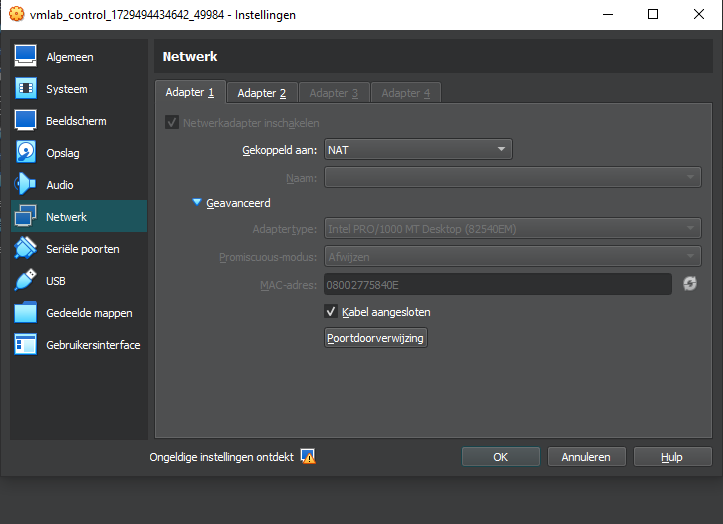
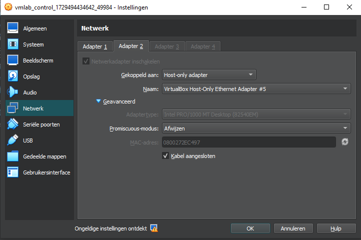
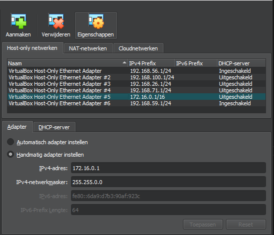
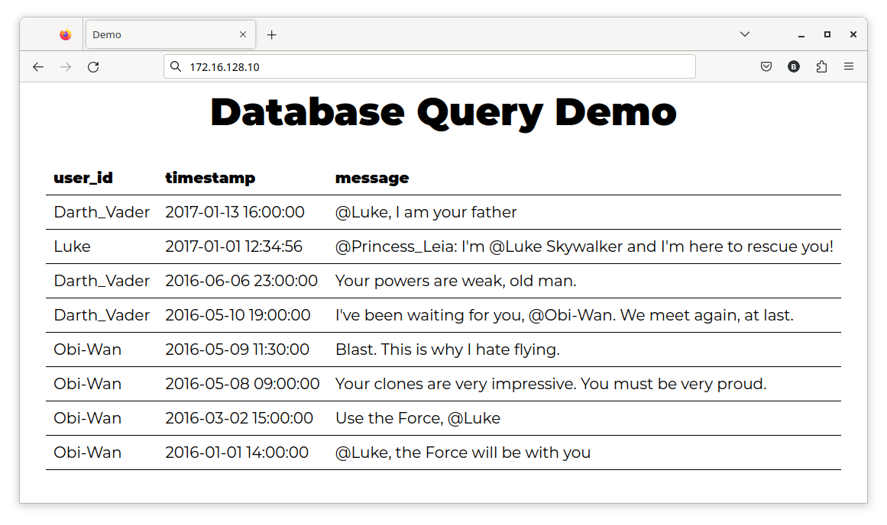

# Lab 2: Configuration Management with Ansible

The goal of this assignment is to set up a complete local network (domain name `infra.lan`, IP 172.16.0.0/16) with some typical services: a web application server (e.g. to host an intranet site), DHCP and DNS. A router will connect the LAN to the Internet. The table below lists the hosts in this network:

| Host name         | Alias  | IP             | Function             |
| :---------------- | :----- | :------------- | :------------------- |
| (physical system) |        | 172.16.0.1     | Your physical pc     |
| r001              | gw     | 172.16.255.254 | Router               |
| srv001            | ns,ns1 | 172.16.128.1   | Primary DNS          |
| srv002            | ns2    | 172.16.128.2   | Secondary DNS        |
| srv003            | dhcp   | 172.16.128.2   | DHCP server          |
| srv004            |        | 172.16.128.4   | Monitoring server    |
| srv100            | www    | 172.16.128.100 | Webserver            |
| ws0001            |        | (DHCP)         | workstation          |
| control           |        | 172.16.128.253 | Ansible control node |

A note on the naming convention used: server VMs with name starting with `srv0` host network infrastructure services. VMs with `srv1` host user-facing services (e.g. webserver).

**Warning:** Sometimes students install the `vagrant-vbguest` plugin that is supposed to automatically check whether VirtualBox Guest additions are up-to-date and to install an update if they aren't. However, the base boxes we use don't have the prerequisites (C-compiler, etc.) so this will fail, resulting in the guest additions no longer working. Biggest problem with this is that the /vagrant directory is no longer mounted. In short: you should never install the `vagrant-vbguest` plugin while working on this assignment

```bash
Benny@FLAB2021 MINGW64 /c/DATA/GIT/IA/infra-labs-24-25-BennyClemmens (main)
$ vagrant plugin list
==> vagrant: A new version of Vagrant is available: 2.4.1 (installed version: 2.3.7)!
==> vagrant: To upgrade visit: https://www.vagrantup.com/downloads.html

vagrant-vyos (1.1.10, global)

Benny@FLAB2021 MINGW64 /c/DATA/GIT/IA/infra-labs-24-25-BennyClemmens (main)
$
```

`So there is no need for 'vagrant plugin uninstall vagrant-vbguest'`

## Learning goals

- You can automate the setup of network services with a configuration management system (Ansible)
- You can install and configure reproducible virtual environments (Infrastructure as Code) with suitable tools for the automation of the entire lifecycle of a VM

## Acceptance criteria

- You should be able to reconstruct the entire setup (except the VMs for the router and workstation) from scratch by executing the command `vagrant up`, without any manual configuration afterwards.
- When connecting a workstation VM to the network, it should:
  - get correct IP settings;
  - be able to view the local website using the hostname, not the IP address (also verify that you have installed a custom SSL certificate);
  - have internet access.
- You should be able to ping the hosts in the network by host name (rather than IP address) from the workstation VM.

## 2.1. Set up the control node

Go to the `vmlab` directory and start the Vagrant environment with `vagrant up`. Currently, the environment consists of a single VM with host name `control`. This is the **Ansible control node**. It is the machine from which you will run Ansible to configure the other VMs in the environment.

```bash
Benny@FLAB2021 MINGW64 /c/DATA/GIT/IA/infra-labs-24-25-BennyClemmens/vmlab (main)
$ vagrant status
Current machine states:

control                   not created (virtualbox)

The environment has not yet been created. Run `vagrant up` to
create the environment. If a machine is not created, only the
default provider will be shown. So if a provider is not listed,
then the machine is not created for that environment.

Benny@FLAB2021 MINGW64 /c/DATA/GIT/IA/infra-labs-24-25-BennyClemmens/vmlab (main)
$ vagrant up
Bringing machine 'control' up with 'virtualbox' provider...
==> control: Importing base box 'bento/almalinux-9'...
==> control: Matching MAC address for NAT networking...
==> control: Checking if box 'bento/almalinux-9' version '202206.14.0' is up to date...
==> control: A newer version of the box 'bento/almalinux-9' for provider 'virtualbox' is
==> control: available! You currently have version '202206.14.0'. The latest is version
==> control: '202407.22.0'. Run `vagrant box update` to update.
==> control: Setting the name of the VM: vmlab_control_1729494434642_49984
==> control: Clearing any previously set network interfaces...
==> control: Preparing network interfaces based on configuration...
    control: Adapter 1: nat
    control: Adapter 2: hostonly
==> control: Forwarding ports...
    control: 22 (guest) => 2222 (host) (adapter 1)
==> control: Running 'pre-boot' VM customizations...
==> control: Booting VM...
==> control: Waiting for machine to boot. This may take a few minutes...
    control: SSH address: 127.0.0.1:2222
    control: SSH username: vagrant
    control: SSH auth method: private key
    control:
    control: Vagrant insecure key detected. Vagrant will automatically replace
    control: this with a newly generated keypair for better security.
    control:
    control: Inserting generated public key within guest...
    control: Removing insecure key from the guest if it's present...
    control: Key inserted! Disconnecting and reconnecting using new SSH key...
==> control: Machine booted and ready!
==> control: Checking for guest additions in VM...
    control: The guest additions on this VM do not match the installed version of
    control: VirtualBox! In most cases this is fine, but in rare cases it can
    control: prevent things such as shared folders from working properly. If you see
    control: shared folder errors, please make sure the guest additions within the
    control: virtual machine match the version of VirtualBox you have installed on
    control: your host and reload your VM.
    control:
    control: Guest Additions Version: 6.1.34
    control: VirtualBox Version: 7.0
==> control: Setting hostname...
==> control: Configuring and enabling network interfaces...
==> control: Mounting shared folders...
    control: /vagrant => C:/DATA/GIT/IA/infra-labs-24-25-BennyClemmens/vmlab
==> control: Running provisioner: shell...
    control: Running: C:/Users/Benny/AppData/Local/Temp/vagrant-shell20241021-9904-reklji.sh
    control: [LOG]  Starting server specific provisioning tasks on host control
    control: [LOG]  Installing Ansible and dependencies
    control: AlmaLinux 9 - AppStream                         3.6 MB/s |  15 MB     00:04
    control: AlmaLinux 9 - BaseOS                            8.3 MB/s |  15 MB     00:01
    control: AlmaLinux 9 - Extras                             33 kB/s |  20 kB     00:00
    control: Dependencies resolved.
    control: ================================================================================
    control:  Package               Architecture    Version            Repository       Size
    control: ================================================================================
    control: Installing:
    control:  epel-release          noarch          9-5.el9            extras           18 k
    control:
    control: Transaction Summary
    control: ================================================================================
    control: Install  1 Package
    control:
    control: Total download size: 18 k
    control: Installed size: 25 k
    control: Downloading Packages:
    control: epel-release-9-5.el9.noarch.rpm                 176 kB/s |  18 kB     00:00
    control: --------------------------------------------------------------------------------
    control: Total                                            34 kB/s |  18 kB     00:00
    control: Running transaction check
    control: Transaction check succeeded.
    control: Running transaction test
    control: Transaction test succeeded.
    control: Running transaction
    control:   Preparing        :                                                        1/1
    control:   Installing       : epel-release-9-5.el9.noarch                            1/1
    control:   Running scriptlet: epel-release-9-5.el9.noarch                            1/1
    control: Many EPEL packages require the CodeReady Builder (CRB) repository.
    control: It is recommended that you run /usr/bin/crb enable to enable the CRB repository.
    control:
    control:   Verifying        : epel-release-9-5.el9.noarch                            1/1
    control:
    control: Installed:
    control:   epel-release-9-5.el9.noarch
    control:
    control: Complete!
    control: Extra Packages for Enterprise Linux 9 - x86_64  5.9 MB/s |  23 MB     00:03
    control: Last metadata expiration check: 0:00:02 ago on Mon 21 Oct 2024 07:08:13 AM UTC.
    control: Package psmisc-23.4-3.el9.x86_64 is already installed.
    control: Package python3-libselinux-3.3-2.el9.x86_64 is already installed.
    control: Package python3-libsemanage-3.3-2.el9.x86_64 is already installed.
    control: Dependencies resolved.
    control: ================================================================================
    control:  Package                     Arch    Version                   Repository  Size
    control: ================================================================================
    control: Installing:
    control:  bash-completion             noarch  1:2.11-5.el9              baseos     291 k
    control:  bats                        noarch  1.8.0-1.el9               epel        54 k
    control:  bind-utils                  x86_64  32:9.16.23-18.el9_4.6     appstream  201 k
    control:  mc                          x86_64  1:4.8.26-5.el9            appstream  1.9 M
    control:  python3-PyMySQL             noarch  0.10.1-6.el9              appstream   93 k
    control:  python3-netaddr             noarch  0.8.0-5.el9               appstream  1.5 M
    control:  python3-pip                 noarch  21.2.3-8.el9              appstream  1.7 M
    control:  sshpass                     x86_64  1.09-4.el9                appstream   27 k
    control:  tree                        x86_64  1.8.0-10.el9              baseos      55 k
    control:  vim-enhanced                x86_64  2:8.2.2637-20.el9_1       appstream  1.8 M
    control: Upgrading:
    control:  libselinux                  x86_64  3.6-1.el9                 baseos      85 k
    control:  libselinux-utils            x86_64  3.6-1.el9                 baseos     161 k
    control:  libsemanage                 x86_64  3.6-1.el9                 baseos     117 k
    control:  libsepol                    x86_64  3.6-1.el9                 baseos     329 k
    control:  python-unversioned-command  noarch  3.9.18-3.el9_4.5          appstream  8.5 k
    control:  python3                     x86_64  3.9.18-3.el9_4.5          baseos      25 k
    control:  python3-libs                x86_64  3.9.18-3.el9_4.5          baseos     7.3 M
    control:  python3-libselinux          x86_64  3.6-1.el9                 appstream  186 k
    control:  python3-libsemanage         x86_64  3.6-1.el9                 appstream   78 k
    control: Installing dependencies:
    control:  bind-libs                   x86_64  32:9.16.23-18.el9_4.6     appstream  1.2 M
    control:  bind-license                noarch  32:9.16.23-18.el9_4.6     appstream   12 k
    control:  fstrm                       x86_64  0.6.1-3.el9               appstream   27 k
    control:  gpm-libs                    x86_64  1.20.7-29.el9             appstream   20 k
    control:  libmaxminddb                x86_64  1.5.2-3.el9               appstream   33 k
    control:  libpkgconf                  x86_64  1.7.3-10.el9              baseos      35 k
    control:  libuv                       x86_64  1:1.42.0-2.el9_4          appstream  146 k
    control:  parallel                    noarch  20240922-2.el9            epel       428 k
    control:  perl-AutoLoader             noarch  5.74-481.el9              appstream   20 k
    control:  perl-B                      x86_64  1.80-481.el9              appstream  178 k
    control:  perl-Carp                   noarch  1.50-460.el9              appstream   29 k
    control:  perl-Class-Struct           noarch  0.66-481.el9              appstream   21 k
    control:  perl-Data-Dumper            x86_64  2.174-462.el9             appstream   55 k
    control:  perl-Digest                 noarch  1.19-4.el9                appstream   25 k
    control:  perl-Digest-MD5             x86_64  2.58-4.el9                appstream   36 k
    control:  perl-Encode                 x86_64  4:3.08-462.el9            appstream  1.7 M
    control:  perl-Errno                  x86_64  1.30-481.el9              appstream   13 k
    control:  perl-Exporter               noarch  5.74-461.el9              appstream   31 k
    control:  perl-Fcntl                  x86_64  1.13-481.el9              appstream   19 k
    control:  perl-File-Basename          noarch  2.85-481.el9              appstream   16 k
    control:  perl-File-Path              noarch  2.18-4.el9                appstream   35 k
    control:  perl-File-Temp              noarch  1:0.231.100-4.el9         appstream   59 k
    control:  perl-File-stat              noarch  1.09-481.el9              appstream   16 k
    control:  perl-FileHandle             noarch  2.03-481.el9              appstream   14 k
    control:  perl-Getopt-Long            noarch  1:2.52-4.el9              appstream   59 k
    control:  perl-Getopt-Std             noarch  1.12-481.el9              appstream   14 k
    control:  perl-HTTP-Tiny              noarch  0.076-462.el9             appstream   53 k
    control:  perl-IO                     x86_64  1.43-481.el9              appstream   85 k
    control:  perl-IO-Socket-IP           noarch  0.41-5.el9                appstream   42 k
    control:  perl-IO-Socket-SSL          noarch  2.073-1.el9               appstream  216 k
    control:  perl-IPC-Open3              noarch  1.21-481.el9              appstream   21 k
    control:  perl-MIME-Base64            x86_64  3.16-4.el9                appstream   30 k
    control:  perl-Mozilla-CA             noarch  20200520-6.el9            appstream   12 k
    control:  perl-Net-SSLeay             x86_64  1.92-2.el9                appstream  364 k
    control:  perl-POSIX                  x86_64  1.94-481.el9              appstream   95 k
    control:  perl-PathTools              x86_64  3.78-461.el9              appstream   85 k
    control:  perl-Pod-Escapes            noarch  1:1.07-460.el9            appstream   20 k
    control:  perl-Pod-Perldoc            noarch  3.28.01-461.el9           appstream   83 k
    control:  perl-Pod-Simple             noarch  1:3.42-4.el9              appstream  215 k
    control:  perl-Pod-Usage              noarch  4:2.01-4.el9              appstream   40 k
    control:  perl-Scalar-List-Utils      x86_64  4:1.56-461.el9            appstream   71 k
    control:  perl-SelectSaver            noarch  1.02-481.el9              appstream   10 k
    control:  perl-Socket                 x86_64  4:2.031-4.el9             appstream   54 k
    control:  perl-Storable               x86_64  1:3.21-460.el9            appstream   95 k
    control:  perl-Symbol                 noarch  1.08-481.el9              appstream   13 k
    control:  perl-Term-ANSIColor         noarch  5.01-461.el9              appstream   48 k
    control:  perl-Term-Cap               noarch  1.17-460.el9              appstream   22 k
    control:  perl-Text-ParseWords        noarch  3.30-460.el9              appstream   16 k
    control:  perl-Text-Tabs+Wrap         noarch  2013.0523-460.el9         appstream   22 k
    control:  perl-Thread-Queue           noarch  3.14-460.el9              appstream   21 k
    control:  perl-Time-Local             noarch  2:1.300-7.el9             appstream   33 k
    control:  perl-URI                    noarch  5.09-3.el9                appstream  108 k
    control:  perl-base                   noarch  2.27-481.el9              appstream   15 k
    control:  perl-constant               noarch  1.33-461.el9              appstream   23 k
    control:  perl-if                     noarch  0.60.800-481.el9          appstream   12 k
    control:  perl-interpreter            x86_64  4:5.32.1-481.el9          appstream   69 k
    control:  perl-libnet                 noarch  3.13-4.el9                appstream  125 k
    control:  perl-libs                   x86_64  4:5.32.1-481.el9          appstream  2.0 M
    control:  perl-mro                    x86_64  1.23-481.el9              appstream   27 k
    control:  perl-overload               noarch  1.31-481.el9              appstream   44 k
    control:  perl-overloading            noarch  0.02-481.el9              appstream   11 k
    control:  perl-parent                 noarch  1:0.238-460.el9           appstream   14 k
    control:  perl-podlators              noarch  1:4.14-460.el9            appstream  111 k
    control:  perl-subs                   noarch  1.03-481.el9              appstream   10 k
    control:  perl-threads                x86_64  1:2.25-460.el9            appstream   57 k
    control:  perl-threads-shared         x86_64  1.61-460.el9              appstream   44 k
    control:  perl-vars                   noarch  1.05-481.el9              appstream   11 k
    control:  pkgconf                     x86_64  1.7.3-10.el9              baseos      40 k
    control:  pkgconf-m4                  noarch  1.7.3-10.el9              baseos      14 k
    control:  pkgconf-pkg-config          x86_64  1.7.3-10.el9              baseos     9.9 k
    control:  protobuf-c                  x86_64  1.3.3-13.el9              baseos      34 k
    control:  python3-cffi                x86_64  1.14.5-5.el9              baseos     241 k
    control:  python3-cryptography        x86_64  36.0.1-4.el9              baseos     1.1 M
    control:  python3-ply                 noarch  3.11-14.el9               baseos     103 k
    control:  python3-pycparser           noarch  2.20-6.el9                baseos     124 k
    control:  vim-common                  x86_64  2:8.2.2637-20.el9_1       appstream  6.6 M
    control:  vim-filesystem              noarch  2:8.2.2637-20.el9_1       baseos      14 k
    control: Installing weak dependencies:
    control:  perl-NDBM_File              x86_64  1.15-481.el9              appstream   21 k
    control:
    control: Transaction Summary
    control: ================================================================================
    control: Install  88 Packages
    control: Upgrade   9 Packages
    control:
    control: Total download size: 33 M
    control: Downloading Packages:
    control: (1/97): bind-license-9.16.23-18.el9_4.6.noarch. 121 kB/s |  12 kB     00:00
    control: (2/97): bind-utils-9.16.23-18.el9_4.6.x86_64.rp 1.1 MB/s | 201 kB     00:00
    control: (3/97): fstrm-0.6.1-3.el9.x86_64.rpm            338 kB/s |  27 kB     00:00
    control: (4/97): libmaxminddb-1.5.2-3.el9.x86_64.rpm     550 kB/s |  33 kB     00:00
    control: (5/97): gpm-libs-1.20.7-29.el9.x86_64.rpm       282 kB/s |  20 kB     00:00
    control: (6/97): bind-libs-9.16.23-18.el9_4.6.x86_64.rpm 4.2 MB/s | 1.2 MB     00:00
    control: (7/97): libuv-1.42.0-2.el9_4.x86_64.rpm         2.0 MB/s | 146 kB     00:00
    control: (8/97): perl-AutoLoader-5.74-481.el9.noarch.rpm 408 kB/s |  20 kB     00:00
    control: (9/97): perl-B-1.80-481.el9.x86_64.rpm          3.3 MB/s | 178 kB     00:00
    control: (10/97): perl-Carp-1.50-460.el9.noarch.rpm      420 kB/s |  29 kB     00:00
    control: (11/97): perl-Class-Struct-0.66-481.el9.noarch. 433 kB/s |  21 kB     00:00
    control: (12/97): perl-Data-Dumper-2.174-462.el9.x86_64. 1.1 MB/s |  55 kB     00:00
    control: (13/97): perl-Digest-1.19-4.el9.noarch.rpm      530 kB/s |  25 kB     00:00
    control: (14/97): mc-4.8.26-5.el9.x86_64.rpm             8.3 MB/s | 1.9 MB     00:00
    control: (15/97): perl-Digest-MD5-2.58-4.el9.x86_64.rpm  1.1 MB/s |  36 kB     00:00
    control: (16/97): perl-Exporter-5.74-461.el9.noarch.rpm  830 kB/s |  31 kB     00:00
    control: (17/97): perl-Errno-1.30-481.el9.x86_64.rpm     176 kB/s |  13 kB     00:00
    control: (18/97): perl-Fcntl-1.13-481.el9.x86_64.rpm     481 kB/s |  19 kB     00:00
    control: (19/97): perl-File-Basename-2.85-481.el9.noarch 427 kB/s |  16 kB     00:00
    control: (20/97): perl-File-Path-2.18-4.el9.noarch.rpm   551 kB/s |  35 kB     00:00
    control: (21/97): perl-File-Temp-0.231.100-4.el9.noarch. 1.2 MB/s |  59 kB     00:00
    control: (22/97): perl-File-stat-1.09-481.el9.noarch.rpm 219 kB/s |  16 kB     00:00
    control: (23/97): perl-FileHandle-2.03-481.el9.noarch.rp 228 kB/s |  14 kB     00:00
    control: (24/97): perl-Encode-3.08-462.el9.x86_64.rpm    6.3 MB/s | 1.7 MB     00:00
    control: (25/97): perl-Getopt-Long-2.52-4.el9.noarch.rpm 1.8 MB/s |  59 kB     00:00
    control: (26/97): perl-Getopt-Std-1.12-481.el9.noarch.rp 369 kB/s |  14 kB     00:00
    control: (27/97): perl-HTTP-Tiny-0.076-462.el9.noarch.rp 1.1 MB/s |  53 kB     00:00
    control: (28/97): perl-IO-1.43-481.el9.x86_64.rpm        1.9 MB/s |  85 kB     00:00
    control: (29/97): perl-IO-Socket-IP-0.41-5.el9.noarch.rp 939 kB/s |  42 kB     00:00
    control: (30/97): perl-IO-Socket-SSL-2.073-1.el9.noarch. 4.4 MB/s | 216 kB     00:00
    control: (31/97): perl-IPC-Open3-1.21-481.el9.noarch.rpm 452 kB/s |  21 kB     00:00
    control: (32/97): perl-MIME-Base64-3.16-4.el9.x86_64.rpm 668 kB/s |  30 kB     00:00
    control: (33/97): perl-NDBM_File-1.15-481.el9.x86_64.rpm 817 kB/s |  21 kB     00:00
    control: (34/97): perl-Mozilla-CA-20200520-6.el9.noarch. 344 kB/s |  12 kB     00:00
    control: (35/97): perl-Net-SSLeay-1.92-2.el9.x86_64.rpm  5.5 MB/s | 364 kB     00:00
    control: (36/97): perl-POSIX-1.94-481.el9.x86_64.rpm     2.0 MB/s |  95 kB     00:00
    control: (37/97): perl-PathTools-3.78-461.el9.x86_64.rpm 1.6 MB/s |  85 kB     00:00
    control: (38/97): perl-Pod-Escapes-1.07-460.el9.noarch.r 405 kB/s |  20 kB     00:00
    control: (39/97): perl-Pod-Perldoc-3.28.01-461.el9.noarc 1.6 MB/s |  83 kB     00:00
    control: (40/97): perl-Pod-Simple-3.42-4.el9.noarch.rpm  4.5 MB/s | 215 kB     00:00
    control: (41/97): perl-Pod-Usage-2.01-4.el9.noarch.rpm   1.0 MB/s |  40 kB     00:00
    control: (42/97): perl-Scalar-List-Utils-1.56-461.el9.x8 1.6 MB/s |  71 kB     00:00
    control: (43/97): perl-SelectSaver-1.02-481.el9.noarch.r 259 kB/s |  10 kB     00:00
    control: (44/97): perl-Socket-2.031-4.el9.x86_64.rpm     1.7 MB/s |  54 kB     00:00
    control: (45/97): perl-Symbol-1.08-481.el9.noarch.rpm    458 kB/s |  13 kB     00:00
    control: (46/97): perl-Storable-3.21-460.el9.x86_64.rpm  1.6 MB/s |  95 kB     00:00
    control: (47/97): perl-Term-ANSIColor-5.01-461.el9.noarc 1.2 MB/s |  48 kB     00:00
    control: (48/97): perl-Term-Cap-1.17-460.el9.noarch.rpm  623 kB/s |  22 kB     00:00
    control: (49/97): perl-Text-ParseWords-3.30-460.el9.noar 419 kB/s |  16 kB     00:00
    control: (50/97): perl-Text-Tabs+Wrap-2013.0523-460.el9. 580 kB/s |  22 kB     00:00
    control: (51/97): perl-Thread-Queue-3.14-460.el9.noarch. 551 kB/s |  21 kB     00:00
    control: (52/97): perl-Time-Local-1.300-7.el9.noarch.rpm 969 kB/s |  33 kB     00:00
    control: (53/97): perl-base-2.27-481.el9.noarch.rpm      357 kB/s |  15 kB     00:00
    control: (54/97): perl-constant-1.33-461.el9.noarch.rpm  807 kB/s |  23 kB     00:00
    control: (55/97): perl-URI-5.09-3.el9.noarch.rpm         1.9 MB/s | 108 kB     00:00
    control: (56/97): perl-if-0.60.800-481.el9.noarch.rpm    497 kB/s |  12 kB     00:00
    control: (57/97): perl-interpreter-5.32.1-481.el9.x86_64 1.3 MB/s |  69 kB     00:00
    control: (58/97): perl-libnet-3.13-4.el9.noarch.rpm      2.3 MB/s | 125 kB     00:00
    control: (59/97): perl-mro-1.23-481.el9.x86_64.rpm       871 kB/s |  27 kB     00:00
    control: (60/97): perl-overload-1.31-481.el9.noarch.rpm  914 kB/s |  44 kB     00:00
    control: (61/97): perl-overloading-0.02-481.el9.noarch.r 208 kB/s |  11 kB     00:00
    control: (62/97): perl-parent-0.238-460.el9.noarch.rpm   302 kB/s |  14 kB     00:00
    control: (63/97): perl-podlators-4.14-460.el9.noarch.rpm 2.4 MB/s | 111 kB     00:00
    control: (64/97): perl-subs-1.03-481.el9.noarch.rpm      217 kB/s |  10 kB     00:00
    control: (65/97): perl-threads-shared-1.61-460.el9.x86_6 1.0 MB/s |  44 kB     00:00
    control: (66/97): perl-threads-2.25-460.el9.x86_64.rpm   870 kB/s |  57 kB     00:00
    control: (67/97): perl-vars-1.05-481.el9.noarch.rpm      342 kB/s |  11 kB     00:00
    control: (68/97): perl-libs-5.32.1-481.el9.x86_64.rpm    7.2 MB/s | 2.0 MB     00:00
    control: (69/97): python3-PyMySQL-0.10.1-6.el9.noarch.rp 1.9 MB/s |  93 kB     00:00
    control: (70/97): sshpass-1.09-4.el9.x86_64.rpm          233 kB/s |  27 kB     00:00
    control: (71/97): python3-netaddr-0.8.0-5.el9.noarch.rpm 7.6 MB/s | 1.5 MB     00:00
    control: (72/97): python3-pip-21.2.3-8.el9.noarch.rpm    3.4 MB/s | 1.7 MB     00:00
    control: (73/97): vim-enhanced-8.2.2637-20.el9_1.x86_64. 4.8 MB/s | 1.8 MB     00:00
    control: (74/97): libpkgconf-1.7.3-10.el9.x86_64.rpm     688 kB/s |  35 kB     00:00
    control: (75/97): bash-completion-2.11-5.el9.noarch.rpm  2.7 MB/s | 291 kB     00:00
    control: (76/97): pkgconf-1.7.3-10.el9.x86_64.rpm        658 kB/s |  40 kB     00:00
    control: (77/97): pkgconf-m4-1.7.3-10.el9.noarch.rpm     207 kB/s |  14 kB     00:00
    control: (78/97): pkgconf-pkg-config-1.7.3-10.el9.x86_64 200 kB/s | 9.9 kB     00:00
    control: (79/97): protobuf-c-1.3.3-13.el9.x86_64.rpm     592 kB/s |  34 kB     00:00
    control: (80/97): python3-cffi-1.14.5-5.el9.x86_64.rpm   3.7 MB/s | 241 kB     00:00
    control: (81/97): python3-ply-3.11-14.el9.noarch.rpm     1.4 MB/s | 103 kB     00:00
    control: (82/97): python3-pycparser-2.20-6.el9.noarch.rp 2.4 MB/s | 124 kB     00:00
    control: (83/97): tree-1.8.0-10.el9.x86_64.rpm           753 kB/s |  55 kB     00:00
    control: (84/97): python3-cryptography-36.0.1-4.el9.x86_ 4.1 MB/s | 1.1 MB     00:00
    control: (85/97): vim-filesystem-8.2.2637-20.el9_1.noarc 194 kB/s |  14 kB     00:00
    control: (86/97): vim-common-8.2.2637-20.el9_1.x86_64.rp 5.4 MB/s | 6.6 MB     00:01
    control: (87/97): bats-1.8.0-1.el9.noarch.rpm            163 kB/s |  54 kB     00:00
    control: (88/97): python-unversioned-command-3.9.18-3.el 325 kB/s | 8.5 kB     00:00
    control: (89/97): python3-libselinux-3.6-1.el9.x86_64.rp 3.5 MB/s | 186 kB     00:00
    control: (90/97): python3-libsemanage-3.6-1.el9.x86_64.r 1.9 MB/s |  78 kB     00:00
    control: (91/97): libselinux-3.6-1.el9.x86_64.rpm        1.8 MB/s |  85 kB     00:00
    control: (92/97): libselinux-utils-3.6-1.el9.x86_64.rpm  3.0 MB/s | 161 kB     00:00
    control: (93/97): libsemanage-3.6-1.el9.x86_64.rpm       2.0 MB/s | 117 kB     00:00
    control: (94/97): libsepol-3.6-1.el9.x86_64.rpm          4.7 MB/s | 329 kB     00:00
    control: (95/97): python3-3.9.18-3.el9_4.5.x86_64.rpm    812 kB/s |  25 kB     00:00
    control: (96/97): parallel-20240922-2.el9.noarch.rpm     769 kB/s | 428 kB     00:00
    control: (97/97): python3-libs-3.9.18-3.el9_4.5.x86_64.r 9.0 MB/s | 7.3 MB     00:00
    control: --------------------------------------------------------------------------------
    control: Total                                           6.6 MB/s |  33 MB     00:04
    control: Extra Packages for Enterprise Linux 9 - x86_64  1.4 MB/s | 1.6 kB     00:00
    control: Importing GPG key 0x3228467C:
    control:  Userid     : "Fedora (epel9) <epel@fedoraproject.org>"
    control:  Fingerprint: FF8A D134 4597 106E CE81 3B91 8A38 72BF 3228 467C
    control:  From       : /etc/pki/rpm-gpg/RPM-GPG-KEY-EPEL-9
    control: Key imported successfully
    control: Running transaction check
    control: Transaction check succeeded.
    control: Running transaction test
    control: Transaction test succeeded.
    control: Running transaction
    control:   Preparing        :                                                        1/1
    control:   Upgrading        : libsepol-3.6-1.el9.x86_64                            1/106
    control:   Upgrading        : libselinux-3.6-1.el9.x86_64                          2/106
    control:   Running scriptlet: libselinux-3.6-1.el9.x86_64                          2/106
    control:   Installing       : protobuf-c-1.3.3-13.el9.x86_64                       3/106
    control:   Installing       : gpm-libs-1.20.7-29.el9.x86_64                        4/106
    control:   Upgrading        : libsemanage-3.6-1.el9.x86_64                         5/106
    control:   Upgrading        : python3-libs-3.9.18-3.el9_4.5.x86_64                 6/106
    control:   Upgrading        : python3-3.9.18-3.el9_4.5.x86_64                      7/106
    control:   Upgrading        : python-unversioned-command-3.9.18-3.el9_4.5.noar     8/106
    control:   Installing       : python3-ply-3.11-14.el9.noarch                       9/106
    control:   Installing       : python3-pycparser-2.20-6.el9.noarch                 10/106
    control:   Installing       : python3-cffi-1.14.5-5.el9.x86_64                    11/106
    control:   Installing       : python3-cryptography-36.0.1-4.el9.x86_64            12/106
    control:   Upgrading        : python3-libselinux-3.6-1.el9.x86_64                 13/106
    control:   Installing       : perl-Digest-1.19-4.el9.noarch                       14/106
    control:   Installing       : perl-Digest-MD5-2.58-4.el9.x86_64                   15/106
    control:   Installing       : perl-B-1.80-481.el9.x86_64                          16/106
    control:   Installing       : perl-FileHandle-2.03-481.el9.noarch                 17/106
    control:   Installing       : perl-Data-Dumper-2.174-462.el9.x86_64               18/106
    control:   Installing       : perl-libnet-3.13-4.el9.noarch                       19/106
    control:   Installing       : perl-base-2.27-481.el9.noarch                       20/106
    control:   Installing       : perl-URI-5.09-3.el9.noarch                          21/106
    control:   Installing       : perl-AutoLoader-5.74-481.el9.noarch                 22/106
    control:   Installing       : perl-Mozilla-CA-20200520-6.el9.noarch               23/106
    control:   Installing       : perl-if-0.60.800-481.el9.noarch                     24/106
    control:   Installing       : perl-IO-Socket-IP-0.41-5.el9.noarch                 25/106
    control:   Installing       : perl-Time-Local-2:1.300-7.el9.noarch                26/106
    control:   Installing       : perl-File-Path-2.18-4.el9.noarch                    27/106
    control:   Installing       : perl-Pod-Escapes-1:1.07-460.el9.noarch              28/106
    control:   Installing       : perl-Text-Tabs+Wrap-2013.0523-460.el9.noarch        29/106
    control:   Installing       : perl-IO-Socket-SSL-2.073-1.el9.noarch               30/106
    control:   Installing       : perl-Net-SSLeay-1.92-2.el9.x86_64                   31/106
    control:   Installing       : perl-Class-Struct-0.66-481.el9.noarch               32/106
    control:   Installing       : perl-POSIX-1.94-481.el9.x86_64                      33/106
    control:   Installing       : perl-Term-ANSIColor-5.01-461.el9.noarch             34/106
    control:   Installing       : perl-IPC-Open3-1.21-481.el9.noarch                  35/106
    control:   Installing       : perl-subs-1.03-481.el9.noarch                       36/106
    control:   Installing       : perl-File-Temp-1:0.231.100-4.el9.noarch             37/106
    control:   Installing       : perl-Term-Cap-1.17-460.el9.noarch                   38/106
    control:   Installing       : perl-Pod-Simple-1:3.42-4.el9.noarch                 39/106
    control:   Installing       : perl-HTTP-Tiny-0.076-462.el9.noarch                 40/106
    control:   Installing       : perl-Socket-4:2.031-4.el9.x86_64                    41/106
    control:   Installing       : perl-SelectSaver-1.02-481.el9.noarch                42/106
    control:   Installing       : perl-Symbol-1.08-481.el9.noarch                     43/106
    control:   Installing       : perl-File-stat-1.09-481.el9.noarch                  44/106
    control:   Installing       : perl-podlators-1:4.14-460.el9.noarch                45/106
    control:   Installing       : perl-Pod-Perldoc-3.28.01-461.el9.noarch             46/106
    control:   Installing       : perl-Fcntl-1.13-481.el9.x86_64                      47/106
    control:   Installing       : perl-Text-ParseWords-3.30-460.el9.noarch            48/106
    control:   Installing       : perl-mro-1.23-481.el9.x86_64                        49/106
    control:   Installing       : perl-IO-1.43-481.el9.x86_64                         50/106
    control:   Installing       : perl-overloading-0.02-481.el9.noarch                51/106
    control:   Installing       : perl-Pod-Usage-4:2.01-4.el9.noarch                  52/106
    control:   Installing       : perl-Errno-1.30-481.el9.x86_64                      53/106
    control:   Installing       : perl-File-Basename-2.85-481.el9.noarch              54/106
    control:   Installing       : perl-Getopt-Std-1.12-481.el9.noarch                 55/106
    control:   Installing       : perl-MIME-Base64-3.16-4.el9.x86_64                  56/106
    control:   Installing       : perl-Scalar-List-Utils-4:1.56-461.el9.x86_64        57/106
    control:   Installing       : perl-constant-1.33-461.el9.noarch                   58/106
    control:   Installing       : perl-Storable-1:3.21-460.el9.x86_64                 59/106
    control:   Installing       : perl-overload-1.31-481.el9.noarch                   60/106
    control:   Installing       : perl-parent-1:0.238-460.el9.noarch                  61/106
    control:   Installing       : perl-vars-1.05-481.el9.noarch                       62/106
    control:   Installing       : perl-Getopt-Long-1:2.52-4.el9.noarch                63/106
    control:   Installing       : perl-Carp-1.50-460.el9.noarch                       64/106
    control:   Installing       : perl-Exporter-5.74-461.el9.noarch                   65/106
    control:   Installing       : perl-NDBM_File-1.15-481.el9.x86_64                  66/106
    control:   Installing       : perl-PathTools-3.78-461.el9.x86_64                  67/106
    control:   Installing       : perl-Encode-4:3.08-462.el9.x86_64                   68/106
    control:   Installing       : perl-libs-4:5.32.1-481.el9.x86_64                   69/106
    control:   Installing       : perl-interpreter-4:5.32.1-481.el9.x86_64            70/106
    control:   Installing       : perl-threads-1:2.25-460.el9.x86_64                  71/106
    control:   Installing       : perl-threads-shared-1.61-460.el9.x86_64             72/106
    control:   Installing       : perl-Thread-Queue-3.14-460.el9.noarch               73/106
    control:   Installing       : parallel-20240922-2.el9.noarch                      74/106
    control:   Installing       : vim-filesystem-2:8.2.2637-20.el9_1.noarch           75/106
    control:   Installing       : vim-common-2:8.2.2637-20.el9_1.x86_64               76/106
    control:   Installing       : pkgconf-m4-1.7.3-10.el9.noarch                      77/106
    control:   Installing       : libpkgconf-1.7.3-10.el9.x86_64                      78/106
    control:   Installing       : pkgconf-1.7.3-10.el9.x86_64                         79/106
    control:   Installing       : pkgconf-pkg-config-1.7.3-10.el9.x86_64              80/106
    control:   Installing       : libuv-1:1.42.0-2.el9_4.x86_64                       81/106
    control:   Installing       : libmaxminddb-1.5.2-3.el9.x86_64                     82/106
    control:   Installing       : fstrm-0.6.1-3.el9.x86_64                            83/106
    control:   Installing       : bind-license-32:9.16.23-18.el9_4.6.noarch           84/106
    control:   Installing       : bind-libs-32:9.16.23-18.el9_4.6.x86_64              85/106
    control:   Installing       : bind-utils-32:9.16.23-18.el9_4.6.x86_64             86/106
    control:   Installing       : bash-completion-1:2.11-5.el9.noarch                 87/106
    control:   Installing       : vim-enhanced-2:8.2.2637-20.el9_1.x86_64             88/106
    control:   Installing       : bats-1.8.0-1.el9.noarch                             89/106
    control:   Installing       : mc-1:4.8.26-5.el9.x86_64                            90/106
    control:   Upgrading        : python3-libsemanage-3.6-1.el9.x86_64                91/106
    control:   Installing       : python3-PyMySQL-0.10.1-6.el9.noarch                 92/106
    control:   Installing       : python3-netaddr-0.8.0-5.el9.noarch                  93/106
    control:   Installing       : python3-pip-21.2.3-8.el9.noarch                     94/106
    control:   Upgrading        : libselinux-utils-3.6-1.el9.x86_64                   95/106
    control:   Installing       : tree-1.8.0-10.el9.x86_64                            96/106
    control:   Installing       : sshpass-1.09-4.el9.x86_64                           97/106
    control:   Cleanup          : python3-libsemanage-3.3-2.el9.x86_64                98/106
    control:   Cleanup          : libsemanage-3.3-2.el9.x86_64                        99/106
    control:   Cleanup          : python3-libselinux-3.3-2.el9.x86_64                100/106
    control:   Cleanup          : libselinux-utils-3.3-2.el9.x86_64                  101/106
    control:   Cleanup          : python3-3.9.10-2.el9.x86_64                        102/106
    control:   Cleanup          : python-unversioned-command-3.9.10-2.el9.noarch     103/106
    control:   Cleanup          : libselinux-3.3-2.el9.x86_64                        104/106
    control:   Cleanup          : libsepol-3.3-2.el9.x86_64                          105/106
    control:   Cleanup          : python3-libs-3.9.10-2.el9.x86_64                   106/106
    control:   Running scriptlet: python3-libs-3.9.10-2.el9.x86_64                   106/106
    control:   Verifying        : bind-libs-32:9.16.23-18.el9_4.6.x86_64               1/106
    control:   Verifying        : bind-license-32:9.16.23-18.el9_4.6.noarch            2/106
    control:   Verifying        : bind-utils-32:9.16.23-18.el9_4.6.x86_64              3/106
    control:   Verifying        : fstrm-0.6.1-3.el9.x86_64                             4/106
    control:   Verifying        : gpm-libs-1.20.7-29.el9.x86_64                        5/106
    control:   Verifying        : libmaxminddb-1.5.2-3.el9.x86_64                      6/106
    control:   Verifying        : libuv-1:1.42.0-2.el9_4.x86_64                        7/106
    control:   Verifying        : mc-1:4.8.26-5.el9.x86_64                             8/106
    control:   Verifying        : perl-AutoLoader-5.74-481.el9.noarch                  9/106
    control:   Verifying        : perl-B-1.80-481.el9.x86_64                          10/106
    control:   Verifying        : perl-Carp-1.50-460.el9.noarch                       11/106
    control:   Verifying        : perl-Class-Struct-0.66-481.el9.noarch               12/106
    control:   Verifying        : perl-Data-Dumper-2.174-462.el9.x86_64               13/106
    control:   Verifying        : perl-Digest-1.19-4.el9.noarch                       14/106
    control:   Verifying        : perl-Digest-MD5-2.58-4.el9.x86_64                   15/106
    control:   Verifying        : perl-Encode-4:3.08-462.el9.x86_64                   16/106
    control:   Verifying        : perl-Errno-1.30-481.el9.x86_64                      17/106
    control:   Verifying        : perl-Exporter-5.74-461.el9.noarch                   18/106
    control:   Verifying        : perl-Fcntl-1.13-481.el9.x86_64                      19/106
    control:   Verifying        : perl-File-Basename-2.85-481.el9.noarch              20/106
    control:   Verifying        : perl-File-Path-2.18-4.el9.noarch                    21/106
    control:   Verifying        : perl-File-Temp-1:0.231.100-4.el9.noarch             22/106
    control:   Verifying        : perl-File-stat-1.09-481.el9.noarch                  23/106
    control:   Verifying        : perl-FileHandle-2.03-481.el9.noarch                 24/106
    control:   Verifying        : perl-Getopt-Long-1:2.52-4.el9.noarch                25/106
    control:   Verifying        : perl-Getopt-Std-1.12-481.el9.noarch                 26/106
    control:   Verifying        : perl-HTTP-Tiny-0.076-462.el9.noarch                 27/106
    control:   Verifying        : perl-IO-1.43-481.el9.x86_64                         28/106
    control:   Verifying        : perl-IO-Socket-IP-0.41-5.el9.noarch                 29/106
    control:   Verifying        : perl-IO-Socket-SSL-2.073-1.el9.noarch               30/106
    control:   Verifying        : perl-IPC-Open3-1.21-481.el9.noarch                  31/106
    control:   Verifying        : perl-MIME-Base64-3.16-4.el9.x86_64                  32/106
    control:   Verifying        : perl-Mozilla-CA-20200520-6.el9.noarch               33/106
    control:   Verifying        : perl-NDBM_File-1.15-481.el9.x86_64                  34/106
    control:   Verifying        : perl-Net-SSLeay-1.92-2.el9.x86_64                   35/106
    control:   Verifying        : perl-POSIX-1.94-481.el9.x86_64                      36/106
    control:   Verifying        : perl-PathTools-3.78-461.el9.x86_64                  37/106
    control:   Verifying        : perl-Pod-Escapes-1:1.07-460.el9.noarch              38/106
    control:   Verifying        : perl-Pod-Perldoc-3.28.01-461.el9.noarch             39/106
    control:   Verifying        : perl-Pod-Simple-1:3.42-4.el9.noarch                 40/106
    control:   Verifying        : perl-Pod-Usage-4:2.01-4.el9.noarch                  41/106
    control:   Verifying        : perl-Scalar-List-Utils-4:1.56-461.el9.x86_64        42/106
    control:   Verifying        : perl-SelectSaver-1.02-481.el9.noarch                43/106
    control:   Verifying        : perl-Socket-4:2.031-4.el9.x86_64                    44/106
    control:   Verifying        : perl-Storable-1:3.21-460.el9.x86_64                 45/106
    control:   Verifying        : perl-Symbol-1.08-481.el9.noarch                     46/106
    control:   Verifying        : perl-Term-ANSIColor-5.01-461.el9.noarch             47/106
    control:   Verifying        : perl-Term-Cap-1.17-460.el9.noarch                   48/106
    control:   Verifying        : perl-Text-ParseWords-3.30-460.el9.noarch            49/106
    control:   Verifying        : perl-Text-Tabs+Wrap-2013.0523-460.el9.noarch        50/106
    control:   Verifying        : perl-Thread-Queue-3.14-460.el9.noarch               51/106
    control:   Verifying        : perl-Time-Local-2:1.300-7.el9.noarch                52/106
    control:   Verifying        : perl-URI-5.09-3.el9.noarch                          53/106
    control:   Verifying        : perl-base-2.27-481.el9.noarch                       54/106
    control:   Verifying        : perl-constant-1.33-461.el9.noarch                   55/106
    control:   Verifying        : perl-if-0.60.800-481.el9.noarch                     56/106
    control:   Verifying        : perl-interpreter-4:5.32.1-481.el9.x86_64            57/106
    control:   Verifying        : perl-libnet-3.13-4.el9.noarch                       58/106
    control:   Verifying        : perl-libs-4:5.32.1-481.el9.x86_64                   59/106
    control:   Verifying        : perl-mro-1.23-481.el9.x86_64                        60/106
    control:   Verifying        : perl-overload-1.31-481.el9.noarch                   61/106
    control:   Verifying        : perl-overloading-0.02-481.el9.noarch                62/106
    control:   Verifying        : perl-parent-1:0.238-460.el9.noarch                  63/106
    control:   Verifying        : perl-podlators-1:4.14-460.el9.noarch                64/106
    control:   Verifying        : perl-subs-1.03-481.el9.noarch                       65/106
    control:   Verifying        : perl-threads-1:2.25-460.el9.x86_64                  66/106
    control:   Verifying        : perl-threads-shared-1.61-460.el9.x86_64             67/106
    control:   Verifying        : perl-vars-1.05-481.el9.noarch                       68/106
    control:   Verifying        : python3-PyMySQL-0.10.1-6.el9.noarch                 69/106
    control:   Verifying        : python3-netaddr-0.8.0-5.el9.noarch                  70/106
    control:   Verifying        : python3-pip-21.2.3-8.el9.noarch                     71/106
    control:   Verifying        : sshpass-1.09-4.el9.x86_64                           72/106
    control:   Verifying        : vim-common-2:8.2.2637-20.el9_1.x86_64               73/106
    control:   Verifying        : vim-enhanced-2:8.2.2637-20.el9_1.x86_64             74/106
    control:   Verifying        : bash-completion-1:2.11-5.el9.noarch                 75/106
    control:   Verifying        : libpkgconf-1.7.3-10.el9.x86_64                      76/106
    control:   Verifying        : pkgconf-1.7.3-10.el9.x86_64                         77/106
    control:   Verifying        : pkgconf-m4-1.7.3-10.el9.noarch                      78/106
    control:   Verifying        : pkgconf-pkg-config-1.7.3-10.el9.x86_64              79/106
    control:   Verifying        : protobuf-c-1.3.3-13.el9.x86_64                      80/106
    control:   Verifying        : python3-cffi-1.14.5-5.el9.x86_64                    81/106
    control:   Verifying        : python3-cryptography-36.0.1-4.el9.x86_64            82/106
    control:   Verifying        : python3-ply-3.11-14.el9.noarch                      83/106
    control:   Verifying        : python3-pycparser-2.20-6.el9.noarch                 84/106
    control:   Verifying        : tree-1.8.0-10.el9.x86_64                            85/106
    control:   Verifying        : vim-filesystem-2:8.2.2637-20.el9_1.noarch           86/106
    control:   Verifying        : bats-1.8.0-1.el9.noarch                             87/106
    control:   Verifying        : parallel-20240922-2.el9.noarch                      88/106
    control:   Verifying        : python-unversioned-command-3.9.18-3.el9_4.5.noar    89/106
    control:   Verifying        : python-unversioned-command-3.9.10-2.el9.noarch      90/106
    control:   Verifying        : python3-libselinux-3.6-1.el9.x86_64                 91/106
    control:   Verifying        : python3-libselinux-3.3-2.el9.x86_64                 92/106
    control:   Verifying        : python3-libsemanage-3.6-1.el9.x86_64                93/106
    control:   Verifying        : python3-libsemanage-3.3-2.el9.x86_64                94/106
    control:   Verifying        : libselinux-3.6-1.el9.x86_64                         95/106
    control:   Verifying        : libselinux-3.3-2.el9.x86_64                         96/106
    control:   Verifying        : libselinux-utils-3.6-1.el9.x86_64                   97/106
    control:   Verifying        : libselinux-utils-3.3-2.el9.x86_64                   98/106
    control:   Verifying        : libsemanage-3.6-1.el9.x86_64                        99/106
    control:   Verifying        : libsemanage-3.3-2.el9.x86_64                       100/106
    control:   Verifying        : libsepol-3.6-1.el9.x86_64                          101/106
    control:   Verifying        : libsepol-3.3-2.el9.x86_64                          102/106
    control:   Verifying        : python3-3.9.18-3.el9_4.5.x86_64                    103/106
    control:   Verifying        : python3-3.9.10-2.el9.x86_64                        104/106
    control:   Verifying        : python3-libs-3.9.18-3.el9_4.5.x86_64               105/106
    control:   Verifying        : python3-libs-3.9.10-2.el9.x86_64                   106/106
    control:
    control: Upgraded:
    control:   libselinux-3.6-1.el9.x86_64
    control:   libselinux-utils-3.6-1.el9.x86_64
    control:   libsemanage-3.6-1.el9.x86_64
    control:   libsepol-3.6-1.el9.x86_64
    control:   python-unversioned-command-3.9.18-3.el9_4.5.noarch
    control:   python3-3.9.18-3.el9_4.5.x86_64
    control:   python3-libs-3.9.18-3.el9_4.5.x86_64
    control:   python3-libselinux-3.6-1.el9.x86_64
    control:   python3-libsemanage-3.6-1.el9.x86_64
    control: Installed:
    control:   bash-completion-1:2.11-5.el9.noarch
    control:   bats-1.8.0-1.el9.noarch
    control:   bind-libs-32:9.16.23-18.el9_4.6.x86_64
    control:   bind-license-32:9.16.23-18.el9_4.6.noarch
    control:   bind-utils-32:9.16.23-18.el9_4.6.x86_64
    control:   fstrm-0.6.1-3.el9.x86_64
    control:   gpm-libs-1.20.7-29.el9.x86_64
    control:   libmaxminddb-1.5.2-3.el9.x86_64
    control:   libpkgconf-1.7.3-10.el9.x86_64
    control:   libuv-1:1.42.0-2.el9_4.x86_64
    control:   mc-1:4.8.26-5.el9.x86_64
    control:   parallel-20240922-2.el9.noarch
    control:   perl-AutoLoader-5.74-481.el9.noarch
    control:   perl-B-1.80-481.el9.x86_64
    control:   perl-Carp-1.50-460.el9.noarch
    control:   perl-Class-Struct-0.66-481.el9.noarch
    control:   perl-Data-Dumper-2.174-462.el9.x86_64
    control:   perl-Digest-1.19-4.el9.noarch
    control:   perl-Digest-MD5-2.58-4.el9.x86_64
    control:   perl-Encode-4:3.08-462.el9.x86_64
    control:   perl-Errno-1.30-481.el9.x86_64
    control:   perl-Exporter-5.74-461.el9.noarch
    control:   perl-Fcntl-1.13-481.el9.x86_64
    control:   perl-File-Basename-2.85-481.el9.noarch
    control:   perl-File-Path-2.18-4.el9.noarch
    control:   perl-File-Temp-1:0.231.100-4.el9.noarch
    control:   perl-File-stat-1.09-481.el9.noarch
    control:   perl-FileHandle-2.03-481.el9.noarch
    control:   perl-Getopt-Long-1:2.52-4.el9.noarch
    control:   perl-Getopt-Std-1.12-481.el9.noarch
    control:   perl-HTTP-Tiny-0.076-462.el9.noarch
    control:   perl-IO-1.43-481.el9.x86_64
    control:   perl-IO-Socket-IP-0.41-5.el9.noarch
    control:   perl-IO-Socket-SSL-2.073-1.el9.noarch
    control:   perl-IPC-Open3-1.21-481.el9.noarch
    control:   perl-MIME-Base64-3.16-4.el9.x86_64
    control:   perl-Mozilla-CA-20200520-6.el9.noarch
    control:   perl-NDBM_File-1.15-481.el9.x86_64
    control:   perl-Net-SSLeay-1.92-2.el9.x86_64
    control:   perl-POSIX-1.94-481.el9.x86_64
    control:   perl-PathTools-3.78-461.el9.x86_64
    control:   perl-Pod-Escapes-1:1.07-460.el9.noarch
    control:   perl-Pod-Perldoc-3.28.01-461.el9.noarch
    control:   perl-Pod-Simple-1:3.42-4.el9.noarch
    control:   perl-Pod-Usage-4:2.01-4.el9.noarch
    control:   perl-Scalar-List-Utils-4:1.56-461.el9.x86_64
    control:   perl-SelectSaver-1.02-481.el9.noarch
    control:   perl-Socket-4:2.031-4.el9.x86_64
    control:   perl-Storable-1:3.21-460.el9.x86_64
    control:   perl-Symbol-1.08-481.el9.noarch
    control:   perl-Term-ANSIColor-5.01-461.el9.noarch
    control:   perl-Term-Cap-1.17-460.el9.noarch
    control:   perl-Text-ParseWords-3.30-460.el9.noarch
    control:   perl-Text-Tabs+Wrap-2013.0523-460.el9.noarch
    control:   perl-Thread-Queue-3.14-460.el9.noarch
    control:   perl-Time-Local-2:1.300-7.el9.noarch
    control:   perl-URI-5.09-3.el9.noarch
    control:   perl-base-2.27-481.el9.noarch
    control:   perl-constant-1.33-461.el9.noarch
    control:   perl-if-0.60.800-481.el9.noarch
    control:   perl-interpreter-4:5.32.1-481.el9.x86_64
    control:   perl-libnet-3.13-4.el9.noarch
    control:   perl-libs-4:5.32.1-481.el9.x86_64
    control:   perl-mro-1.23-481.el9.x86_64
    control:   perl-overload-1.31-481.el9.noarch
    control:   perl-overloading-0.02-481.el9.noarch
    control:   perl-parent-1:0.238-460.el9.noarch
    control:   perl-podlators-1:4.14-460.el9.noarch
    control:   perl-subs-1.03-481.el9.noarch
    control:   perl-threads-1:2.25-460.el9.x86_64
    control:   perl-threads-shared-1.61-460.el9.x86_64
    control:   perl-vars-1.05-481.el9.noarch
    control:   pkgconf-1.7.3-10.el9.x86_64
    control:   pkgconf-m4-1.7.3-10.el9.noarch
    control:   pkgconf-pkg-config-1.7.3-10.el9.x86_64
    control:   protobuf-c-1.3.3-13.el9.x86_64
    control:   python3-PyMySQL-0.10.1-6.el9.noarch
    control:   python3-cffi-1.14.5-5.el9.x86_64
    control:   python3-cryptography-36.0.1-4.el9.x86_64
    control:   python3-netaddr-0.8.0-5.el9.noarch
    control:   python3-pip-21.2.3-8.el9.noarch
    control:   python3-ply-3.11-14.el9.noarch
    control:   python3-pycparser-2.20-6.el9.noarch
    control:   sshpass-1.09-4.el9.x86_64
    control:   tree-1.8.0-10.el9.x86_64
    control:   vim-common-2:8.2.2637-20.el9_1.x86_64
    control:   vim-enhanced-2:8.2.2637-20.el9_1.x86_64
    control:   vim-filesystem-2:8.2.2637-20.el9_1.noarch
    control:
    control: Complete!
    control: Defaulting to user installation because normal site-packages is not writeable
    control: Collecting ansible
    control:   Downloading ansible-8.7.0-py3-none-any.whl (48.4 MB)
    control: Collecting ansible-core~=2.15.7
    control:   Downloading ansible_core-2.15.12-py3-none-any.whl (2.3 MB)
    control: Requirement already satisfied: PyYAML>=5.1 in /usr/lib64/python3.9/site-packages (from ansible-core~=2.15.7->ansible) (5.4.1)
    control: Collecting importlib-resources<5.1,>=5.0
    control:   Downloading importlib_resources-5.0.7-py3-none-any.whl (24 kB)
    control: Collecting jinja2>=3.0.0
    control:   Downloading jinja2-3.1.4-py3-none-any.whl (133 kB)
    control: Collecting packaging
    control:   Downloading packaging-24.1-py3-none-any.whl (53 kB)
    control: Collecting resolvelib<1.1.0,>=0.5.3
    control:   Downloading resolvelib-1.0.1-py2.py3-none-any.whl (17 kB)
    control: Requirement already satisfied: cryptography in /usr/lib64/python3.9/site-packages (from ansible-core~=2.15.7->ansible) (36.0.1)
    control: Collecting MarkupSafe>=2.0
    control:   Downloading MarkupSafe-3.0.2-cp39-cp39-manylinux_2_17_x86_64.manylinux2014_x86_64.whl (20 kB)
    control: Requirement already satisfied: cffi>=1.12 in /usr/lib64/python3.9/site-packages (from cryptography->ansible-core~=2.15.7->ansible) (1.14.5)
    control: Requirement already satisfied: pycparser in /usr/lib/python3.9/site-packages (from cffi>=1.12->cryptography->ansible-core~=2.15.7->ansible) (2.20)
    control: Requirement already satisfied: ply==3.11 in /usr/lib/python3.9/site-packages (from pycparser->cffi>=1.12->cryptography->ansible-core~=2.15.7->ansible) (3.11)
    control: Installing collected packages: MarkupSafe, resolvelib, packaging, jinja2, importlib-resources, ansible-core, ansible
    control:   WARNING: Value for scheme.platlib does not match. Please report this to <https://github.com/pypa/pip/issues/10151>
    control:   distutils: /home/vagrant/.local/lib/python3.9/site-packages
    control:   sysconfig: /home/vagrant/.local/lib64/python3.9/site-packages
    control:   WARNING: Additional context:
    control:   user = True
    control:   home = None
    control:   root = None
    control:   prefix = None
    control: Successfully installed MarkupSafe-3.0.2 ansible-8.7.0 ansible-core-2.15.12 importlib-resources-5.0.7 jinja2-3.1.4 packaging-24.1 resolvelib-1.0.1

Benny@FLAB2021 MINGW64 /c/DATA/GIT/IA/infra-labs-24-25-BennyClemmens/vmlab (main)
$
```

**Possible issue for Linux/MacOS users**: you might run into an error concerning the allowed IP-range of host-only networks in VirtualBox. The error message itself is quite self-explanatory: you should create/adapt the `/etc/vbox/networks.conf` file to allow all IP-addresses using the following line:

```config
* 0.0.0.0/0
```

`Not an issue as I am using Windows.`

Check that you can log in to the VM with `vagrant ssh control`.

```bash
Benny@FLAB2021 MINGW64 /c/DATA/GIT/IA/infra-labs-24-25-BennyClemmens/vmlab (main)
$ vagrant ssh control

This system is built by the Bento project by Chef Software
More information can be found at https://github.com/chef/bento
[vagrant@control ~]$
```

- What is/are the IP addresses of this VM?

  ```bash
  [vagrant@control ~]$ ip -4 a | awk '/inet / {print $2}'
  127.0.0.1/8
  10.0.2.15/24
  172.16.128.253/16
  [vagrant@control ~]$ grep -A 3 '\- name: control' /vagrant/vagrant-hosts.yml
  - name: control
    ip: 172.16.128.253
    netmask: 255.255.0.0
    box: bento/almalinux-9
  ```

- Check the VirtualBox network adapters of the VM and see if you can match the IP addresses with the VirtualBox adapter.

  

  

  

- Which Linux distribution are we running (command `lsb_release -a` or `cat /etc/redhat-release`)? Find some information about this distro!

  ```bash
  [vagrant@control ~]$ lsb_release -a
  -bash: lsb_release: command not found
  [vagrant@control ~]$ cat /etc/redhat-release
  AlmaLinux release 9.0 (Emerald Puma)
  [vagrant@control ~]$ cat /etc/os-release
  NAME="AlmaLinux"
  VERSION="9.0 (Emerald Puma)"
  ID="almalinux"
  ID_LIKE="rhel centos fedora"
  VERSION_ID="9.0"
  PLATFORM_ID="platform:el9"
  PRETTY_NAME="AlmaLinux 9.0 (Emerald Puma)"
  ANSI_COLOR="0;34"
  LOGO="fedora-logo-icon"
  CPE_NAME="cpe:/o:almalinux:almalinux:9::baseos"
  HOME_URL="https://almalinux.org/"
  DOCUMENTATION_URL="https://wiki.almalinux.org/"
  BUG_REPORT_URL="https://bugs.almalinux.org/"

  ALMALINUX_MANTISBT_PROJECT="AlmaLinux-9"
  ALMALINUX_MANTISBT_PROJECT_VERSION="9.0"
  REDHAT_SUPPORT_PRODUCT="AlmaLinux"
  REDHAT_SUPPORT_PRODUCT_VERSION="9.0"
  ```

  <https://wiki.almalinux.org/>

- What version of the Linux kernel is installed (uname -a)?

  ```bash
  [vagrant@control ~]$ uname -a
  Linux control 5.14.0-70.13.1.el9_0.x86_64 #1 SMP PREEMPT Tue May 17 15:53:11 EDT 2022 x86_64 x86_64 x86_64 GNU/Linux
  ```

- What version of Ansible is installed?

  ```bash
  [vagrant@control ~]$ ansible --version
  ansible [core 2.15.12]
    config file = None
    configured module search path = ['/home/vagrant/.ansible/plugins/modules', '/usr/share/ansible/plugins/modules']
    ansible python module location = /home/vagrant/.local/lib/python3.9/site-packages/ansible
    ansible collection location = /home/vagrant/.ansible/collections:/usr/share/ansible/collections
    executable location = /home/vagrant/.local/bin/ansible
    python version = 3.9.18 (main, Aug 23 2024, 00:00:00) [GCC 11.4.1 20231218 (Red Hat 11.4.1-3)] (/usr/bin/python3)
    jinja version = 3.1.4
    libyaml = True
  ```

- Check the contents of the direcory `/vagrant/`.

  ```bash
  [vagrant@control ~]$ ls -l /vagrant/
  total 24
  drwxrwxrwx. 1 vagrant vagrant     0 Oct 11 06:21 ansible
  -rwxrwxrwx. 1 vagrant vagrant  1083 Oct 11 06:21 LICENSE
  -rwxrwxrwx. 1 vagrant vagrant 11125 Oct 11 06:21 README.md
  drwxrwxrwx. 1 vagrant vagrant     0 Oct 11 06:21 scripts
  drwxrwxrwx. 1 vagrant vagrant     0 Oct 11 06:21 test
  -rwxrwxrwx. 1 vagrant vagrant  3752 Oct 11 06:21 Vagrantfile
  -rwxrwxrwx. 1 vagrant vagrant   840 Oct 11 06:21 vagrant-hosts.yml
  ```

    The contents of this directory correspond with the `vmlab/` directory on your physical system. In fact, it is a shared directory, so changes you make on your physical system are immediately visible on the VM and vice versa.

    ```bash
    Benny@FLAB2021 MINGW64 /c/DATA/GIT/IA/infra-labs-24-25-BennyClemmens/vmlab (main)
    $ ls -l
    total 24
    drwxr-xr-x 1 Benny 197121     0 okt 11 08:21 ansible/
    -rw-r--r-- 1 Benny 197121  1083 okt 11 08:21 LICENSE
    -rw-r--r-- 1 Benny 197121 11125 okt 11 08:21 README.md
    drwxr-xr-x 1 Benny 197121     0 okt 11 08:21 scripts/
    drwxr-xr-x 1 Benny 197121     0 okt 11 08:21 test/
    -rw-r--r-- 1 Benny 197121  3752 okt 11 08:21 Vagrantfile
    -rw-r--r-- 1 Benny 197121   840 okt 11 08:21 vagrant-hosts.yml
    ```

You can start using the control node to execute Ansible commands. Ensure that you're in the correct directory (`/vagrant/ansible/`) before you do!

`Being in this directory is because future commands rely on an inventory in the directory. This work nonetheless:`

```bash
[vagrant@control ~]$ pwd
/home/vagrant
[vagrant@control ~]$ ansible localhost -m ping
[WARNING]: No inventory was parsed, only implicit localhost is available
localhost | SUCCESS => {
    "changed": false,
    "ping": "pong"
}
```

Feel free to improve the configuration of the control node to your liking. To make your changes persistent, update the Bash script found in `vmlab/scripts/control.sh`. This script is executed every time the VM is created, or when you run `vagrant provision control`. For example, you can install additional useful commands or Ansible dependencies, customize the bashrc file with command aliases or a fancy prompt, run the Ansible playbooks to configure the managed hosts, etc.

`Scripts will be customized later. For now a show that the provisioning is idempotent.`

```bash
Benny@FLAB2021 MINGW64 /c/DATA/GIT/IA/infra-labs-24-25-BennyClemmens/vmlab (main)
$ vagrant provision control
==> control: Running provisioner: shell...
    control: Running: C:/Users/Benny/AppData/Local/Temp/vagrant-shell20241021-26236-9t576i.sh
    control: [LOG]  Starting server specific provisioning tasks on host control
    control: [LOG]  Installing Ansible and dependencies
    control: Last metadata expiration check: 1:02:09 ago on Mon 21 Oct 2024 07:46:24 AM UTC.
    control: Package epel-release-9-5.el9.noarch is already installed.
    control: Dependencies resolved.
    control: ================================================================================
    control:  Package                Architecture     Version           Repository      Size
    control: ================================================================================
    control: Upgrading:
    control:  epel-release           noarch           9-8.el9           epel            18 k
    control:
    control: Transaction Summary
    control: ================================================================================
    control: Upgrade  1 Package
    control:
    control: Total download size: 18 k
    control: Downloading Packages:
    control: epel-release-9-8.el9.noarch.rpm                  57 kB/s |  18 kB     00:00
    control: --------------------------------------------------------------------------------
    control: Total                                            20 kB/s |  18 kB     00:00
    control: Running transaction check
    control: Transaction check succeeded.
    control: Running transaction test
    control: Transaction test succeeded.
    control: Running transaction
    control:   Preparing        :                                                        1/1
    control:   Upgrading        : epel-release-9-8.el9.noarch                            1/2
    control:   Running scriptlet: epel-release-9-8.el9.noarch                            1/2
    control:   Cleanup          : epel-release-9-5.el9.noarch                            2/2
    control:   Running scriptlet: epel-release-9-5.el9.noarch                            2/2
    control:   Verifying        : epel-release-9-8.el9.noarch                            1/2
    control:   Verifying        : epel-release-9-5.el9.noarch                            2/2
    control:
    control: Upgraded:
    control:   epel-release-9-8.el9.noarch
    control:
    control: Complete!
    control: Extra Packages for Enterprise Linux 9 openh264  3.1 kB/s | 2.5 kB     00:00
    control: Package bash-completion-1:2.11-5.el9.noarch is already installed.
    control: Package bats-1.8.0-1.el9.noarch is already installed.
    control: Package bind-utils-32:9.16.23-18.el9_4.6.x86_64 is already installed.
    control: Package mc-1:4.8.26-5.el9.x86_64 is already installed.
    control: Package psmisc-23.4-3.el9.x86_64 is already installed.
    control: Package python3-libselinux-3.6-1.el9.x86_64 is already installed.
    control: Package python3-libsemanage-3.6-1.el9.x86_64 is already installed.
    control: Package python3-netaddr-0.8.0-5.el9.noarch is already installed.
    control: Package python3-pip-21.2.3-8.el9.noarch is already installed.
    control: Package python3-PyMySQL-0.10.1-6.el9.noarch is already installed.
    control: Package sshpass-1.09-4.el9.x86_64 is already installed.
    control: Package tree-1.8.0-10.el9.x86_64 is already installed.
    control: Package vim-enhanced-2:8.2.2637-20.el9_1.x86_64 is already installed.
    control: Dependencies resolved.
    control: Nothing to do.
    control: Complete!
    control: Defaulting to user installation because normal site-packages is not writeable
    control: Requirement already satisfied: ansible in ./.local/lib/python3.9/site-packages (8.7.0)
    control: Requirement already satisfied: ansible-core~=2.15.7 in ./.local/lib/python3.9/site-packages (from ansible) (2.15.12)
    control: Requirement already satisfied: cryptography in /usr/lib64/python3.9/site-packages (from ansible-core~=2.15.7->ansible) (36.0.1)
    control: Requirement already satisfied: PyYAML>=5.1 in /usr/lib64/python3.9/site-packages (from ansible-core~=2.15.7->ansible) (5.4.1)
    control: Requirement already satisfied: packaging in ./.local/lib/python3.9/site-packages (from ansible-core~=2.15.7->ansible) (24.1)
    control: Requirement already satisfied: resolvelib<1.1.0,>=0.5.3 in ./.local/lib/python3.9/site-packages (from ansible-core~=2.15.7->ansible) (1.0.1)
    control: Requirement already satisfied: jinja2>=3.0.0 in ./.local/lib/python3.9/site-packages (from ansible-core~=2.15.7->ansible) (3.1.4)
    control: Requirement already satisfied: importlib-resources<5.1,>=5.0 in ./.local/lib/python3.9/site-packages (from ansible-core~=2.15.7->ansible) (5.0.7)
    control: Requirement already satisfied: MarkupSafe>=2.0 in ./.local/lib/python3.9/site-packages (from jinja2>=3.0.0->ansible-core~=2.15.7->ansible) (3.0.2)
    control: Requirement already satisfied: cffi>=1.12 in /usr/lib64/python3.9/site-packages (from cryptography->ansible-core~=2.15.7->ansible) (1.14.5)
    control: Requirement already satisfied: pycparser in /usr/lib/python3.9/site-packages (from cffi>=1.12->cryptography->ansible-core~=2.15.7->ansible) (2.20)
    control: Requirement already satisfied: ply==3.11 in /usr/lib/python3.9/site-packages (from pycparser->cffi>=1.12->cryptography->ansible-core~=2.15.7->ansible) (3.11)
    control: WARNING: Value for scheme.platlib does not match. Please report this to <https://github.com/pypa/pip/issues/10151>
    control: distutils: /home/vagrant/.local/lib/python3.9/site-packages
    control: sysconfig: /home/vagrant/.local/lib64/python3.9/site-packages
    control: WARNING: Additional context:
    control: user = True
    control: home = None
    control: root = None
    control: prefix = None
```

## 2.2. Adding a managed node

Next, we are going to set up our first **managed node**, i.e. a host that is managed by Ansible.

Add a new VM named `srv100` (which will become our web server) to the Vagrant environment by editing the `vagrant-hosts.yml` file in the `vmlab` directory.

```yaml
- name: srv100
  ip: 172.16.128.100
  netmask: 255.255.0.0
  box: bento/almalinux-9
```

```bash
[vagrant@control ~]$ grep -vE '^#|^$' /vagrant/vagrant-hosts.yml
---
- name: srv100
  ip: 172.16.128.100
  netmask: 255.255.0.0
  box: bento/almalinux-9
- name: control
  ip: 172.16.128.253
  netmask: 255.255.0.0
  box: bento/almalinux-9
```

Your control node should always be the last VM defined in `vagrant-hosts.yml`. The reason will become apparent at the final stage of this assignment.

`As we will be using the 'control'-node as the machine from which we run ansible commands, the other machines offcourse have to be up first.`

Check whether the new VM is recognized by Vagrant by running `vagrant status` and look for the host name in the command output. If it is, start the VM with `vagrant up srv100`. Check that you can log in to the VM with `vagrant ssh srv100`.

```bash
Benny@FLAB2021 MINGW64 /c/DATA/GIT/IA/infra-labs-24-25-BennyClemmens/vmlab (main)
$ vagrant status
Current machine states:

srv100                    not created (virtualbox)
control                   running (virtualbox)

This environment represents multiple VMs. The VMs are all listed
above with their current state. For more information about a specific
VM, run `vagrant status NAME`.

Benny@FLAB2021 MINGW64 /c/DATA/GIT/IA/infra-labs-24-25-BennyClemmens/vmlab (main)
$ vagrant up srv100
Bringing machine 'srv100' up with 'virtualbox' provider...
==> srv100: Importing base box 'bento/almalinux-9'...
==> srv100: Matching MAC address for NAT networking...
==> srv100: Checking if box 'bento/almalinux-9' version '202206.14.0' is up to date...
==> srv100: A newer version of the box 'bento/almalinux-9' for provider 'virtualbox' is
==> srv100: available! You currently have version '202206.14.0'. The latest is version
==> srv100: '202407.22.0'. Run `vagrant box update` to update.
==> srv100: Setting the name of the VM: vmlab_srv100_1729501393550_50774
==> srv100: Fixed port collision for 22 => 2222. Now on port 2200.
==> srv100: Clearing any previously set network interfaces...
==> srv100: Preparing network interfaces based on configuration...
    srv100: Adapter 1: nat
    srv100: Adapter 2: hostonly
==> srv100: Forwarding ports...
    srv100: 22 (guest) => 2200 (host) (adapter 1)
==> srv100: Running 'pre-boot' VM customizations...
==> srv100: Booting VM...
==> srv100: Waiting for machine to boot. This may take a few minutes...
    srv100: SSH address: 127.0.0.1:2200
    srv100: SSH username: vagrant
    srv100: SSH auth method: private key
    srv100:
    srv100: Vagrant insecure key detected. Vagrant will automatically replace
    srv100: this with a newly generated keypair for better security.
    srv100:
    srv100: Inserting generated public key within guest...
    srv100: Removing insecure key from the guest if it's present...
    srv100: Key inserted! Disconnecting and reconnecting using new SSH key...
==> srv100: Machine booted and ready!
==> srv100: Checking for guest additions in VM...
    srv100: The guest additions on this VM do not match the installed version of
    srv100: VirtualBox! In most cases this is fine, but in rare cases it can
    srv100: prevent things such as shared folders from working properly. If you see
    srv100: shared folder errors, please make sure the guest additions within the
    srv100: virtual machine match the version of VirtualBox you have installed on
    srv100: your host and reload your VM.
    srv100:
    srv100: Guest Additions Version: 6.1.34
    srv100: VirtualBox Version: 7.0
==> srv100: Setting hostname...
==> srv100: Configuring and enabling network interfaces...
==> srv100: Mounting shared folders...
    srv100: /vagrant => C:/DATA/GIT/IA/infra-labs-24-25-BennyClemmens/vmlab

Benny@FLAB2021 MINGW64 /c/DATA/GIT/IA/infra-labs-24-25-BennyClemmens/vmlab (main)
$ vagrant ssh srv100

This system is built by the Bento project by Chef Software
More information can be found at https://github.com/chef/bento
[vagrant@srv100 ~]$
```

In order to communicate with managed nodes, you need to provide Ansible with a list of hosts. This list is called an [inventory](https://docs.ansible.com/ansible/latest/user_guide/intro_inventory.html). The inventory can be a simple list of host names, but it can also contain additional information like the host's IP address, the user account to log in with, etc. We will use a simple inventory file that contains only the host name of the VM we just created. Create a file `vmlab/ansible/inventory.yml` with the following contents:

```yaml
---
servers:
  vars:
    ansible_user: vagrant
    ansible_ssh_password: vagrant
    ansible_become: true
  hosts:
    srv100:
      ansible_host: 172.16.128.100
```

```bash
[vagrant@control ansible]$ pwd
/vagrant/ansible
[vagrant@control ansible]$ touch inventory.yml
[vagrant@control ansible]$ nano inventory.yml
-bash: nano: command not found
[vagrant@control ansible]$ which vim
/usr/bin/vim
```

`Added nano into dnf install in control.sh. Please don't hate me :)`

```bash
Benny@FLAB2021 MINGW64 /c/DATA/GIT/IA/infra-labs-24-25-BennyClemmens/vmlab (main)
$ vagrant provision control
==> control: Running provisioner: shell...
    control: Running: C:/Users/Benny/AppData/Local/Temp/vagrant-shell20241021-30740-ux12x7.sh
    control: [LOG]  Starting server specific provisioning tasks on host control
    control: [LOG]  Installing Ansible and dependencies
    control: Last metadata expiration check: 0:27:05 ago on Mon 21 Oct 2024 08:48:36 AM UTC.
    control: Package epel-release-9-8.el9.noarch is already installed.
    control: Dependencies resolved.
    control: Nothing to do.
    control: Complete!
    control: Last metadata expiration check: 0:27:06 ago on Mon 21 Oct 2024 08:48:36 AM UTC.
    control: Package bash-completion-1:2.11-5.el9.noarch is already installed.
    control: Package bats-1.8.0-1.el9.noarch is already installed.
    control: Package bind-utils-32:9.16.23-18.el9_4.6.x86_64 is already installed.
    control: Package mc-1:4.8.26-5.el9.x86_64 is already installed.
    control: Package psmisc-23.4-3.el9.x86_64 is already installed.
    control: Package python3-libselinux-3.6-1.el9.x86_64 is already installed.
    control: Package python3-libsemanage-3.6-1.el9.x86_64 is already installed.
    control: Package python3-netaddr-0.8.0-5.el9.noarch is already installed.
    control: Package python3-pip-21.2.3-8.el9.noarch is already installed.
    control: Package python3-PyMySQL-0.10.1-6.el9.noarch is already installed.
    control: Package sshpass-1.09-4.el9.x86_64 is already installed.
    control: Package tree-1.8.0-10.el9.x86_64 is already installed.
    control: Package vim-enhanced-2:8.2.2637-20.el9_1.x86_64 is already installed.
    control: Dependencies resolved.
    control: ================================================================================
    control:  Package        Architecture     Version                 Repository        Size
    control: ================================================================================
    control: Installing:
    control:  nano           x86_64           5.6.1-5.el9             baseos           690 k
    control:
    control: Transaction Summary
    control: ================================================================================
    control: Install  1 Package
    control:
    control: Total download size: 690 k
    control: Installed size: 2.7 M
    control: Downloading Packages:
    control: nano-5.6.1-5.el9.x86_64.rpm                     3.0 MB/s | 690 kB     00:00
    control: --------------------------------------------------------------------------------
    control: Total                                           951 kB/s | 690 kB     00:00
    control: Running transaction check
    control: Transaction check succeeded.
    control: Running transaction test
    control: Transaction test succeeded.
    control: Running transaction
    control:   Preparing        :                                                        1/1
    control:   Installing       : nano-5.6.1-5.el9.x86_64                                1/1
    control:   Running scriptlet: nano-5.6.1-5.el9.x86_64                                1/1
    control:   Verifying        : nano-5.6.1-5.el9.x86_64                                1/1
    control:
    control: Installed:
    control:   nano-5.6.1-5.el9.x86_64
    control:
    control: Complete!
    control: Defaulting to user installation because normal site-packages is not writeable
    control: Requirement already satisfied: ansible in ./.local/lib/python3.9/site-packages (8.7.0)
    control: Requirement already satisfied: ansible-core~=2.15.7 in ./.local/lib/python3.9/site-packages (from ansible) (2.15.12)
    control: Requirement already satisfied: cryptography in /usr/lib64/python3.9/site-packages (from ansible-core~=2.15.7->ansible) (36.0.1)
    control: Requirement already satisfied: jinja2>=3.0.0 in ./.local/lib/python3.9/site-packages (from ansible-core~=2.15.7->ansible) (3.1.4)
    control: Requirement already satisfied: packaging in ./.local/lib/python3.9/site-packages (from ansible-core~=2.15.7->ansible) (24.1)
    control: Requirement already satisfied: resolvelib<1.1.0,>=0.5.3 in ./.local/lib/python3.9/site-packages (from ansible-core~=2.15.7->ansible) (1.0.1)
    control: Requirement already satisfied: PyYAML>=5.1 in /usr/lib64/python3.9/site-packages (from ansible-core~=2.15.7->ansible) (5.4.1)
    control: Requirement already satisfied: importlib-resources<5.1,>=5.0 in ./.local/lib/python3.9/site-packages (from ansible-core~=2.15.7->ansible) (5.0.7)
    control: Requirement already satisfied: MarkupSafe>=2.0 in ./.local/lib/python3.9/site-packages (from jinja2>=3.0.0->ansible-core~=2.15.7->ansible) (3.0.2)
    control: Requirement already satisfied: cffi>=1.12 in /usr/lib64/python3.9/site-packages (from cryptography->ansible-core~=2.15.7->ansible) (1.14.5)
    control: Requirement already satisfied: pycparser in /usr/lib/python3.9/site-packages (from cffi>=1.12->cryptography->ansible-core~=2.15.7->ansible) (2.20)
    control: Requirement already satisfied: ply==3.11 in /usr/lib/python3.9/site-packages (from pycparser->cffi>=1.12->cryptography->ansible-core~=2.15.7->ansible) (3.11)
    control: WARNING: Value for scheme.platlib does not match. Please report this to <https://github.com/pypa/pip/issues/10151>
    control: distutils: /home/vagrant/.local/lib/python3.9/site-packages
    control: sysconfig: /home/vagrant/.local/lib64/python3.9/site-packages
    control: WARNING: Additional context:
    control: user = True
    control: home = None
    control: root = None
    control: prefix = None
```

```bash
[vagrant@control ~]$ nano /vagrant/ansible/inventory.yml
[vagrant@control ~]$ cat /vagrant/ansible/inventory.yml
---
servers:
  vars:
    ansible_user: vagrant
    ansible_ssh_password: vagrant
    ansible_become: true
  hosts:
    srv100:
      ansible_host: 172.16.128.100
```

The first line with `servers:` defines a group of hosts. All server VMs will be added to this group. Later, we'll add another group for the router VM.

The variables section contains a list of variables that apply to all hosts in the group. The variables `ansible_user` specifies the user that Ansible will use to log in to the managed nodes and run commands. The variable `ansible_ssh_private_key_file` specifies the SSH private key that will be used to log in. This one in particular was generated automatically by Vagrant and is also used when you execute `vagrant ssh`. The variable `ansible_become` specifies that Ansible should use `sudo` to run commands with administrator privileges.

`The previous paragraph still mentions the 23-24 settings where the key-file was used. However there are some issue's when using this file: It does not have the correct visibilty as it is on a shared folder (mapped from the Windows). This can be solved with some scripting. The 23-24 inventory is found in another file and will be dealt with later, but this is a more secure then using login/password. Also note: System hardening should disable login/password.`

```bash
[vagrant@control ~]$ ls -al /vagrant/.vagrant/machines/srv100/virtualbox/private_key
-rwxrwxrwx. 1 vagrant vagrant 1702 Oct 21 09:03 /vagrant/.vagrant/machines/srv100/virtualbox/private_key
[vagrant@control ansible]$ cat /vagrant/ansible/inventory_pk.yml
---
servers:
  vars:
    ansible_user: vagrant
    ansible_become: true
  hosts:
    srv100:
      ansible_ssh_private_key_file: /vagrant/.vagrant/machines/srv100/virtualbox/private_key
      ansible_host: 172.16.128.100

[vagrant@control ansible]$ ansible -i /vagrant/ansible/inventory_pk.yml -m ping srv100
srv100 | UNREACHABLE! => {
    "changed": false,
    "msg": "Failed to connect to the host via ssh: @@@@@@@@@@@@@@@@@@@@@@@@@@@@@@@@@@@@@@@@@@@@@@@@@@@@@@@@@@@\r\n@         WARNING: UNPROTECTED PRIVATE KEY FILE!          @\r\n@@@@@@@@@@@@@@@@@@@@@@@@@@@@@@@@@@@@@@@@@@@@@@@@@@@@@@@@@@@\r\nPermissions 0777 for '/vagrant/.vagrant/machines/srv100/virtualbox/private_key' are too open.\r\nIt is required that your private key files are NOT accessible by others.\r\nThis private key will be ignored.\r\nLoad key \"/vagrant/.vagrant/machines/srv100/virtualbox/private_key\": bad permissions\r\nvagrant@172.16.128.100: Permission denied (publickey,gssapi-keyex,gssapi-with-mic,password).",
    "unreachable": true
}
```

The `hosts` section contains a list of hosts that Ansible can manage. You will extend this list later. The `ansible_host` variable specifies the IP address of the host. This is necessary because the host name `srv100` is not known outside the VM: there is no DNS server available (yet!) that knows how to map host name `srv100` to the specified IP address.

To check whether Ansible can communicate with the VM, execute the following command from within the control node, in the `ansible/` directory:

```console
ansible -i inventory.yml -m ping srv100
```

```bash
[vagrant@control ~]$ ansible -i /vagrant/ansible/inventory.yml -m ping srv100
srv100 | FAILED! => {
    "msg": "Using a SSH password instead of a key is not possible because Host Key checking is enabled and sshpass does not support this.  Please add this host's fingerprint to your known_hosts file to manage this host."
}
```

`In the 23-24 edition of this course, another issue appeared where first sshpass had to be installed.`

It's possible you get an SSH fingerprint error, which is normal if it's the first time you connect to srv100 through SSH. To resolve this issue, you can manually connect to srv100 through SSH, collect the server's fingerprint or enable an Ansible setting to disable host key checking (don't do this on production systems!).

`First try:`

```bash
[vagrant@control ~]$ export ANSIBLE_HOST_KEY_CHECKING=False
[vagrant@control ~]$ ansible -i /vagrant/ansible/inventory.yml -m ping srv100
srv100 | SUCCESS => {
    "ansible_facts": {
        "discovered_interpreter_python": "/usr/bin/python3"
    },
    "changed": false,
    "ping": "pong"
}
```

`This is not best practice so let's revert that.`

```bash
[vagrant@control ~]$ cat ~/.ssh/known_hosts
172.16.128.100 ssh-ed25519 AAAAC3NzaC1lZDI1NTE5AAAAIGQzBJQb/qgJ4LNbTeQxjnLHH1OGshIng0WCHjX+yAcB
[vagrant@control ~]$ ssh-keygen -R 172.163128.100
Host 172.163128.100 not found in /home/vagrant/.ssh/known_hosts
[vagrant@control ~]$ ssh-keygen -R 172.16.128.100
# Host 172.16.128.100 found: line 1
/home/vagrant/.ssh/known_hosts updated.
Original contents retained as /home/vagrant/.ssh/known_hosts.old
[vagrant@control ~]$ unset ANSIBLE_HOST_KEY_CHECKING
[vagrant@control ~]$ ansible -i /vagrant/ansible/inventory.yml -m ping srv100
srv100 | FAILED! => {
    "msg": "Using a SSH password instead of a key is not possible because Host Key checking is enabled and sshpass does not support this.  Please add this host's fingerprint to your known_hosts file to manage this host."
}
```

`Manually connecting to srv100.`

```bash
[vagrant@control ~]$ ssh vagrant@172.16.128.100
The authenticity of host '172.16.128.100 (172.16.128.100)' can't be established.
ED25519 key fingerprint is SHA256:IIVg0tr5PqwbgvyJ7YEWXwDsycHE0bY1M7M9zCm5f9o.
This key is not known by any other names
Are you sure you want to continue connecting (yes/no/[fingerprint])? yes
Warning: Permanently added '172.16.128.100' (ED25519) to the list of known hosts.
vagrant@172.16.128.100's password:

This system is built by the Bento project by Chef Software
More information can be found at https://github.com/chef/bento
Last login: Mon Oct 21 10:50:01 2024 from 172.16.128.253
[vagrant@srv100 ~]$ exit
logout
Connection to 172.16.128.100 closed.
[vagrant@control ~]$ ansible -i /vagrant/ansible/inventory.yml -m ping srv100
srv100 | SUCCESS => {
    "ansible_facts": {
        "discovered_interpreter_python": "/usr/bin/python3"
    },
    "changed": false,
    "ping": "pong"
}
```

If this works, you can have Ansible lookup all kinds of information about the managed node with the `setup` module:

```console
ansible -i inventory.yml -m setup srv100
```

```bash
[vagrant@control ~]$ ansible -i /vagrant/ansible/inventory.yml -m setup srv100
srv100 | SUCCESS => {
    "ansible_facts": {
        "ansible_all_ipv4_addresses": [
            "10.0.2.15",
            "172.16.128.100"
        ],
        "ansible_all_ipv6_addresses": [
            "fe80::1f1a:4557:a93f:7490",
            "fe80::a00:27ff:fe06:d45b"
        ],
        "ansible_apparmor": {
            "status": "disabled"
        },
        "ansible_architecture": "x86_64",
        "ansible_bios_date": "12/01/2006",
        "ansible_bios_vendor": "innotek GmbH",
        "ansible_bios_version": "VirtualBox",
        "ansible_board_asset_tag": "NA",
        "ansible_board_name": "VirtualBox",
        "ansible_board_serial": "0",
        "ansible_board_vendor": "Oracle Corporation",
        "ansible_board_version": "1.2",
        "ansible_chassis_asset_tag": "NA",
        "ansible_chassis_serial": "NA",
        "ansible_chassis_vendor": "Oracle Corporation",
        "ansible_chassis_version": "NA",
        "ansible_cmdline": {
            "BOOT_IMAGE": "(hd0,msdos2)/boot/vmlinuz-5.14.0-70.13.1.el9_0.x86_64",
            "biosdevname": "0",
            "crashkernel": "1G-4G:192M,4G-64G:256M,64G-:512M",
            "net.ifnames": "0",
            "resume": "UUID=da44adc5-c00c-4bde-9f73-0ea98cf1ed00",
            "ro": true,
            "root": "UUID=d5a2770c-db71-434b-b78a-780f37f957f0"
        },
        "ansible_date_time": {
            "date": "2024-10-21",
            "day": "21",
            "epoch": "1729508231",
            "epoch_int": "1729508231",
            "hour": "10",
            "iso8601": "2024-10-21T10:57:11Z",
            "iso8601_basic": "20241021T105711031122",
            "iso8601_basic_short": "20241021T105711",
            "iso8601_micro": "2024-10-21T10:57:11.031122Z",
            "minute": "57",
            "month": "10",
            "second": "11",
            "time": "10:57:11",
            "tz": "UTC",
            "tz_dst": "UTC",
            "tz_offset": "+0000",
            "weekday": "Monday",
            "weekday_number": "1",
            "weeknumber": "43",
            "year": "2024"
        },
        "ansible_default_ipv4": {
            "address": "10.0.2.15",
            "alias": "eth0",
            "broadcast": "10.0.2.255",
            "gateway": "10.0.2.2",
            "interface": "eth0",
            "macaddress": "08:00:27:75:84:0e",
            "mtu": 1500,
            "netmask": "255.255.255.0",
            "network": "10.0.2.0",
            "prefix": "24",
            "type": "ether"
        },
        "ansible_default_ipv6": {},
        "ansible_device_links": {
            "ids": {
                "sda": [
                    "ata-VBOX_HARDDISK_VB8eac6ae0-372a742e",
                    "scsi-0ATA_VBOX_HARDDISK_VB8eac6ae0-372a742e",
                    "scsi-1ATA_VBOX_HARDDISK_VB8eac6ae0-372a742e",
                    "scsi-SATA_VBOX_HARDDISK_VB8eac6ae0-372a742e"
                ],
                "sda1": [
                    "ata-VBOX_HARDDISK_VB8eac6ae0-372a742e-part1",
                    "scsi-0ATA_VBOX_HARDDISK_VB8eac6ae0-372a742e-part1",
                    "scsi-1ATA_VBOX_HARDDISK_VB8eac6ae0-372a742e-part1",
                    "scsi-SATA_VBOX_HARDDISK_VB8eac6ae0-372a742e-part1"
                ],
                "sda2": [
                    "ata-VBOX_HARDDISK_VB8eac6ae0-372a742e-part2",
                    "scsi-0ATA_VBOX_HARDDISK_VB8eac6ae0-372a742e-part2",
                    "scsi-1ATA_VBOX_HARDDISK_VB8eac6ae0-372a742e-part2",
                    "scsi-SATA_VBOX_HARDDISK_VB8eac6ae0-372a742e-part2"
                ]
            },
            "labels": {},
            "masters": {},
            "uuids": {
                "sda1": [
                    "da44adc5-c00c-4bde-9f73-0ea98cf1ed00"
                ],
                "sda2": [
                    "d5a2770c-db71-434b-b78a-780f37f957f0"
                ]
            }
        },
        "ansible_devices": {
            "sda": {
                "holders": [],
                "host": "",
                "links": {
                    "ids": [
                        "ata-VBOX_HARDDISK_VB8eac6ae0-372a742e",
                        "scsi-0ATA_VBOX_HARDDISK_VB8eac6ae0-372a742e",
                        "scsi-1ATA_VBOX_HARDDISK_VB8eac6ae0-372a742e",
                        "scsi-SATA_VBOX_HARDDISK_VB8eac6ae0-372a742e"
                    ],
                    "labels": [],
                    "masters": [],
                    "uuids": []
                },
                "model": "VBOX HARDDISK",
                "partitions": {
                    "sda1": {
                        "holders": [],
                        "links": {
                            "ids": [
                                "ata-VBOX_HARDDISK_VB8eac6ae0-372a742e-part1",
                                "scsi-0ATA_VBOX_HARDDISK_VB8eac6ae0-372a742e-part1",
                                "scsi-1ATA_VBOX_HARDDISK_VB8eac6ae0-372a742e-part1",
                                "scsi-SATA_VBOX_HARDDISK_VB8eac6ae0-372a742e-part1"
                            ],
                            "labels": [],
                            "masters": [],
                            "uuids": [
                                "da44adc5-c00c-4bde-9f73-0ea98cf1ed00"
                            ]
                        },
                        "sectors": "4458496",
                        "sectorsize": 512,
                        "size": "2.13 GB",
                        "start": "2048",
                        "uuid": "da44adc5-c00c-4bde-9f73-0ea98cf1ed00"
                    },
                    "sda2": {
                        "holders": [],
                        "links": {
                            "ids": [
                                "ata-VBOX_HARDDISK_VB8eac6ae0-372a742e-part2",
                                "scsi-0ATA_VBOX_HARDDISK_VB8eac6ae0-372a742e-part2",
                                "scsi-1ATA_VBOX_HARDDISK_VB8eac6ae0-372a742e-part2",
                                "scsi-SATA_VBOX_HARDDISK_VB8eac6ae0-372a742e-part2"
                            ],
                            "labels": [],
                            "masters": [],
                            "uuids": [
                                "d5a2770c-db71-434b-b78a-780f37f957f0"
                            ]
                        },
                        "sectors": "129757184",
                        "sectorsize": 512,
                        "size": "61.87 GB",
                        "start": "4460544",
                        "uuid": "d5a2770c-db71-434b-b78a-780f37f957f0"
                    }
                },
                "removable": "0",
                "rotational": "1",
                "sas_address": null,
                "sas_device_handle": null,
                "scheduler_mode": "mq-deadline",
                "sectors": "134217728",
                "sectorsize": "512",
                "serial": "VB8eac6ae0",
                "size": "64.00 GB",
                "support_discard": "0",
                "vendor": "ATA",
                "virtual": 1
            }
        },
        "ansible_distribution": "AlmaLinux",
        "ansible_distribution_file_parsed": true,
        "ansible_distribution_file_path": "/etc/redhat-release",
        "ansible_distribution_file_variety": "RedHat",
        "ansible_distribution_major_version": "9",
        "ansible_distribution_release": "Emerald Puma",
        "ansible_distribution_version": "9.0",
        "ansible_dns": {
            "nameservers": [
                "10.0.2.3"
            ],
            "options": {
                "single-request-reopen": true
            },
            "search": [
                "addelijn.be"
            ]
        },
        "ansible_domain": "",
        "ansible_effective_group_id": 0,
        "ansible_effective_user_id": 0,
        "ansible_env": {
            "HOME": "/root",
            "LANG": "en_US.UTF-8",
            "LOGNAME": "root",
            "LS_COLORS": "rs=0:di=01;34:ln=01;36:mh=00:pi=40;33:so=01;35:do=01;35:bd=40;33;01:cd=40;33;01:or=40;31;01:mi=01;37;41:su=37;41:sg=30;43:ca=30;41:tw=30;42:ow=34;42:st=37;44:ex=01;32:*.tar=01;31:*.tgz=01;31:*.arc=01;31:*.arj=01;31:*.taz=01;31:*.lha=01;31:*.lz4=01;31:*.lzh=01;31:*.lzma=01;31:*.tlz=01;31:*.txz=01;31:*.tzo=01;31:*.t7z=01;31:*.zip=01;31:*.z=01;31:*.dz=01;31:*.gz=01;31:*.lrz=01;31:*.lz=01;31:*.lzo=01;31:*.xz=01;31:*.zst=01;31:*.tzst=01;31:*.bz2=01;31:*.bz=01;31:*.tbz=01;31:*.tbz2=01;31:*.tz=01;31:*.deb=01;31:*.rpm=01;31:*.jar=01;31:*.war=01;31:*.ear=01;31:*.sar=01;31:*.rar=01;31:*.alz=01;31:*.ace=01;31:*.zoo=01;31:*.cpio=01;31:*.7z=01;31:*.rz=01;31:*.cab=01;31:*.wim=01;31:*.swm=01;31:*.dwm=01;31:*.esd=01;31:*.jpg=01;35:*.jpeg=01;35:*.mjpg=01;35:*.mjpeg=01;35:*.gif=01;35:*.bmp=01;35:*.pbm=01;35:*.pgm=01;35:*.ppm=01;35:*.tga=01;35:*.xbm=01;35:*.xpm=01;35:*.tif=01;35:*.tiff=01;35:*.png=01;35:*.svg=01;35:*.svgz=01;35:*.mng=01;35:*.pcx=01;35:*.mov=01;35:*.mpg=01;35:*.mpeg=01;35:*.m2v=01;35:*.mkv=01;35:*.webm=01;35:*.webp=01;35:*.ogm=01;35:*.mp4=01;35:*.m4v=01;35:*.mp4v=01;35:*.vob=01;35:*.qt=01;35:*.nuv=01;35:*.wmv=01;35:*.asf=01;35:*.rm=01;35:*.rmvb=01;35:*.flc=01;35:*.avi=01;35:*.fli=01;35:*.flv=01;35:*.gl=01;35:*.dl=01;35:*.xcf=01;35:*.xwd=01;35:*.yuv=01;35:*.cgm=01;35:*.emf=01;35:*.ogv=01;35:*.ogx=01;35:*.aac=01;36:*.au=01;36:*.flac=01;36:*.m4a=01;36:*.mid=01;36:*.midi=01;36:*.mka=01;36:*.mp3=01;36:*.mpc=01;36:*.ogg=01;36:*.ra=01;36:*.wav=01;36:*.oga=01;36:*.opus=01;36:*.spx=01;36:*.xspf=01;36:",
            "MAIL": "/var/mail/root",
            "PATH": "/sbin:/bin:/usr/sbin:/usr/bin",
            "PWD": "/home/vagrant",
            "SHELL": "/bin/bash",
            "SHLVL": "0",
            "SUDO_COMMAND": "/bin/sh -c echo BECOME-SUCCESS-chbyjosqshwmjuphxdipmbvelqvrhnkf ; /usr/bin/python3 /home/vagrant/.ansible/tmp/ansible-tmp-1729508229.83872-1349-19846530961370/AnsiballZ_setup.py",
            "SUDO_GID": "1000",
            "SUDO_UID": "1000",
            "SUDO_USER": "vagrant",
            "TERM": "xterm-256color",
            "USER": "root",
            "_": "/usr/bin/python3"
        },
        "ansible_eth0": {
            "active": true,
            "device": "eth0",
            "features": {
                "esp_hw_offload": "off [fixed]",
                "esp_tx_csum_hw_offload": "off [fixed]",
                "fcoe_mtu": "off [fixed]",
                "generic_receive_offload": "on",
                "generic_segmentation_offload": "on",
                "highdma": "off [fixed]",
                "hsr_dup_offload": "off [fixed]",
                "hsr_fwd_offload": "off [fixed]",
                "hsr_tag_ins_offload": "off [fixed]",
                "hsr_tag_rm_offload": "off [fixed]",
                "hw_tc_offload": "off [fixed]",
                "l2_fwd_offload": "off [fixed]",
                "large_receive_offload": "off [fixed]",
                "loopback": "off [fixed]",
                "macsec_hw_offload": "off [fixed]",
                "netns_local": "off [fixed]",
                "ntuple_filters": "off [fixed]",
                "receive_hashing": "off [fixed]",
                "rx_all": "off",
                "rx_checksumming": "off",
                "rx_fcs": "off",
                "rx_gro_hw": "off [fixed]",
                "rx_gro_list": "off",
                "rx_udp_gro_forwarding": "off",
                "rx_udp_tunnel_port_offload": "off [fixed]",
                "rx_vlan_filter": "on [fixed]",
                "rx_vlan_offload": "on",
                "rx_vlan_stag_filter": "off [fixed]",
                "rx_vlan_stag_hw_parse": "off [fixed]",
                "scatter_gather": "on",
                "tcp_segmentation_offload": "on",
                "tls_hw_record": "off [fixed]",
                "tls_hw_rx_offload": "off [fixed]",
                "tls_hw_tx_offload": "off [fixed]",
                "tx_checksum_fcoe_crc": "off [fixed]",
                "tx_checksum_ip_generic": "on",
                "tx_checksum_ipv4": "off [fixed]",
                "tx_checksum_ipv6": "off [fixed]",
                "tx_checksum_sctp": "off [fixed]",
                "tx_checksumming": "on",
                "tx_esp_segmentation": "off [fixed]",
                "tx_fcoe_segmentation": "off [fixed]",
                "tx_gre_csum_segmentation": "off [fixed]",
                "tx_gre_segmentation": "off [fixed]",
                "tx_gso_list": "off [fixed]",
                "tx_gso_partial": "off [fixed]",
                "tx_gso_robust": "off [fixed]",
                "tx_ipxip4_segmentation": "off [fixed]",
                "tx_ipxip6_segmentation": "off [fixed]",
                "tx_lockless": "off [fixed]",
                "tx_nocache_copy": "off",
                "tx_scatter_gather": "on",
                "tx_scatter_gather_fraglist": "off [fixed]",
                "tx_sctp_segmentation": "off [fixed]",
                "tx_tcp6_segmentation": "off [fixed]",
                "tx_tcp_ecn_segmentation": "off [fixed]",
                "tx_tcp_mangleid_segmentation": "off",
                "tx_tcp_segmentation": "on",
                "tx_tunnel_remcsum_segmentation": "off [fixed]",
                "tx_udp_segmentation": "off [fixed]",
                "tx_udp_tnl_csum_segmentation": "off [fixed]",
                "tx_udp_tnl_segmentation": "off [fixed]",
                "tx_vlan_offload": "on [fixed]",
                "tx_vlan_stag_hw_insert": "off [fixed]",
                "vlan_challenged": "off [fixed]"
            },
            "hw_timestamp_filters": [],
            "ipv4": {
                "address": "10.0.2.15",
                "broadcast": "10.0.2.255",
                "netmask": "255.255.255.0",
                "network": "10.0.2.0",
                "prefix": "24"
            },
            "ipv6": [
                {
                    "address": "fe80::1f1a:4557:a93f:7490",
                    "prefix": "64",
                    "scope": "link"
                }
            ],
            "macaddress": "08:00:27:75:84:0e",
            "module": "e1000",
            "mtu": 1500,
            "pciid": "0000:00:03.0",
            "promisc": false,
            "speed": 1000,
            "timestamping": [],
            "type": "ether"
        },
        "ansible_eth1": {
            "active": true,
            "device": "eth1",
            "features": {
                "esp_hw_offload": "off [fixed]",
                "esp_tx_csum_hw_offload": "off [fixed]",
                "fcoe_mtu": "off [fixed]",
                "generic_receive_offload": "on",
                "generic_segmentation_offload": "on",
                "highdma": "off [fixed]",
                "hsr_dup_offload": "off [fixed]",
                "hsr_fwd_offload": "off [fixed]",
                "hsr_tag_ins_offload": "off [fixed]",
                "hsr_tag_rm_offload": "off [fixed]",
                "hw_tc_offload": "off [fixed]",
                "l2_fwd_offload": "off [fixed]",
                "large_receive_offload": "off [fixed]",
                "loopback": "off [fixed]",
                "macsec_hw_offload": "off [fixed]",
                "netns_local": "off [fixed]",
                "ntuple_filters": "off [fixed]",
                "receive_hashing": "off [fixed]",
                "rx_all": "off",
                "rx_checksumming": "off",
                "rx_fcs": "off",
                "rx_gro_hw": "off [fixed]",
                "rx_gro_list": "off",
                "rx_udp_gro_forwarding": "off",
                "rx_udp_tunnel_port_offload": "off [fixed]",
                "rx_vlan_filter": "on [fixed]",
                "rx_vlan_offload": "on",
                "rx_vlan_stag_filter": "off [fixed]",
                "rx_vlan_stag_hw_parse": "off [fixed]",
                "scatter_gather": "on",
                "tcp_segmentation_offload": "on",
                "tls_hw_record": "off [fixed]",
                "tls_hw_rx_offload": "off [fixed]",
                "tls_hw_tx_offload": "off [fixed]",
                "tx_checksum_fcoe_crc": "off [fixed]",
                "tx_checksum_ip_generic": "on",
                "tx_checksum_ipv4": "off [fixed]",
                "tx_checksum_ipv6": "off [fixed]",
                "tx_checksum_sctp": "off [fixed]",
                "tx_checksumming": "on",
                "tx_esp_segmentation": "off [fixed]",
                "tx_fcoe_segmentation": "off [fixed]",
                "tx_gre_csum_segmentation": "off [fixed]",
                "tx_gre_segmentation": "off [fixed]",
                "tx_gso_list": "off [fixed]",
                "tx_gso_partial": "off [fixed]",
                "tx_gso_robust": "off [fixed]",
                "tx_ipxip4_segmentation": "off [fixed]",
                "tx_ipxip6_segmentation": "off [fixed]",
                "tx_lockless": "off [fixed]",
                "tx_nocache_copy": "off",
                "tx_scatter_gather": "on",
                "tx_scatter_gather_fraglist": "off [fixed]",
                "tx_sctp_segmentation": "off [fixed]",
                "tx_tcp6_segmentation": "off [fixed]",
                "tx_tcp_ecn_segmentation": "off [fixed]",
                "tx_tcp_mangleid_segmentation": "off",
                "tx_tcp_segmentation": "on",
                "tx_tunnel_remcsum_segmentation": "off [fixed]",
                "tx_udp_segmentation": "off [fixed]",
                "tx_udp_tnl_csum_segmentation": "off [fixed]",
                "tx_udp_tnl_segmentation": "off [fixed]",
                "tx_vlan_offload": "on [fixed]",
                "tx_vlan_stag_hw_insert": "off [fixed]",
                "vlan_challenged": "off [fixed]"
            },
            "hw_timestamp_filters": [],
            "ipv4": {
                "address": "172.16.128.100",
                "broadcast": "172.16.255.255",
                "netmask": "255.255.0.0",
                "network": "172.16.0.0",
                "prefix": "16"
            },
            "ipv6": [
                {
                    "address": "fe80::a00:27ff:fe06:d45b",
                    "prefix": "64",
                    "scope": "link"
                }
            ],
            "macaddress": "08:00:27:06:d4:5b",
            "module": "e1000",
            "mtu": 1500,
            "pciid": "0000:00:08.0",
            "promisc": false,
            "speed": 1000,
            "timestamping": [],
            "type": "ether"
        },
        "ansible_fibre_channel_wwn": [],
        "ansible_fips": false,
        "ansible_form_factor": "Other",
        "ansible_fqdn": "srv100",
        "ansible_hostname": "srv100",
        "ansible_hostnqn": "",
        "ansible_interfaces": [
            "eth0",
            "lo",
            "eth1"
        ],
        "ansible_is_chroot": false,
        "ansible_iscsi_iqn": "",
        "ansible_kernel": "5.14.0-70.13.1.el9_0.x86_64",
        "ansible_kernel_version": "#1 SMP PREEMPT Tue May 17 15:53:11 EDT 2022",
        "ansible_lo": {
            "active": true,
            "device": "lo",
            "features": {
                "esp_hw_offload": "off [fixed]",
                "esp_tx_csum_hw_offload": "off [fixed]",
                "fcoe_mtu": "off [fixed]",
                "generic_receive_offload": "on",
                "generic_segmentation_offload": "on",
                "highdma": "on [fixed]",
                "hsr_dup_offload": "off [fixed]",
                "hsr_fwd_offload": "off [fixed]",
                "hsr_tag_ins_offload": "off [fixed]",
                "hsr_tag_rm_offload": "off [fixed]",
                "hw_tc_offload": "off [fixed]",
                "l2_fwd_offload": "off [fixed]",
                "large_receive_offload": "off [fixed]",
                "loopback": "on [fixed]",
                "macsec_hw_offload": "off [fixed]",
                "netns_local": "on [fixed]",
                "ntuple_filters": "off [fixed]",
                "receive_hashing": "off [fixed]",
                "rx_all": "off [fixed]",
                "rx_checksumming": "on [fixed]",
                "rx_fcs": "off [fixed]",
                "rx_gro_hw": "off [fixed]",
                "rx_gro_list": "off",
                "rx_udp_gro_forwarding": "off",
                "rx_udp_tunnel_port_offload": "off [fixed]",
                "rx_vlan_filter": "off [fixed]",
                "rx_vlan_offload": "off [fixed]",
                "rx_vlan_stag_filter": "off [fixed]",
                "rx_vlan_stag_hw_parse": "off [fixed]",
                "scatter_gather": "on",
                "tcp_segmentation_offload": "on",
                "tls_hw_record": "off [fixed]",
                "tls_hw_rx_offload": "off [fixed]",
                "tls_hw_tx_offload": "off [fixed]",
                "tx_checksum_fcoe_crc": "off [fixed]",
                "tx_checksum_ip_generic": "on [fixed]",
                "tx_checksum_ipv4": "off [fixed]",
                "tx_checksum_ipv6": "off [fixed]",
                "tx_checksum_sctp": "on [fixed]",
                "tx_checksumming": "on",
                "tx_esp_segmentation": "off [fixed]",
                "tx_fcoe_segmentation": "off [fixed]",
                "tx_gre_csum_segmentation": "off [fixed]",
                "tx_gre_segmentation": "off [fixed]",
                "tx_gso_list": "on",
                "tx_gso_partial": "off [fixed]",
                "tx_gso_robust": "off [fixed]",
                "tx_ipxip4_segmentation": "off [fixed]",
                "tx_ipxip6_segmentation": "off [fixed]",
                "tx_lockless": "on [fixed]",
                "tx_nocache_copy": "off [fixed]",
                "tx_scatter_gather": "on [fixed]",
                "tx_scatter_gather_fraglist": "on [fixed]",
                "tx_sctp_segmentation": "on",
                "tx_tcp6_segmentation": "on",
                "tx_tcp_ecn_segmentation": "on",
                "tx_tcp_mangleid_segmentation": "on",
                "tx_tcp_segmentation": "on",
                "tx_tunnel_remcsum_segmentation": "off [fixed]",
                "tx_udp_segmentation": "on",
                "tx_udp_tnl_csum_segmentation": "off [fixed]",
                "tx_udp_tnl_segmentation": "off [fixed]",
                "tx_vlan_offload": "off [fixed]",
                "tx_vlan_stag_hw_insert": "off [fixed]",
                "vlan_challenged": "on [fixed]"
            },
            "hw_timestamp_filters": [],
            "ipv4": {
                "address": "127.0.0.1",
                "broadcast": "",
                "netmask": "255.0.0.0",
                "network": "127.0.0.0",
                "prefix": "8"
            },
            "ipv6": [
                {
                    "address": "::1",
                    "prefix": "128",
                    "scope": "host"
                }
            ],
            "mtu": 65536,
            "promisc": false,
            "timestamping": [],
            "type": "loopback"
        },
        "ansible_loadavg": {
            "15m": 0.0,
            "1m": 0.0,
            "5m": 0.0
        },
        "ansible_local": {},
        "ansible_locally_reachable_ips": {
            "ipv4": [
                "10.0.2.15",
                "127.0.0.0/8",
                "127.0.0.1",
                "172.16.128.100"
            ],
            "ipv6": [
                "::1",
                "fe80::a00:27ff:fe06:d45b",
                "fe80::1f1a:4557:a93f:7490"
            ]
        },
        "ansible_lsb": {},
        "ansible_lvm": "N/A",
        "ansible_machine": "x86_64",
        "ansible_machine_id": "067df0216f79413fa48a53e382be47fc",
        "ansible_memfree_mb": 677,
        "ansible_memory_mb": {
            "nocache": {
                "free": 795,
                "used": 165
            },
            "real": {
                "free": 677,
                "total": 960,
                "used": 283
            },
            "swap": {
                "cached": 0,
                "free": 2176,
                "total": 2176,
                "used": 0
            }
        },
        "ansible_memtotal_mb": 960,
        "ansible_mounts": [
            {
                "block_available": 15906232,
                "block_size": 4096,
                "block_total": 16211729,
                "block_used": 305497,
                "device": "/dev/sda2",
                "fstype": "xfs",
                "inode_available": 32413363,
                "inode_total": 32439296,
                "inode_used": 25933,
                "mount": "/",
                "options": "rw,seclabel,relatime,attr2,inode64,logbufs=8,logbsize=32k,noquota",
                "size_available": 65151926272,
                "size_total": 66403241984,
                "uuid": "d5a2770c-db71-434b-b78a-780f37f957f0"
            }
        ],
        "ansible_nodename": "srv100",
        "ansible_os_family": "RedHat",
        "ansible_pkg_mgr": "dnf",
        "ansible_proc_cmdline": {
            "BOOT_IMAGE": "(hd0,msdos2)/boot/vmlinuz-5.14.0-70.13.1.el9_0.x86_64",
            "biosdevname": "0",
            "crashkernel": "1G-4G:192M,4G-64G:256M,64G-:512M",
            "net.ifnames": "0",
            "resume": "UUID=da44adc5-c00c-4bde-9f73-0ea98cf1ed00",
            "ro": true,
            "root": "UUID=d5a2770c-db71-434b-b78a-780f37f957f0"
        },
        "ansible_processor": [
            "0",
            "GenuineIntel",
            "11th Gen Intel(R) Core(TM) i7-1165G7 @ 2.80GHz",
            "1",
            "GenuineIntel",
            "11th Gen Intel(R) Core(TM) i7-1165G7 @ 2.80GHz"
        ],
        "ansible_processor_cores": 2,
        "ansible_processor_count": 1,
        "ansible_processor_nproc": 2,
        "ansible_processor_threads_per_core": 1,
        "ansible_processor_vcpus": 2,
        "ansible_product_name": "VirtualBox",
        "ansible_product_serial": "0",
        "ansible_product_uuid": "9991bc6b-fa40-8446-8c87-b258642e6a0f",
        "ansible_product_version": "1.2",
        "ansible_python": {
            "executable": "/usr/bin/python3",
            "has_sslcontext": true,
            "type": "cpython",
            "version": {
                "major": 3,
                "micro": 10,
                "minor": 9,
                "releaselevel": "final",
                "serial": 0
            },
            "version_info": [
                3,
                9,
                10,
                "final",
                0
            ]
        },
        "ansible_python_version": "3.9.10",
        "ansible_real_group_id": 0,
        "ansible_real_user_id": 0,
        "ansible_selinux": {
            "config_mode": "permissive",
            "mode": "permissive",
            "policyvers": 33,
            "status": "enabled",
            "type": "targeted"
        },
        "ansible_selinux_python_present": true,
        "ansible_service_mgr": "systemd",
        "ansible_ssh_host_key_ecdsa_public": "AAAAE2VjZHNhLXNoYTItbmlzdHAyNTYAAAAIbmlzdHAyNTYAAABBBHI6n0rJI4AlZ9eQ8ncDkwgX0rVA7u7xUdD+NSdnOfF5zADYbLkdSPv3wBMTqAb/uJrTsfKkIkp/tg7UARih8Y8=",
        "ansible_ssh_host_key_ecdsa_public_keytype": "ecdsa-sha2-nistp256",
        "ansible_ssh_host_key_ed25519_public": "AAAAC3NzaC1lZDI1NTE5AAAAIGQzBJQb/qgJ4LNbTeQxjnLHH1OGshIng0WCHjX+yAcB",
        "ansible_ssh_host_key_ed25519_public_keytype": "ssh-ed25519",
        "ansible_ssh_host_key_rsa_public": "AAAAB3NzaC1yc2EAAAADAQABAAABgQDDXVV2xBWkPTnrzut1+7YGDBTTzjBmY9JdvdN4TzVPjCDGsHPRk5JkUTGLhb5AbZObrVXpcirYwVfTkcPiBTJFd32YrT2xm8SDxnQ0gql98aNFwiMkdrg2lQpvmfl//tiPG7GyGSKSL0gAZjlAj1HvY7Utp80ZP2C6afwhjgRlqHr+w3+8byocuAAMkyWKmqBroqcKoNo+IhqMGIyW49snlw04solvbxm/R/kmDubDM8d36dfSp3TvGcp2W7JDv4kRIRVuRJOESIQPabQQOHrZlj12ShPSF27y6TUr1YvYrBPgmoriHvi8woOHPvQY5mtn1y1Q94E1jH70Sv/CiLPW0/2GSjaxBbCXAYV4B7cUqpyiVEQ2kRP0UEZEGLSVrmF5N93JGqK269W0iGiUDsFDfqfiJ7IVkajR7xwdFDD3S8GXtVE5xV0J0MYcMNUagKuxqsHTm0T6wkmCTvzYR3VGMAGQ60ZXjLwkvbgrnsxxd8j7RPhM3G6SjbObNfslOmE=",
        "ansible_ssh_host_key_rsa_public_keytype": "ssh-rsa",
        "ansible_swapfree_mb": 2176,
        "ansible_swaptotal_mb": 2176,
        "ansible_system": "Linux",
        "ansible_system_capabilities": [],
        "ansible_system_capabilities_enforced": "False",
        "ansible_system_vendor": "innotek GmbH",
        "ansible_uptime_seconds": 3207,
        "ansible_user_dir": "/root",
        "ansible_user_gecos": "root",
        "ansible_user_gid": 0,
        "ansible_user_id": "root",
        "ansible_user_shell": "/bin/bash",
        "ansible_user_uid": 0,
        "ansible_userspace_architecture": "x86_64",
        "ansible_userspace_bits": "64",
        "ansible_virtualization_role": "guest",
        "ansible_virtualization_tech_guest": [
            "virtualbox"
        ],
        "ansible_virtualization_tech_host": [],
        "ansible_virtualization_type": "virtualbox",
        "discovered_interpreter_python": "/usr/bin/python3",
        "gather_subset": [
            "all"
        ],
        "module_setup": true
    },
    "changed": false
}
```

The result will be a long list of facts about the managed node. You can also limit the output to a specific fact by specifying the fact name with the `-a` option:

```console
ansible -i inventory.yml -m setup -a "filter=ansible_distribution*" srv100
```

```bash
[vagrant@control ~]$ ansible -i /vagrant/ansible/inventory.yml -m setup -a "filter=ansible_distribution*" srv100
srv100 | SUCCESS => {
    "ansible_facts": {
        "ansible_distribution": "AlmaLinux",
        "ansible_distribution_file_parsed": true,
        "ansible_distribution_file_path": "/etc/redhat-release",
        "ansible_distribution_file_variety": "RedHat",
        "ansible_distribution_major_version": "9",
        "ansible_distribution_release": "Emerald Puma",
        "ansible_distribution_version": "9.0",
        "discovered_interpreter_python": "/usr/bin/python3"
    },
    "changed": false
}
```

**Remark:** From here on out, you can assume that the command `vagrant` should always be executed from your physical system, in your preferred shell (Bash, Git Bash, PowerShell, ...) and from the directory `vmlabs/` (containing the file `Vagrantfile`). All Ansible commands should be executed from within the control node, from the directory `/vagrant/ansible/` (containing the `site.yml` playbook).

`Working with the inventory file offcourse is better so let's try to implement this too.`

```bash
[vagrant@control ~]$ ansible -i /vagrant/ansible/inventory_pk.yml -m ping srv100
srv100 | UNREACHABLE! => {
    "changed": false,
    "msg": "Failed to connect to the host via ssh: vagrant@172.16.128.100: Permission denied (publickey,gssapi-keyex,gssapi-with-mic,password).",
    "unreachable": true
}
```

`Solution: copy pk and adjust visibility`

```bash
[vagrant@control ~]$ mkdir -p /home/vagrant/keys/srv100
[vagrant@control ~]$ cp /vagrant/.vagrant/machines/srv100/virtualbox/private_key /home/vagrant/keys/srv100/
[vagrant@control ~]$ chmod -R 700 /home/vagrant/keys/
```

`Adjusting the inventory to find this new file`

```bash
[vagrant@control ~]$ cat /vagrant/ansible/inventory_pk.yml
---
servers:
  vars:
    ansible_user: vagrant
    ansible_become: true
  hosts:
    srv100:
      ansible_ssh_private_key_file: /home/vagrant/keys/srv100/private_key
      ansible_host: 172.16.128.100

[vagrant@control ~]$ ansible -i /vagrant/ansible/inventory_pk.yml -m ping srv100
srv100 | SUCCESS => {
    "ansible_facts": {
        "discovered_interpreter_python": "/usr/bin/python3"
    },
    "changed": false,
    "ping": "pong"
}
```

`In the 23-24 version i made a script to automate some copying of keys, but that is only safe for using with local machines, not for publicly exposed, where automating access will have to take another route.`

## 2.3 Applying a role to a managed node

Configuring a managed node with Ansible is done by executing a [playbook](https://docs.ansible.com/ansible/latest/playbook_guide/index.html). A playbook is a [YAML](https://yaml.org) file that contains a list of tasks that should be executed on the target system. In our setup, the main playbook is called `site.yml`. It is all but empty now, but you will add to it later.

The easiest way to configure a VM is to apply an existing [role](https://docs.ansible.com/ansible/latest/user_guide/playbooks_reuse_roles.html). A role is a playbook that is written to be reusable. It contains a general description of the desired state of the target system, and you can customize it for your specific case by setting role variables.

Edit `ansible/site.yml` and add the following:

```yaml
---
- name: Configure srv100 # Each task should have a name
  hosts: srv100          # Indicates hosts this applies to (host or group name)
  roles:                 # Enumerate roles to be applied
    - bertvv.rh-base
```

The role [bertvv.rh-base](https://galaxy.ansible.com/ui/standalone/roles/bertvv/rh-base/) is one that is published on [Ansible Galaxy](https://galaxy.ansible.com/), a public repository of Ansible roles. It does some basic configuration tasks for improving security (like enabling SELinux and starting the firewall) and allows the user to specify some desired configuration options like packages to install, users or groups to create, etc. by initializing some role variables. See the role documentation either on Ansible Galaxy (click the Read Me button) or in the role's [public GitHub repository](https://github.com/bertvv/ansible-role-rh-base). It contains an overview of all supported role variables and how to use them.

In order to use this role, you should first install it with the command:

```console
ansible-galaxy install bertvv.rh-base
```

This will download the role and put it in the correct directory (which one?) so Ansible can make use of it. You will add more roles later, so it's a good idea to have a way install them all at once. This can be done by creating a file `ansible/requirements.yml` with the following contents:

```yaml
---
roles:
  - name: bertvv.rh-base
```

You can install all roles listed in this file with the command:

```console
ansible-galaxy install -r requirements.yml
```

Add all roles you will use in this lab assignment to this file. You can also add this command to the `vmlab/scripts/control.sh` script, so the roles are installed automatically when you create the control node!

Next, run the `site.yml` playbook with command:

```console
ansible-playbook -i inventory.yml site.yml
```

Watch the output and see what happens, specifically, which changes were made to the system. If the playbook ran without errors, run it again and check that this time, no changes were applied. What is the name of this property that after the first run, the operation does not change the target system anymore?

The role `bertvv.rh-base` performs several operations to configure the managed node to some desired state. It is possible to customize this desired state by setting so-called role variables. Well written roles have good documentation that explains which variables are available and how to use them. The documentation for `bertvv.rh-base` can be found on [Ansible Galaxy](https://galaxy.ansible.com/ui/standalone/roles/bertvv/rh-base/) (click on the README button) or in the role's [public GitHub repository](https://github.com/bertvv/ansible-role-rh-base).

Variables can be set in a playbook itself, but this would quickly make it very hard to read. It is best practice to initialise variables in a separate file. Ansible looks for variables in some default locations, either in a subdirectory `ansible/group_vars/`  or `ansible/host_vars/`. Host variables will only be visible inside that specific host. For `srv100`, this host variable file should be called `ansible/host_vars/srv100.yml`. Hosts can be ordered into groups, but at this time, this is outside the scope of this assignment. However, there is one special group, called `all`, that contains all hosts that can be managed by Ansible (for now, only `srv100`). This variable file should be called `ansible/group_vars/all.yml`, which is already created. We created a `server` group, so those variables should be stored in `ansible/group_vars/servers.yml`. Open this file and add the following content:

```yaml
# ansible/group_vars/servers.yml
---
rhbase_repositories:
  - epel-release
rhbase_install_packages:
  - bash-completion
  - vim-enhanced
```

These variables will result in the following changes (check the role documentation for details!):

- The package repository EPEL (Extra Packages for Enterprise Linux) is installed and enabled
- The software packages `bash-completion` and `vim-enhanced` are installed

Run the playbook again to bring the VM to the new desired state. Check the output to verify the changes.

Update the variable file so the following useful packages are also installed:

- bind-utils
- git
- nano
- setroubleshoot-server
- tree
- wget

Create a user account for yourself (e.g. your first name, in lowercase letters) with a chosen password. Check the role documentation to see which variable you should use and the correct syntax to initialise it. This user will become an administrator of the system, which means that they should get `sudo` privileges. On a RedHat-like system like the one we're working on, this means that we should add this user to the (already existing) user group `wheel`.

On your physical system, you should already have an SSH key pair (that you use for GitHub). If not, create one by executing the command `ssh-keygen` in a Bash terminal (on Mac/Linux) or Git Bash (Windows) and pressing ENTER until you're back on a shell prompt. Your home directory should contain a directory `.ssh` with a file `id_rsa.pub`. This is your public key. Open the file with a text editor (or print the contents with `cat`) and copy the text. Register this public key file in `all.yml` in the way that is specified in the role documentation. This will allow you to SSH into the VM as your own user without having to specify a password.

Re-apply the role and check the changes. Verify that you can SSH into the VM with your username, without a password. Open a (Bash) shell on your physical system and execute:

```console
ssh USER@IP_ADDRESS
```

where you replace USER with your chosen username (case-sensitive!) and the IP address of your VM on interface `eth1` (starts with 172). The first time you do this, you will get a warning that the authenticity of this host can't be established. Enter `yes` to confirm that you want to continue connecting. You should also be able to log in from your Ansible control node!

Since the previous changes were applied to `group_vars/servers.yml`, every VM that we will add to this will automatically have these same properties.

## 2.4. Web application server

Next, we will configure `srv100` as a web application server. In this assignment, we'll use the `bertvv.rh-base` role to install the necessary packages and start the corresponding services. For a "production environment", you'll probably be using an existing role, or write your own full-fledged role.

### 2.4.1. Installing Apache and MariaDB

The first step is to install the MariaDB database server, the Apache web server (including support for HTTPS), PHP (including the mysqlnd package for connecting to the database). Look up which packages are necessary and add them to the variable `rhbase_install_packages`.

**Pay attention!** Since these packages are only needed on `srv100`, you should *not* specify them in `servers.yml`. Instead, create a file called `ansible/host_vars/srv100.yml` and define the variable `rhbase_install_packages` there. It is important to realise that we now have two places where `rhbase_install_packages` is defined. Ansible will choose the most specific one, i.e. the one defined in `host_vars/srv100.yml`. That means that you should add the packages specified in `servers.yml` to the list in `host_vars/srv100.yml`!

At this point you can run the site playbook again to see if all packages are installed correctly.

### 2.4.2. Make services available

The next step is to make sure that MariaDB and Apache are running and that they will be enabled at boot. Look up the correct variables in the role documentation and set them in `host_vars/srv100.yml`.

The `rh-base` role also supports configuring the firewall. Ensure that the firewall is configured so that the web server is accessible from the outside world. *Note:* it's best practice to specify *services* allowed through the firewall rather than *port numbers*. Remark that the MariaDB service should *not* be exposed to the outside world! It is only used by the PHP application running on the server itself.

Run the playbook again and check the result. Can you access the default web page at <http://172.16.128.100> *and* <https://172.16.128.100>? Is the database server running and can you open a console with `sudo mysql`?

### 2.4.3. PHP application

The directory `ansible/files` contains an SQL script to initialise the database and a PHP-script that queries a database table and shows the result. In this step, we will install the PHP script and ensure that it works correctly when accessed with a web browser.

In `ansible/site.yml`, add a `tasks:` section below `roles:`

```yaml
- name: Configure srv100
  hosts: srv100
  roles:
    - bertvv.rh-base
  tasks:
    # ...
```

An Ansible task is a single action that should be performed on the target system. It is usually structured as follows:

```yaml
- name: Name of the task
  module.name:
    parameter1: value1
    parameter2: value2
```

An Ansible module is a piece of code that performs a specific action. The `module.name` is the name of the module that should be executed. The parameters are specific to the module. There are dozens (if not hundreds) of modules for all kinds of purposes. You can find an [index of all modules](https://docs.ansible.com/ansible/latest/collections/index_module.html) in the Ansible documentation. Bookmark this page, you will need it often!

We'll need to perform the tasks enumerated below. First some advice, though: don't try to do everything at once. Start with the first task, run the playbook, make sure it works *and* verify the result before moving on to the next one. Use the Ansible documentation or find a tutorial on how to write playbooks.

- Copy the database creation script (db.sql) to the server
    - Use module `ansible.builtin.copy`
    - Put the file in `/tmp/`
- Install the PHP script `test.php`
    - Use the copy module again
    - Put the file in the appropriate directory and rename it to `index.php`
    - Verify that you can see the PHP file in a web browser. It won't show the database contents yet, but you should at least see the page title.
- Create the database
    - Use module `community.mysql.mysql_db`
    - As database name, specify a *variable* `db_name`. The variable is initialised in `host_vars/srv100.yml`. The PHP script contains the expected name for the database.
        - The syntax for using a variable is `{{ VARIABLE_NAME }}`, so `{{ db_name }}` in this case
    - Use the suitable module parameters to specify that the database shouls be initialised from the `db.sql` script.
    - Since we're on the same host as the database, it isn't necessary to specify a host, username or password. We can connect using the parameter `login_unix_socket` and specify the socket file. On RedHat-like systems, this is `/var/lib/mysql/mysql.sock`.
    - Verify that the database was created correctly by logging in to the database server with `sudo mysql` and executing the command `show databases;` and a select query on one of the tables.
- Create a database user
    - Use module `community.mysql.mysql_user`
    - As name and password, use the variables `db_user` and `db_password` respectively. These are initialised in `host_vars/srv100.yml` with the expected values found in the PHP script.
    - Ensure that this user has all privileges on the database specified by variable `db_name`
    - Connect using the `login_unix_socket` parameter
    - Verify that the database user exists and that it can be used log in to the database with `mysql -uUSER -pPASSWORD DATABASE` (replace USER, PASSWORD and DATABASE with the correct values), and that you can show the tables and contents.

After these steps, you should see the contents of the database when you open the PHP script in a web browser:



### 2.4.4. SSL certificate

Nowadays, a webserver is not complete without supporting HTTPS. This means that the server should have an SSL certificate installed. The default installation of Apache already has a self-signed certificate, but in production use, you would install a certificate from a trusted certificate authority (CA). For this assignment, we will simulate the installation of an SSL certificate, but we'll create one that is self-signed.

The creation of a certificate should not be automated, as it is a step that is performed only once. However, the installation of the certificate can be automated. The role `bertvv.httpd` supports the installation of a certificate. The role documentation explains how to do this.

So, install the necessary tools to generate an SSL certificate, create it, and copy the generated files to the correct location in your Ansible project tree. Then modify the playbook or `hosts_vars` to install the certificate. Finally, verify that the certificate is installed correctly by opening the website with HTTPS.

### 2.4.5. Idempotency

If you run the playbook again, you will notice that the database is re-initialised. Unfortunately, the `mysql_db` module is not *idempotent* when you use the import option. This means that the module will always execute the import script, even if the database already exists. This is not what we want! We only want to execute the import script when we first copy the initialisation script to the server.

There are two ways to solve this problem:

- Redefine the task that creates the database as a "handler". When you copy the database script, "notify" the handler. The handler will only be executed when the task is notified. [Read about handlers](https://docs.ansible.com/ansible/latest/playbook_guide/playbooks_handlers.html) in the Ansible documentation.
- In the copy task, use the "register" option to store the result of the task in a variable. Then, in the task that creates the database, use the "when" option to only execute the task when the result has changed. [Read about conditionals](https://docs.ansible.com/ansible/latest/user_guide/playbooks_conditionals.html) in the Ansible documentation.

Implement either method so your playbook becomes idempotent.

## 2.5. DNS

In the next part, you will use the Ansible role `bertvv.bind` to configure a **new** server `srv001` as a DNS server. The role's primarily purpose is to set up an authoritative-only name server that only replies to queries within its own domain. However, it is possible to configure it as a caching name server that either forwards requests to another DNS server, or replies to queries that have been cached.

Don't forget basic security settings, specifically the firewall! Use the `rh-base` role to configure the firewall so that the DNS server is accessible from the outside world.

### 2.5.1. Adding a new VM

Before you can start configuring `srv001` as a DNS server, you first need to create it. Add an entry to `vmlab/vagrant-hosts.yml` for `srv001`. Use the same Vagrant base box as `srv100`, and assign the correct IP address.

Next, add a new section for `srv001` to the `site.yml` file and assign the roles `bertvv.rh-base` and `bertvv.bind`. Don't forget to install this new role on the control node and add it to `requirements.yml`!

Create a file `ansible/host_vars/srv001.yml` for defining role variables specific for this host.

**Tip:** when running the `site.yml` playbook against your environment, it will update the desired state of *all* hosts in the inventory. If you only want to apply the changes to a specific host, you can use the `--limit` option (or `-l` for short). For example, to only apply the changes to `srv001`, you can run:

```console
ansible-playbook -i inventory.yml --limit srv001 site.yml
```

This may save you a lot of time in the remainder of the assignment. You could also comment out code of the hosts that you're not currently working on.

### 2.5.2. Caching name server

Let's now start configuring the new server as a caching nameserver without any authoritative zones. Define the necessary role variables (peruse the role documentation!) to:

- allow any host to send a query to this DNS server
- allow recursion
- set it up as a forward-only server
- list IP addresses of one or two forwarders. Remark:
    - you can forward to the IP address of the DNS-server provided in the VirtualBox NAT network.
    - if you enter an external forwarder (e.g. Quad9), be aware that this may not always be possible from the HOGENT campus. Most of these are firewalled. Instead, you need to use the HOGENT's own DNS servers or one of the few forwarders that are allowed (e.g. Google, Cloudflare). You should be able to find the IP addresses of HOGENT's DNS servers on your own!
- disable DNSSEC (which is important if you set up DNS in production, but this is beyond the scope of this course)

If the service is running, check the following:

- check the service state with `systemctl`
- what sockets/ports are in use? (`ss`)
- check the service logs with `journalctl`
- look at the contents of the main configuration file
- enable query logging
- send a query to the DNS service with `dig` and check if it responds
- send a query from your physical system and check if it responds
- check the logs again, can you see which queries were sent a what response the server gave?

### 2.5.3. Authoritative name server

If your DNS server is available to other hosts in the network, you can move on to the next part, which consists of adding a zone file for our domain, `infra.lan`. Define the variable `bind_zones` and specify:

- the domain name
- the IP subnet(s) associated with this domain
- the primary name server's IP address and name
- hosts within this domain, including their host name, IP address and any aliases.
    - Ensure the DNS server responds to a query for both `www.infra.lan` and `infra.lan`, so that later, client machines will be able to point their browser to `http://www.infra.lan` and `http://infra.lan`.
  
Again, when the service is running, check:

- what changed in the main config file?
- look at the contents of the zone file
- turn on DNS query logging (with `rndc querylog`) and send DNS-requests to the service, both from the VM and from your physical system. Check the logs to see whether these queries were received and how the service responded.
- Try a zone transfer request (e.g. from the control node with `dig`)

### 2.5.4. Secondary name server

In this part, you will set up `srv002` as a secondary name server. This means that it will receive a copy of the zone file from the primary name server and will be able to respond to queries for this domain. This is useful for redundancy: if the primary name server is down or under high load, the secondary name server can still respond to queries.

- Add a host entry for `srv002` to `vmlab/vagrant-hosts.yml`
- Add a new section for `srv002` to `site.yml` and assign the roles `bertvv.rh-base` and `bertvv.bind`
- Create a file `ansible/host_vars/srv002.yml` for defining role variables specific for this host.
- Define the necessary role variables to configure `srv002` as a secondary name server for the domain `infra.lan`. Check the role documentation for details!

When the service is running, check:

- Do the server logs show that a zone transfer was performed?
- Turn on query logging and check if the server responds to DNS requests
- Try the following experiment (while keeping the logs of the secondary DNS server open in a terminal, i.e. add the `-f` option to `journalctl`):
    - Make a change to the zone file for `infra.lan` on the primary name server: add a new host srv101 with IP address 172.16.128.101. Save the file and reload the service.
    - Check whether the primary name server responds to this a query for this host.
    - The secondary name server will *not* respond to this query. Why not? What should be done so a zone transfer is triggered and the secondary name server gets a copy of the updated zone file?
    - Apply this necessary change, and check the logs of the secondary name server for the zone transfer. Check again whether the secondary name server responds to the query.

After this experiment, because of the manual changes, your DNS VMs have "drifted" from their desired state. Revert the changes by running the site playbook again. Verify that the name servers no longer respond to queries for the host `srv101`.

## 2.6. DHCP

In a local network, workstations usually get correct IP settings from a DHCP server. In this part of the lab assignment, you will use the Ansible role `bertvv.dhcp` to configure `srv003` as a DHCP server.

The address space of the internal network is used as follows:

| Lowest address | Highest address | Host type                    |
| :------------- | :-------------- | :--------------------------- |
| 172.16.0.1     | --              | Your physical system         |
| 172.16.0.2     | 172.16.127.254  | Guests (dynamic IP)          |
| 172.16.128.1   | 172.16.191.254  | Servers, gateway (static IP) |
| 172.16.192.1   | 172.16.255.253  | Workstations (reserved IP)   |
| 172.16.255.254 | --              | Router                       |

First, create a new virtual machine named `srv003`. Then configure the DHCP server so workstations that attach to the network get an IP address in the correct range and all other necessary settings to get access to the LAN and the Internet. Lease time is 4 hours.

Some remarks:

- Only hosts with a dynamic or reserved IP address are assigned by the DHCP server!
- A subnet declaration is only needed for the dynamic IP addresses. The reserved IP addresses are configured with host declarations.
- Make sure that the address range specified in your subnet declaration doesn't overlap with the reserved IP addresses!
- A subnet declaration's network IP should match the network part of the DHCP server's IP address, otherwise the daemon will not start.

## 2.7. Managing a router with Ansible (Cisco version)

In the previous parts of this lab assignment, we set up several machines that, when put together, can form a fully functioning local network. There's still a component missing, and that is the router that connects this network with the outside world. So, next, we are going to set up a router and configure it using Ansible.

There are some Vagrant base boxes for router OSs, but most don't work very well. So, for the purpose of this lab assignment, we will have to configure the VM manually. We'll be using a Cisco IOS VM (CSR1000v). If you are enrolled in a Cisco NetAcad academy, you should have access to the following files:

- `VirtualBox ETW-CSR1000v.ova`: base VirtualBox appliance
- `csr1000v-universalk9.17.03.02.iso` (or a newer version), the installation ISO for Cisco IOS

Be aware that the router VM takes 4 GB of RAM!

**If for some reason the Cisco Router VM does not work, you can replace this part of the assignment (2.7) with an alternative assignment that you can find in the file [2.7-router-vyos.md](2.7-router-vyos.md).**

### 2.7.1. Create and boot the router VM

- Import the OVA file in VirtualBox and, optionally, put it in the `vmlab` group (that was automatically created by Vagrant)
- Copy or move the .iso file to the directory that contains the VM (should be something like `${HOME}/VirtualBox VMs/vmlab/CSR1000v`, with `${HOME}` your user's home directory, i.e. `c:\Users\USERNAME` on Windows, `/Users/USERNAME` on Mac or `/home/USERNAME` on Linux).
- Edit the Network settings of the VM.
    - By default, you should have a single active network adapter. Attach it to a NAT interface. After booting, an IP address will be assigned by DHCP (which one?)
    - Enable Adapter 2 and attach it to the Host-only network interface that is also used by your other VMs in this environment. After booting, these interfaces will be set to "administratively down".
    - The Adapter Type must be set to **Paravirtualized Network (virtio-net)**
- Boot the VM. You should see a GRUB boot menu. Choose the default option or wait until it is selected automatically.
- The installation process will now begin. This will probably take a while! The VM will reboot once and the installation-ISO will be ejected. If everything went ok, you should see the following text:

```text
*                                           *
**                                         **
***                                       ***
***  Cisco Networking Academy             ***
***   Emerging Technologies Workshop:     ***
***    Model Driven Programmability       ***
***                                       ***
***  This software is provided for        ***
***   Educational Purposes                ***
***    Only in Networking Academies       ***
***                                       ***
**                                         **
*                                           *

CSR1kv>
```

### 2.7.2. Check the default configuration

Verify the router configuration by showing an overview of the network interfaces and the routing table. Check the port forwarding rules on the NAT interface. Specifically, find on what port SSH traffic is forwarded to. Verify that you can log in on your router with SSH by opening a Bash terminal on your physical system and executing the following command (replace PORT by the forwarded SSH port number of the VM's NAT adapter), and using password `cisco123!`:

```console
$ ssh -o StrictHostKeyChecking=no -p PORT cisco@127.0.0.1
Password: 

*                                           *
**                                         **
***                                       ***
***  Cisco Networking Academy             ***
***   Emerging Technologies Workshop:     ***
***    Model Driven Programmability       ***
***                                       ***
***  This software is provided for        ***
***   Educational Purposes                ***
***    Only in Networking Academies       ***
***                                       ***
**                                         **
*                                           *

CSR1kv#
```

### 2.7.3. Managing the router with Ansible

In order to manage this VM with Ansible, we will need to update the inventory file. Add a new group `routers` and add the following host to it:

```yaml
---
servers:
  # ...
routers:
  hosts:
    CSR1kv:
      ansible_connection: "ansible.netcommon.network_cli"
      ansible_network_os: "ios"
      ansible_host: "127.0.0.1"
      ansible_port: 5022
      ansible_user: "cisco"
      ansible_password: "cisco123!"
```

Test whether this works by executing the following command:

```console
ansible -i inventory.yml -m ios_facts -a "gather_subset=all" all
```

You should get a lot of output with an overview of the router's configuration in JSON format.

### 2.7.4. Writing the playbook

Now, we will create the playbook to actually configure our router. Create a file `router-config.yml` in the `ansible/` directory (the one containing the `site.yml` playbook).

```console
# Router configuration playbook
---
- hosts: CSR1kv
  tasks:
    - name: Set interface GE2
      cisco.ios.ios_l3_interfaces:
        config:
          - name: GigabitEthernet2
            ipv4:
              - address: IP_ADDRESS
        state: merged
    - name: Enable GE2
      cisco.ios.ios_interfaces:
        config:
          - name: GigabitEthernet2
            enabled: yes
        state: merged
```

Replace IP_ADDRESS with the actual IP address, in CIDR notation, the router should have.

Now, execute the playbook with:

```console
ansible-playbook -i inventory.yml router-config.yml 
```

from the directory containing your inventory file and router config playbook. Verify that this works by pinging the IP address of the router from any of the VMs in your environment and from the physical system. Also check the router's configuration from the IOS console.

Change the playbook so the Router hostname is set to `r001`. Execute the playbook and verify the result.

Finally, make sure the running configuration is not lost after rebooting the router. Add a new task to the playbook, execute it and verify that you're still able to ping the router from e.g. your physical machine.

### 2.7.5. Possible extensions

- Configure the firewall on the router, implement a suitable security policy for the network.

## 2.8. Integration: a working LAN

We now have set up all components for a working local network. The final step is to put them all together by booting the router and all VMs. Remark that our setup uses up a lot of RAM, so this will only work if you have enough physical RAM (at least 16 GB recommended).

### 2.8.1. Adding a "workstation" VM

To test whether the LAN actually works, configure a new VirtualBox VM manually and use a pre-configured .ova (e.g. [Kali Linux](https://www.kali.org/get-kali/#kali-virtual-machines), or your favourite Linux distribution from [osboxes.org](https://www.osboxes.org/)). This workstation VM should have enough RAM and processor cores to boot into a graphical user interface and one network adapter. Attach the adapter to the VirtualBox Host-only Interface used by the other VMs in your lab environment.

If you boot the VM:

- the DHCP-server should provide it with an IP address in the correct range, the correct IP addresses for the default gateway and DNS server.
- When you open a web browser in the VM, you should have Internet access (open any website)
- You should be able to view the website on `srv100` by entering `https://www.infra.lan/` in the web browser.

Verify that the IP address is in the correct range (the one reserved for guests with a dynamic IP). Reconfigure the DHCP server so your workstation VM will receive a reserved IP address (also in the correct range!).

### 2.8.2. Reproducibility

This is probably the most scary part of the assignment. You will now destroy all VMs (`vagrant destroy`) and rebuild them from scratch (`vagrant up`). Before you do, make sure you have committed all changes to your playbooks and variable foles to your Git repository! Also, update the provisioning script of the control node so that it also installs the roles specified in `requirements.yml` and runs the `site.yml` playbook on all VMs. If the control node is the last one in the `vagrant-hosts.yml` file, all managed nodes already exist and the playbook should be able to run correctly. Run the playbook a second time to ensure it is idempotent.

This is a good test to see whether your configuration is reproducible. If you did everything correctly, you should end up with a working LAN again!

### 2.8.3. Possible extensions

- **Use Vagrant SSH keys to log in to the VMs.** Vagrant generates private keys that can be used instead of a password for logging in. Conveniently, the private keys are visible inside the control node in the directory `/vagrant/.vagrant/machines/VMNAME/virtualbox/private_key`. Unfortunately, it's not possible to use these directly. If you would replace the line
  
  `ansible_ssh_password: vagrant`
  
  in the `inventory.yml`  file with
  
  `ansible_ssh_private_key_file: ../.vagrant/machines/srv100/virtualbox/private_key`

  when your physical system is Windows, you will get an error that the permissions of the private key are insecure. A private key's permissions should be set to `0600`, but all files in the `/vagrant` directory (which is basically an NTFS volume mounted from the physical system) will be shown as `0777` without a possibility to change this.

  However, you could rewrite the `control.sh` script so it copies the private keys of all managed nodes to the appropriate location on the control node and sets the correct permissions. You can then use the variable `ansible_ssh_private_key_file` in the inventory file to specify the location of each private key.

## Reflection

Remark that in this lab assignment, we actually only scratched the surface of what you can accomplish with Ansible (or any configuration management system, for that matter).

If you don't find the features you need for the computer systems that you manage in existing Ansible Galaxy roles, you'll have to write your own playbooks. Or you may want to write your own reusable role to deploy a specific application on different platforms. This is outside the scope of this course, but you can find ample documentation on how to do this.

The Vagrant environment we created runs on our laptop, but it should be relatively easy to run the playbook on production systems. What we need to accomplish this, is another inventory file that, instead of specifying how to control the VirtualBox VMs, lists the necessary settings for contacting the production machines. You "only" need the IP addresses, an account with administrator privileges with the corresponding password or SSH key.

System administrators use two main approaches when they need to repeatedly set up new machines. The first approach is to (manually or automatically) configure a single system, and save an image of the hard disk in a safe place. [Packer](https://www.packer.io) is a tool that could be used for this purpose. If a new system has to be set up, they take this "**golden image**", make any necessary (hopefully small) changes and release into production. Docker is an example of this approach, with Docker Hub being the main source of golden images. Configuration changes to containers running in production are infeasible. These systems are considered to be **immutable**. When an upgrade is necessary, newly created containers with the desired changes are spun up, while the old ones are taken down.

The other approach is what you did in this lab assignment: use a **configuration management system**. This approach implies that the system administrator will never perform manual changes on a production system. If changes must be applied, the description of the desired state is changed and the playbook is re-applied. **Idempotence** guarantees that only the necessary changes are performed. The system can remain in production, often with no/little downtime.

Both approaches (golden image vs config management) have their place, and a system administrator will choose between them as appropriate for their specific situation. You can even combine both approaches, e.g. starting with Packer to create a Vagrant base box (= golden image) and then then use Ansible to install and configure the necessary software.

The end goal is the same in all cases: the setup of a server must be reproducible and automated as much as possible.
